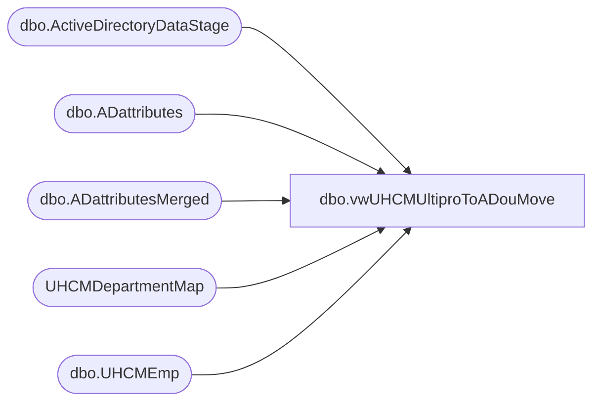

# dbo.vwUHCMUltiproToADouMove

**Database:** dw  
**Server:** papamart  

## Architecture Diagram



## Table Dependencies

| Referenced Table |
|---|
| dbo.ActiveDirectoryDataStage |
| dbo.ADattributes |
| dbo.ADattributesMerged |
| UHCMDepartmentMap |
| dbo.UHCMEmp |

## View Code

```sql
CREATE View [dbo].[vwUHCMUltiproToADouMove]
AS


with 
adsPaths as
(
select distinct(AdsPAth), Name, samaccountname, EmployeeID, UserPrincipalName from [dbo].[ActiveDirectoryDataStage] 
),
adAttributes as
(
select AdsPAth, Name, samaccountname, EmployeeID, UserPrincipalName, EmployeeADGroup from papamart.dw.dbo.ADattributesMerged 
--where EmployeeID = '0074343'
),
uhcmEmps as
(
select e.EecLocation, e.EepEEID, e.EepNameFirst, e.EepNamePreferred, e.EepNameLast, e.LocDesc, e.JbcJobCode, e.EecOrgLvl1Code, e.samaccountname,  
'EmployeeADGroup' = CASE WHEN ISNUMERIC(e.EecLocation) = 1 THEN
						--case when  e.JbcJobCode in ('CWM','GWM','DCWM', 'CNCWM','CWMTMP','CNCWMTMP') and a.EmployeeADGroup in ('Stores 000-099') and cast(e.EecLocation as integer) < 1013 then '000-099'
						--when  e.JbcJobCode in ('CWM','GWM','DCWM', 'CNCWM','CWMTMP','CNCWMTMP') and a.EmployeeADGroup in ('Stores 000-099') and cast(e.EecLocation as integer) between 1014 and 1099 then '000-099'
						--when  e.JbcJobCode in ('CWM','GWM','DCWM', 'CNCWM','CWMTMP','CNCWMTMP') and a.EmployeeADGroup in ('Stores 100-199') and cast(e.EecLocation as integer) between 1014 and 1199 then '100-199'
						--when  e.JbcJobCode in ('CWM','GWM','DCWM', 'CNCWM','CWMTMP','CNCWMTMP') and a.EmployeeADGroup in ('Stores 200-299') and cast(e.EecLocation as integer) between 1200 and 1299 then '200-299'
						--when  e.JbcJobCode in ('CWM','GWM','DCWM', 'CNCWM','CWMTMP','CNCWMTMP') and a.EmployeeADGroup in ('Stores 300-399') and cast(e.EecLocation as integer) between 1300 and 1399 then '300-399'
						--when  e.JbcJobCode in ('CWM','GWM','DCWM', 'CNCWM','CWMTMP','CNCWMTMP') and a.EmployeeADGroup in ('Stores 400-499') and cast(e.EecLocation as integer) between 1400 and 1499 then '400-499'
						--when  e.JbcJobCode in ('CWM','GWM','DCWM', 'CNCWM','CWMTMP','CNCWMTMP') and a.EmployeeADGroup in ('Stores 400-499') and cast(e.EecLocation as integer) between 1500 and 1599 then '500-599'
						--when  e.JbcJobCode in ('CWM','GWM','DCWM', 'CNCWM','CWMTMP','CNCWMTMP') and a.EmployeeADGroup in ('Stores 500-599') and cast(e.EecLocation as integer) between 1600 and 1599 then '600-699'
						case when  e.JbcJobCode in ('CWM','GWM','DCWM', 'CNCWM','CWMTMP','CNCWMTMP')  and cast(e.EecLocation as integer) < 1013 then '000-099'
						when  e.JbcJobCode in ('CWM','GWM','DCWM', 'CNCWM','CWMTMP','CNCWMTMP')  and cast(e.EecLocation as integer) between 1014 and 1099 then '000-099'
						when  e.JbcJobCode in ('CWM','GWM','DCWM', 'CNCWM','CWMTMP','CNCWMTMP')  and cast(e.EecLocation as integer) between 1014 and 1199 then '100-199'
						when  e.JbcJobCode in ('CWM','GWM','DCWM', 'CNCWM','CWMTMP','CNCWMTMP')  and cast(e.EecLocation as integer) between 1200 and 1299 then '200-299'
						when  e.JbcJobCode in ('CWM','GWM','DCWM', 'CNCWM','CWMTMP','CNCWMTMP') and cast(e.EecLocation as integer) between 1300 and 1399 then '300-399'
						when  e.JbcJobCode in ('CWM','GWM','DCWM', 'CNCWM','CWMTMP','CNCWMTMP')  and cast(e.EecLocation as integer) between 1400 and 1499 then '400-499'
						when  e.JbcJobCode in ('CWM','GWM','DCWM', 'CNCWM','CWMTMP','CNCWMTMP')  and cast(e.EecLocation as integer) between 1500 and 1599 then '500-599'
						when  e.JbcJobCode in ('CWM','GWM','DCWM', 'CNCWM','CWMTMP','CNCWMTMP') and cast(e.EecLocation as integer) between 1600 and 1599 then '600-699'
						when e.EecLocation in ('1013','IN','OUT') and a.EmployeeADGroup = 'SelfServe'
						and e.JbcJobCode in ('ITBRHSSU','BHCLEAN', 'BHHRAD', 'BHHRASST', 'BHSHIPSP', 'BHRECPT','BHWRKIII','DXBRHS','LOGWHOCO','LXBH',
						'LXWEB','MNTTCH','MNTTCH2','MXBHHR','MXBHMNT','MXBHOPS','MXGMBH','SMXOPSEC','SXBH','SXWEB','SXWEBAST','SXWHOCOR','BHRECSP')  then 'Bearhouse'
							
						when cast(e.EecLocation as integer) > 1999 and e.JbcJobCode in
						('IrelandAssistant Workshop Manager30','IrelandBear Builder4','IrelandSales Lead Hourly12','IrelandSales Lead Hourly20','UKAssistant Workshop Manager20',
						'UKAssistant Workshop Manager25','UKAssistant Workshop Manager30','UKAssistant Workshop Manager35','UKAssistant Workshop Manager40','UKBear Builder4',
						'UKSales Lead Hourly12','UKSales Lead Hourly20','UKSales Lead Hourly4') then 'SelfServe'

						when cast(e.EecLocation as integer) > 1999 and e.JbcJobCode in ('UKChief Workshop Manager35','UKChief Workshop Manager40','UKDual Site Chief Workshop Manager35',
						'UKDual Site Chief Workshop Manager40') then a.EmployeeADGroup -- then 'CWM'

						when e.JbcJobCode = 'Manager Treasury & Accounts Payable' then 'Finance'

						else a.EmployeeADGroup end

					WHEN ISNUMERIC(e.EecLocation) = 0 THEN
						case when e.EecLocation = 'FN' and a.EmployeeADGroup in ('Accounting', 'SalesAudit') then 'Finance'
							 --when e.EecLocation = 'EXEC' and a.EmployeeADGroup in ('Business Dev') then 'EXEC'
							 --when e.EecLocation = 'BQEXEC' and a.EmployeeADGroup in ('Business Dev') then 'EXEC'
							 when e.EecLocation = 'EXEC' and a.EmployeeADGroup in ('Accounting') and e.EepEEID = '0045202' then 'EXEC'
							 when e.EecLocation = 'EXEC' and a.EmployeeADGroup in ('HR') and e.EepEEID = '0000019' then 'EXEC'
							 when e.EecLocation = 'EXEC' and a.EmployeeADGroup in ('Legal') and e.EepEEID = '0028889' then 'EXEC'
							 --when e.EecLocation = 'OUT' and a.EmployeeADGroup = 'SelfServe' then 'Bearhouse'
							 --when e.EecLocation = 'IN' and a.EmployeeADGroup = 'SelfServe' then 'Bearhouse'
							 when e.EecLocation = 'MKT' and a.EmployeeADGroup = 'Creative' and e.EepEEID in (0051689,0049834,0015176,0015300,0013323,0034027,0059005) then 'Marketing'
						--else a.EmployeeADGroup end
							when e.EecLocation in ('IN','OUT') and a.EmployeeADGroup = 'SelfServe'
							and e.JbcJobCode in ('ITBRHSSU','BHCLEAN', 'BHHRAD', 'BHHRASST', 'BHSHIPSP', 'BHRECPT','BHWRKIII','DXBRHS','LOGWHOCO','LXBH',
							'LXWEB','MNTTCH','MNTTCH2','MXBHHR','MXBHMNT','MXBHOPS','MXGMBH','SMXOPSEC','SXBH','SXWEB','SXWEBAST','SXWHOCOR','BHRECSP')  then 'Bearhouse_'
					
					else  a.EmployeeADGroup end end,

d.EecLocation as 'deptEecLocation', 

'AD_Department' = CASE WHEN ISNUMERIC(e.EecLocation) = 1 THEN								
					case when cast(e.EecLocation as integer) < 1013 and e.JbcJobCode in ('BB','SL','AWM', 'SLTMP') then  'SelfServe'
						when cast(e.EecLocation as integer) between 1014 and 1700  and e.JbcJobCode in ('BB','SL','AWM', 'SLTMP')then  'SelfServe'
						when cast(e.EecLocation as integer) < 1013 and e.JbcJobCode in ('CWM','GWM','SENGM','DCWM', 'CNCWM','CWMTMP','CNCWMTMP') then '000-099' -- 'CWMs' 
						when cast(e.EecLocation as integer) between 1014 and 1099 and e.JbcJobCode in ('CWM','GWM','SENGM','DCWM', 'CNCWM','CWMTMP','CNCWMTMP') then '000-099' 
						when cast(e.EecLocation as integer) between 1100 and 1199 and e.JbcJobCode in ('CWM','GWM','SENGM','DCWM', 'CNCWM','CWMTMP','CNCWMTMP') then '100-199'
						when cast(e.EecLocation as integer) between 1200 and 1299 and e.JbcJobCode in ('CWM','GWM','SENGM','DCWM', 'CNCWM','CWMTMP','CNCWMTMP') then '200-299'
						when cast(e.EecLocation as integer) between 1300 and 1399 and e.JbcJobCode in ('CWM','GWM','SENGM','DCWM', 'CNCWM','CWMTMP','CNCWMTMP') then '300-399'
						when cast(e.EecLocation as integer) between 1400 and 1499 and e.JbcJobCode in ('CWM','GWM','SENGM','DCWM', 'CNCWM','CWMTMP','CNCWMTMP') then '400-499'
						when cast(e.EecLocation as integer) between 1500 and 1599 and e.JbcJobCode in ('CWM','GWM','SENGM','DCWM', 'CNCWM','CWMTMP','CNCWMTMP') then '500-599'
						when cast(e.EecLocation as integer) between 1600 and 1699 and e.JbcJobCode in ('CWM','GWM','SENGM','DCWM', 'CNCWM','CWMTMP','CNCWMTMP') then '600-699'


						
						when cast(e.EecLocation as integer) > 1999 and e.JbcJobCode in
						('IrelandAssistant Workshop Manager30','IrelandBear Builder4','IrelandSales Lead Hourly12','IrelandSales Lead Hourly20','UKAssistant Workshop Manager20','UKAssistant Workshop Manager25','UKAssistant Workshop Manager30',
'UKAssistant Workshop Manager35','UKAssistant Workshop Manager40','UKBear Builder4','UKSales Lead Hourly12','UKSales Lead Hourly20','UKSales Lead Hourly4') then 'SelfServe'

						when cast(e.EecLocation as integer) > 1999 and e.JbcJobCode in 
							('UKChief Workshop Manager35','UKChief Workshop Manager40','UKDual Site Chief Workshop Manager35','UKDual Site Chief Workshop Manager40') 
							then 'CWM'
						
						when cast(e.EecLocation as integer) > 1999 and e.JbcJobCode = 'Accountant' then 'Finance'
						when cast(e.EecLocation as integer) > 1999 and e.JbcJobCode = 'Construction Manager' then 'Operations'
						when cast(e.EecLocation as integer) > 1999 and e.JbcJobCode = 'District Manager' then 'DM'
						when cast(e.EecLocation as integer) > 1999 and e.JbcJobCode = 'Finance Director' then 'Finance'
						when cast(e.EecLocation as integer) > 1999 and e.JbcJobCode = 'Finance Manager' then 'Finance'
						when cast(e.EecLocation as integer) > 1999 and e.JbcJobCode = 'Manager Treasury & Accounts Payable' then 'Finance'
						when cast(e.EecLocation as integer) > 1999 and e.JbcJobCode = 'HR Advisor' then 'HR'
						when cast(e.EecLocation as integer) > 1999 and e.JbcJobCode = 'HR Manager' then 'HR'
						when cast(e.EecLocation as integer) > 1999 and e.JbcJobCode = 'Human Resources Administrator' then 'HR'
						when cast(e.EecLocation as integer) > 1999 and e.JbcJobCode = 'Senior HR Officer' then 'HR'
						when cast(e.EecLocation as integer) > 1999 and e.JbcJobCode = 'IT Team Leader' then 'IT'
						when cast(e.EecLocation as integer) > 1999 and e.JbcJobCode = 'Operations Director' then 'Operations'
						when cast(e.EecLocation as integer) > 1999 and e.JbcJobCode = 'Operations Manager Europe' then  'Operations'
						when cast(e.EecLocation as integer) > 1999 and e.JbcJobCode = 'Payroll Manager' then 'Finance'
						when cast(e.EecLocation as integer) > 1999 and e.JbcJobCode = 'Purchase Ledger' then 'FInance'
						when cast(e.EecLocation as integer) > 1999 and e.JbcJobCode = 'Senior Manager, International Business Development' then 'Operations'
						when cast(e.EecLocation as integer) > 1999 and e.JbcJobCode = 'Sr.Managing Director' then 'MD'
						when cast(e.EecLocation as integer) > 1999 and e.JbcJobCode = 'Senior Human Resources Manager' then 'MD'
						when cast(e.EecLocation as integer) > 1999 and e.JbcJobCode = 'Territory Manager' then 'DM'


						else d.AD_Department end
					else d.AD_Department end,
--'promotedCWM' = case when e.JbcJobCode in ('CWM','CNCWM','GWM') and e.samaccountname like '0%' and a.EmployeeADGroup = 'SelfServe' then 'Yes' else 'No' end,

'newAdsPath' = CASE WHEN ISNUMERIC(e.EecLocation) = 1 THEN								
					case when cast(e.EecLocation as integer) < 1013 and e.JbcJobCode in ('CWM','GWM','SENGM','DCWM', 'CNCWM','CWMTMP','CNCWMTMP') then 'LDAP://OU=000-099,OU=CWMs,OU=Stores,OU=BABW,DC=buildabear,DC=com'
						when cast(e.EecLocation as integer) = 1013 then  'LDAP://OU=Bearhouse,OU=BQ,OU=BABW,DC=buildabear,DC=com'
						when cast(e.EecLocation as integer) between 1014 and 1099 and e.JbcJobCode in ('CWM','GWM','SENGM','DCWM', 'CNCWM','CWMTMP','CNCWMTMP') then  'LDAP://OU=000-099,OU=CWMs,OU=Stores,OU=BABW,DC=buildabear,DC=com'
						when cast(e.EecLocation as integer) between 1100 and 1199 and e.JbcJobCode in ('CWM','GWM','SENGM','DCWM', 'CNCWM','CWMTMP','CNCWMTMP') then  'LDAP://OU=100-199,OU=CWMs,OU=Stores,OU=BABW,DC=buildabear,DC=com'
						when cast(e.EecLocation as integer) between 1200 and 1299 and e.JbcJobCode in ('CWM','GWM','SENGM','DCWM', 'CNCWM','CWMTMP','CNCWMTMP') then  'LDAP://OU=200-299,OU=CWMs,OU=Stores,OU=BABW,DC=buildabear,DC=com'
						when cast(e.EecLocation as integer) between 1300 and 1399 and e.JbcJobCode in ('CWM','GWM','SENGM','DCWM', 'CNCWM','CWMTMP','CNCWMTMP') then 'LDAP://OU=300-399,OU=CWMs,OU=Stores,OU=BABW,DC=buildabear,DC=com'
						when cast(e.EecLocation as integer) between 1400 and 1499 and e.JbcJobCode in ('CWM','GWM','SENGM','DCWM', 'CNCWM','CWMTMP','CNCWMTMP') then 'LDAP://OU=400-499,OU=CWMs,OU=Stores,OU=BABW,DC=buildabear,DC=com'
						when cast(e.EecLocation as integer) between 1500 and 1599 and e.JbcJobCode in ('CWM','GWM','SENGM','DCWM', 'CNCWM','CWMTMP','CNCWMTMP') then 'LDAP://OU=500-599,OU=CWMs,OU=Stores,OU=BABW,DC=buildabear,DC=com'
						when cast(e.EecLocation as integer) between 1600 and 1699 and e.JbcJobCode in ('CWM','GWM','SENGM','DCWM', 'CNCWM','CWMTMP','CNCWMTMP') then 'LDAP://OU=600-699,OU=CWMs,OU=Stores,OU=BABW,DC=buildabear,DC=com'
						when cast(e.EecLocation as integer) < 1013 and e.JbcJobCode in ('BB','SL','AWM', 'SLTMP') then 'LDAP://OU=SelfServe,DC=buildabear,DC=com'
						when cast(e.EecLocation as integer) between 1014 and 1700  and e.JbcJobCode in ('BB','SL','AWM', 'SLTMP')then  'LDAP://OU=SelfServe,DC=buildabear,DC=com'
					    when cast(e.EecLocation as integer) between 2000 and 2999 and e.JbcJobCode in ('UKChief Workshop Manager35','UKChief Workshop Manager40','UKDual Site Chief Workshop Manager35','UKDual Site Chief Workshop Manager40') then 'LDAP://OU=CWM,OU=Stores,OU=BABWUK,DC=buildabear,DC=com'
						when cast(e.EecLocation as integer) between 2000 and 2999 and e.JbcJobCode in ('IrelandAssistant Workshop Manager25','IrelandAssistant Workshop Manager35','IrelandAssistant Workshop Manager40',
						'IrelandBear Builder4','IrelandSales Lead Hourly12','IrelandSales Lead Hourly20','IrelandSales Lead Hourly4','UKAssistant Workshop Manager25','UKAssistant Workshop Manager30',
					    'UKAssistant Workshop Manager35','UKAssistant Workshop Manager40','UKBear Builder4','UKSales Lead Hourly12','UKSales Lead Hourly20','UKSales Lead Hourly4') then 'LDAP://OU=SelfServe,DC=buildabear,DC=com'
						when cast(e.EecLocation as integer) between 2000 and 2999 and e.JbcJobCode = 'Territory Manager' then 'LDAP://OU=DM,OU=HomeOffice,OU=BABWUK,DC=buildabear,DC=com'
						when cast(e.EecLocation as integer) > 9000 and e.JbcJobCode in ('Human Resources Administrator') then 'LDAP://OU=HR,OU=HomeOffice,OU=BABWUK,DC=buildabear,DC=com'
						when cast(e.EecLocation as integer) > 9000 and e.JbcJobCode in ('Payroll, Compensation & Benefits Manager') then 'LDAP://OU=HR,OU=HomeOffice,OU=BABWUK,DC=buildabear,DC=com'
						when cast(e.EecLocation as integer) > 9000 and e.JbcJobCode in ('Senior Human Resources Manager') then 'LDAP://OU=MD,OU=HomeOffice,OU=BABWUK,DC=buildabear,DC=com'
						when cast(e.EecLocation as integer) > 9000 and e.JbcJobCode in ('Senior HR Officer') then 'LDAP://OU=HR,OU=HomeOffice,OU=BABWUK,DC=buildabear,DC=com'
						when cast(e.EecLocation as integer) > 9000 and e.JbcJobCode in ('Senior Manager, International Business Development') then 'LDAP://OU=Operations,OU=HomeOffice,OU=BABWUK,DC=buildabear,DC=com'
						when cast(e.EecLocation as integer) > 9000 and e.JbcJobCode in ('Deputy Controller and Treasurer') then 'LDAP://OU=Finance,OU=HomeOffice,OU=BABWUK,DC=buildabear,DC=com'
						when cast(e.EecLocation as integer) > 9000 and e.JbcJobCode in ('Director International Business Development') then 'LDAP://OU=Operations,OU=HomeOffice,OU=BABWUK,DC=buildabear,DC=com'
						when cast(e.EecLocation as integer) > 9000 and e.JbcJobCode in ('District Manager') then 'LDAP://OU=DM,OU=HomeOffice,OU=BABWUK,DC=buildabear,DC=com'
						when cast(e.EecLocation as integer) > 9000 and e.JbcJobCode in ('Manager of Finance') then 'LDAP://OU=Finance,OU=HomeOffice,OU=BABWUK,DC=buildabear,DC=com'
						when cast(e.EecLocation as integer) > 9000 and e.JbcJobCode in ('Manager Treasury & Accounts Payable') then 'LDAP://OU=Finance,OU=HomeOffice,OU=BABWUK,DC=buildabear,DC=com'
						when cast(e.EecLocation as integer) > 9000 and e.JbcJobCode in ('Finance Manager') then 'LDAP://OU=Finance,OU=HomeOffice,OU=BABWUK,DC=buildabear,DC=com'
						when cast(e.EecLocation as integer) > 9000 and e.JbcJobCode in ('IT Systems Engineer') then 'LDAP://OU=IT,OU=HomeOffice,OU=BABWUK,DC=buildabear,DC=com'
						when cast(e.EecLocation as integer) > 9000 and e.JbcJobCode in ('Operations Director') then 'LDAP://OU=Operations,OU=HomeOffice,OU=BABWUK,DC=buildabear,DC=com'
						when cast(e.EecLocation as integer) > 9000 and e.JbcJobCode in ('Purchase Ledger')  then 'LDAP://OU=Merchandising,OU=HomeOffice,OU=BABWUK,DC=buildabear,DC=com'
						when cast(e.EecLocation as integer) > 9000 and e.JbcJobCode in ('Retail Operations Manager') then 'LDAP://OU=Operations,OU=HomeOffice,OU=BABWUK,DC=buildabear,DC=com'
						when cast(e.EecLocation as integer) > 9000 and e.JbcJobCode in ('Senior HR Administrator') then 'LDAP://OU=HR,OU=HomeOffice,OU=BABWUK,DC=buildabear,DC=com'
						when cast(e.EecLocation as integer) > 9000 and e.JbcJobCode in ('Senior Manager of Operations') then 'LDAP://OU=Operations,OU=HomeOffice,OU=BABWUK,DC=buildabear,DC=com'
						when cast(e.EecLocation as integer) > 9000 and e.JbcJobCode in ('Senior Operations Manager') then 'LDAP://OU=Operations,OU=HomeOffice,OU=BABWUK,DC=buildabear,DC=com'
						when cast(e.EecLocation as integer) > 9000 and e.JbcJobCode in ('Sr.Managing Director') then 'LDAP://OU=MD,OU=HomeOffice,OU=BABWUK,DC=buildabear,DC=com'
						else '' end
					WHEN ISNUMERIC(e.EecLocation) = 0 THEN
						case when e.EecLocation = 'FN' then 'LDAP://OU=Accounting,OU=BQ,OU=BABW,DC=buildabear,DC=com'
						when e.EecLocation = 'EXEC' then 'LDAP://OU=Business Dev,OU=BQ,OU=BABW,DC=buildabear,DC=com'
						when e.EecLocation = 'BQEXEC' then 'LDAP://OU=Business Dev,OU=BQ,OU=BABW,DC=buildabear,DC=com'
						when e.EecLocation = 'OUT' then 'LDAP://OU=Bearhouse,OU=BQ,OU=BABW,DC=buildabear,DC=com'
						when e.EecLocation = 'IN' then 'LDAP://OU=Bearhouse,OU=BQ,OU=BABW,DC=buildabear,DC=com'
						when e.EecLocation = 'RE' then 'LDAP://OU=Business Dev,OU=BQ,OU=BABW,DC=buildabear,DC=com'	
						when e.EecLocation = 'Creative' then 'LDAP://OU=Creative,OU=BQ,OU=BABW,DC=buildabear,DC=com'
						when e.EecLocation like 'HR%' then 'LDAP://OU=HR,OU=BQ,OU=BABW,DC=buildabear,DC=com'
						when e.EecLocation = 'INTL' then 'LDAP://OU=International,OU=BQ,OU=BABW,DC=buildabear,DC=com'			
						when e.EecLocation = 'IT' then 'LDAP://OU=IT,OU=BQ,OU=BABW,DC=buildabear,DC=com'
						when e.EecLocation = 'BQIT' then 'LDAP://OU=IT,OU=BQ,OU=BABW,DC=buildabear,DC=com'
						when e.EecLocation = 'LGL' then 'LDAP://OU=Legal,OU=BQ,OU=BABW,DC=buildabear,DC=com'
						when e.EecLocation = 'MKT' or e.EecLocation = 'EMKT' or e.EecLocation = 'STRG' then 'LDAP://OU=Marketing,OU=BQ,OU=BABW,DC=buildabear,DC=com'
						when e.EecLocation = 'LOG' or e.EecLocation = 'MPLN' or e.EecLocation = 'PRO' then 'LDAP://OU=Planning,OU=BQ,OU=BABW,DC=buildabear,DC=com'
						when e.EecLocation = 'PR' then 'LDAP://OU=PR,OU=BQ,OU=BABW,DC=buildabear,DC=com'
						when e.EecLocation = 'PROD' or e.EecLocation = 'PROD1' then 'LDAP://OU=Product Dev,OU=BQ,OU=BABW,DC=buildabear,DC=com'
						when e.EecLocation = 'OPS' or e.EecLocation = 'CNST' then 'LDAP://OU=StoreOps,OU=BQ,OU=BABW,DC=buildabear,DC=com'
						when e.EecLocation = 'GSR' then 'LDAP://OU=BSR,OU=StoreOps,OU=BQ,OU=BABW,DC=buildabear,DC=com'
						when e.EecLocation like 'DM%' or e.EecLocation like 'AM%' or JbcJobCode = 'TERRMGR' then 'LDAP://OU=BL,OU=Regional Directors,OU=StoreOps,OU=BQ,OU=BABW,DC=buildabear,DC=com'
						else '' end
					ELSE '' END

from [dbo].[UHCMEmp] e 
--join vwADEmployee a On a.EmployeeID = e.EepEEID
join papamart.dwstaging.dbo.ADattributes a on a.EmployeeID = e.EepEEID
left join  UHCMDepartmentMap d on e.EecLocation = d.EecLocation and d.AD_Department <> 'Bearhouse'
--where e.EecEmplStatus = 'Active' 
--and e.JbcJobCode = 'CWM'

where
e.EecEmplStatus <> 'Terminated' 
--and d.AD_Department <> 'Bearhouse'
--and e.EepCompanyCode <> 'BABUK'
--and e.EepEEID = '0068984'
	-- limit results to records updated in past x days
and (datediff(dd, e.UpdateDate, getdate()) < 40 or datediff(dd, e.InsertDate, getdate()) < 40)

-- order by e.EepEEID asc

)

select u.EecLocation, u.EepEEID, u.EepNameFirst, u.EepNamePreferred, u.EepNameLast, u.LocDesc, 
u.JbcJobCode, u.EecOrgLvl1Code, u.samaccountname,  u.newAdsPath, a.adsPath as 'objectToMove',
u.EmployeeADGroup as OU_new ,am.EmployeeADGroup as OU_current, 
--u.AD_Department, 
a.UserPrincipalName
from uhcmEmps u
join adsPaths a on u.EepEEID = a.EmployeeID
join adAttributes am on u.EepEEID = am.EmployeeID
where 1=1 
--and (u.EmployeeADGroup <> u.AD_Department)
and (u.EmployeeADGroup <> am.EmployeeADGroup)
--and u.EepEEID = '0083659'
--and u.EepEEID = '0068984'
--and u.EepEEID in ('0018930','0036380', '0057430')
and u.EepEEID not in ('2003442','2010412','2019247','2019858')  -- '2018595'
```

