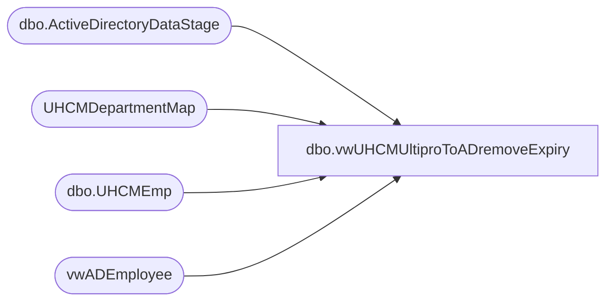

# dbo.vwUHCMUltiproToADremoveExpiry

**Database:** dw  
**Server:** papamart  

## Architecture Diagram



## Table Dependencies

| Referenced Table |
|---|
| dbo.ActiveDirectoryDataStage |
| UHCMDepartmentMap |
| dbo.UHCMEmp |
| vwADEmployee |

## View Code

```sql
CREATE View [dbo].[vwUHCMUltiproToADremoveExpiry]
AS

with 
adsPaths as
(
select distinct(AdsPAth), Name, samaccountname, EmployeeID, UserPrincipalName from [dbo].[ActiveDirectoryDataStage] 
where SamAccountName = '0058168' 
--where SamAccountName = '8888888' 
),
uhcmEmps as
(
select e.EecLocation, e.EepEEID, e.EepNameFirst, e.EepNamePreferred, e.EepNameLast, e.LocDesc, e.JbcJobCode, e.EecOrgLvl1Code, e.samaccountname,  
a.EmployeeADGroup , d.EecLocation as 'deptEecLocation', d.AD_Department 
from [dbo].[UHCMEmp] e 
join vwADEmployee a On a.EmployeeID = e.EepEEID
left join  UHCMDepartmentMap d on e.EecLocation = d.EecLocation
--where e.EecEmplStatus = 'Active' 
--and e.JbcJobCode = 'CWM'
where
e.EecEmplStatus <> 'Terminated' 
--and e.EepEEID > 0000001
	-- limit results to records updated in past x days
and (datediff(dd, e.UpdateDate, getdate()) < 200 or datediff(dd, e.InsertDate, getdate()) < 200)
--order by e.sAMAccountName asc

)

select u.EecLocation, u.EepEEID, u.EepNameFirst, u.EepNamePreferred, u.EepNameLast, u.LocDesc, 
u.JbcJobCode, u.EecOrgLvl1Code, u.samaccountname,  --u.newAdsPath, a.adsPath as 'objectToMove',
u.EmployeeADGroup,u.AD_Department, a.UserPrincipalName
--9223372036854775807 as 'accountExpires','retail store' as 'department',  
--dateadd(dd, +2914383, getdate())  as 'accountExpires2', 0 as 'accountExpires3'
from uhcmEmps u
join adsPaths a on u.EepEEID = a.EmployeeID
--where (u.EmployeeADGroup <> u.AD_Department)
--and u.EepEEID in ('0018930','0036380', '0057430')
union 
select '' as EecLocation, '8888888' as EepEEID, '' as EepNameFirst, '' as EepNamePreferred, '' as EepNameLast, '' as LocDesc, 
'' as JbcJobCode, '' as EecOrgLvl1Code, '8888888' as samaccountname,  --u.newAdsPath, a.adsPath as 'objectToMove',
'' as EmployeeADGroup, '' as AD_Department, '' as UserPrincipalName
```

