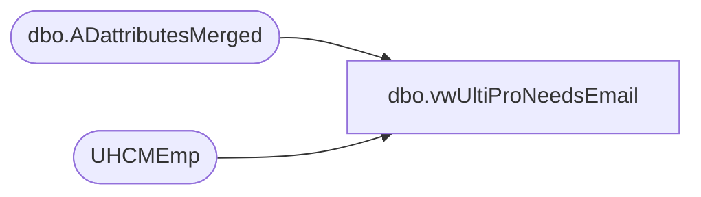

# dbo.vwUltiProNeedsEmail

**Database:** dw  
**Server:** papamart  

## Architecture Diagram



## Table Dependencies

| Referenced Table |
|---|
| dbo.ADattributesMerged |
| UHCMEmp |

## View Code

```sql
CREATE view [dbo].[vwUltiProNeedsEmail] 

as
---only want to include UltiPro employees that don't have a BAB email in UltiPro, but do have bab email in AD that is not equal to their Employee number


With 
UltiPro as -- UltiPro Employees without bab Email 
	(
		select 
			eepCompanyCode as CompanyCode,
			convert(varchar, EecDateOfLastHire, 101) as EffectiveDate,
			EepEEID as EmployeeID,
			case 
				when 
					eepAddressEmail like '%@buildabear%' 
				and eepAddressEmail <> concat(EepEEID, '@buildabear.com')
				then eepAddressEmail
				else NULL 
			end as Email
		from UHCMEmp with (nolock)
		where 1=1
		and eecEmplStatus = 'Active'
		and (EepAddressEmail is NULL or EepAddressEmail not like '%@buildabear.com%')
		--and not (eecLocation = 'UKBQ' or left(eecLocation,1) = '2') -- exclude uk for now
	),
AD as --Active Directory Email and SamAccountName
	(	
		/*
		select --AD employees with bab email that is not their employee number
			EmployeeID,
			Mail
		from ADEmployee with (nolock)
		where mail like '%@buildabear%' 
		and mail <> concat(EmployeeID, '@buildabear.com')
		*/

		
		select 
		EmployeeID,
			Mail 
			from [dbo].[ADattributesMerged] with (nolock)
		where mail like '%@buildabear%' 
		and mail <> concat(EmployeeID, '@buildabear.com')
		and EmployeeId not like '2%'
		


	)
select 
	u.CompanyCode,
	convert(varchar, getdate(), 101) as EffectiveDate, --convert(varchar, eecDateOfOriginalHire, 101)??
	u.EmployeeID,
	ad.Mail as PrimaryEmail
from UltiPro u 
join AD on u.EmployeeID=AD.EmployeeID
where getdate() >= u.EffectiveDate
and u.EmployeeID not in ('0085375','0083930','0084642','0085470','0084461','0085349','0083395')
```

