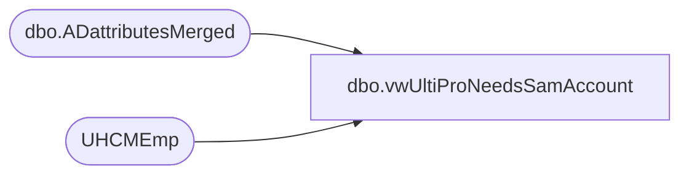

# dbo.vwUltiProNeedsSamAccount

**Database:** dw  
**Server:** papamart  

## Architecture Diagram



## Table Dependencies

| Referenced Table |
|---|
| dbo.ADattributesMerged |
| UHCMEmp |

## View Code

```sql
CREATE view [dbo].[vwUltiProNeedsSamAccount] 

as


With 
UltiPro as
	(
		select --UltiPro employees without a samaccount name - Active - Not UK
			eepCompanyCode as CompanyCode,
			convert(varchar, EecDateOfLastHire, 101) as EffectiveDate,
			EepEEID as EmployeeID,
			samaccountname
		from UHCMEmp with (nolock)
		where 1=1
		--and eecEmplStatus = 'Active'
		and eecEmplStatus in ('Active','Leave of Absence') -- added LOA employees idw 5/9/2020
		and samaccountname is null
		--and not (eecLocation = 'UKBQ' or left(eecLocation,1) = '2') -- exclude uk for now
	),
AD as
	(	
		--select --AD employees that have samaccount
		--	EmployeeID,
		--	samaccountName
		--from ADEmployee with (nolock)
		--where samaccountName <> 'no data' 
		--and samaccountName=EmployeeID
		--and EmployeeID = '0085596'

		select 
		EmployeeID,
			samaccountName 
			from [dbo].[ADattributesMerged] with (nolock)
		where samaccountName <> 'no data' 
		--	and EmployeeId = '0085596'

	)
select --UltiPro employees without samaccount, joined to AD with Samaccount -->These employees will be sent to UltiPro to set samaccount
	u.CompanyCode,
	--convert(varchar, getdate(), 101) as EffectiveDate, --convert(varchar, eecDateOfOriginalHire, 101)??
	u.EffectiveDate,
	u.EmployeeID,
	ad.samAccountname as SamAccountName
from UltiPro u 
join AD on u.EmployeeID=AD.EmployeeID
where getdate() >= u.EffectiveDate
```

