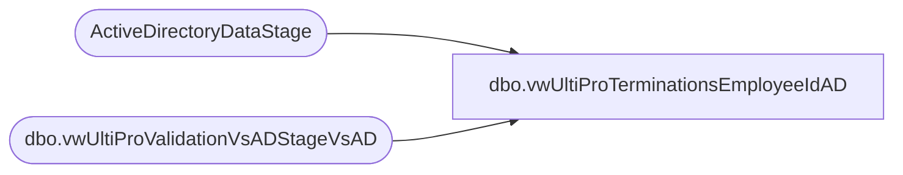

# dbo.vwUltiProTerminationsEmployeeIdAD

**Database:** dw  
**Server:** papamart  

## Architecture Diagram



## Table Dependencies

| Referenced Table |
|---|
| ActiveDirectoryDataStage |
| dbo.vwUltiProValidationVsADStageVsAD |

## View Code

```sql
CREATE view [dbo].[vwUltiProTerminationsEmployeeIdAD]

as


with 
lastProvision
as
(
select * 
from [dbo].[vwUltiProValidationVsADStageVsAD] 
--where datediff(hh, ADInsertDate, getdate()) > 0
--where cast(ADInsertDate as date) < cast(getdate() as date) 
--where EmployeeID in ('0076078','0075079','0078025','0073950','0079911','0079912','0080389','0079905','0079942','0075045','0079170','0076728','0079264','0075654')
),
currentAD 
as
(
select distinct EmployeeID, GivenName, LastName, Description, Enabled, Samaccountname from ActiveDirectoryDataStage 
--where EmployeeId in ('0080117','0080277','0080248','0080274','0080360')
)
select l.EmployeeID,  l.DisplayName as FullName, l.CompanyCode, l.UltiproStatus as Status, l.TerminatedEffectiveDate, l.StagedProvisionEvent, c.EmployeeID as ADemployeeID, c.Samaccountname, c.Enabled  
from lastProvision l 
left join currentAD c on l.EmployeeID = c.EmployeeID
where 1=1 
and l.TerminatedEffectiveDate is not null
and l.StagedProvisionEvent = 'T'
and c.Enabled = 1
--and l.EmployeeID = '0079683'
and   datediff(dd, l.TerminatedEffectiveDate, getdate()) > 1 
--and l.EmployeeID in ('0080117','0080277','0080248','0080274','0080360')
--order by l.TerminatedEffectiveDate asc
```

