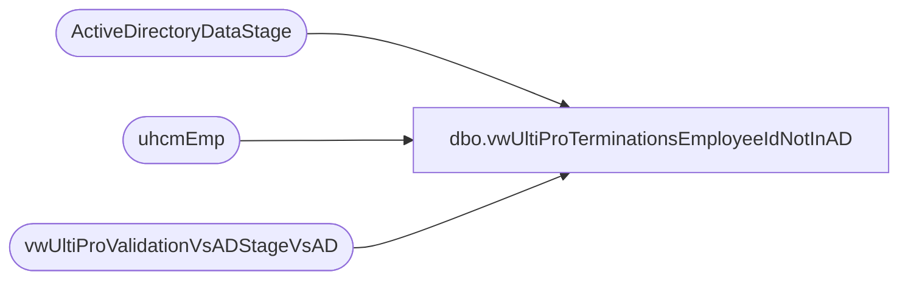

# dbo.vwUltiProTerminationsEmployeeIdNotInAD

**Database:** dw  
**Server:** papamart  

## Architecture Diagram



## Table Dependencies

| Referenced Table |
|---|
| ActiveDirectoryDataStage |
| uhcmEmp |
| vwUltiProValidationVsADStageVsAD |

## View Code

```sql
CREATE view [dbo].[vwUltiProTerminationsEmployeeIdNotInAD]

as

with 
StagedTerminations as
	(
		select t.EmployeeID
		from vwUltiProValidationVsADStageVsAD t
		left join ActiveDirectoryDataStage ad on t.EmployeeID=ad.EmployeeID
		where 1=1
		and t.StagedProvisionEvent = 'T'
		and ad.EmployeeID is NULL
		and (
				datediff(dd, t.ADStageDate, getdate()) = 0 --staged today
				or
				(datediff(dd, t.ADStageDate, getdate()-1) = 0 and datepart(hh, t.ADStageDate) >= 17) --staged yesterday after 5pm
			)
		UNION
		select t.EmployeeID
		from vwUltiProValidationVsADStageVsAD t
		join ActiveDirectoryDataStage ad on t.EmployeeID=ad.EmployeeID
		where 1=1
		and t.StagedProvisionEvent = 'T'
		and ad.memberOf like '%SelfServe%'
		and (
				datediff(dd, t.ADStageDate, getdate()) = 0 --staged today
				or
				(datediff(dd, t.ADStageDate, getdate()-1) = 0 and datepart(hh, t.ADStageDate) >= 17) --staged yesterday after 5pm
			)
		UNION
		select u.eepeeid as EmployeeID
		from uhcmEmp u with (nolock)
		left join ActiveDirectoryDataStage ad on u.eepeeid=ad.EmployeeID
		where 1=1
		and u.EecLocation <> 'UKBQ'   
		and u.EecLocation not like '2%'
		and u.eecEmplStatus = 'Terminated'
		and (
				datediff(dd, isnull(u.UpdateDate, u.InsertDate), getdate()) = 0 --staged today
				or
				(datediff(dd, isnull(u.UpdateDate, u.InsertDate), getdate()-1) = 0 and datepart(hh, isnull(u.UpdateDate, u.InsertDate)) >= 17) --staged yesterday after 5pm
			)
		and datediff(dd, isnull(u.TerminatedEnteredDate, u.TerminatedEffectiveDate), getdate()) <= 1
		and ad.EmployeeID is NULL
		UNION
		select u.eepeeid as EmployeeID
		from uhcmEmp u with (nolock)
		join ActiveDirectoryDataStage ad on u.eepeeid=ad.EmployeeID
		where 1=1
		and u.EecLocation <> 'UKBQ'   
		and u.EecLocation not like '2%'
		and u.eecEmplStatus = 'Terminated'
		and (
				datediff(dd, isnull(u.UpdateDate, u.InsertDate), getdate()) = 0 --staged today
				or
				(datediff(dd, isnull(u.UpdateDate, u.InsertDate), getdate()-1) = 0 and datepart(hh, isnull(u.UpdateDate, u.InsertDate)) >= 17) --staged yesterday after 5pm
			)
		and datediff(dd, isnull(u.TerminatedEnteredDate, u.TerminatedEffectiveDate), getdate()) <= 1
		and ad.memberOf like '%SelfServe%'
	)
select 
	eepeeid EmployeeID,
	eepnamepreferred PreferredName,
	eepnamefirst FirstName,
	eepnameLast LastName,
	JbcLongDesc JobDescription,
	eecemplStatus EmployeeStatus,
	eecDateofLastHire,
	TerminationDate,
	TerminatedEffectiveDate,
	TErminatedEnteredDate,
	eepAddressEmail EmailAddress,
	sAMAccountName,
	isnull(UpdateDate, InsertDate) LastUltiProUpdate
from uhcmemp
where 1=1
--and EecLocation <> 'UKBQ'   
and EepEEID not like '2%'
and eecEmplStatus = 'Terminated'
and eepeeid in (select EmployeeID from StagedTerminations)
and (
		TerminationDate is not null
		or
		TerminatedEffectiveDate is not null
		or
		TErminatedEnteredDate is not null
	)
--order by eecemplStatus, JobDescription,isnull(UpdateDate, InsertDate), eepeeid
```

