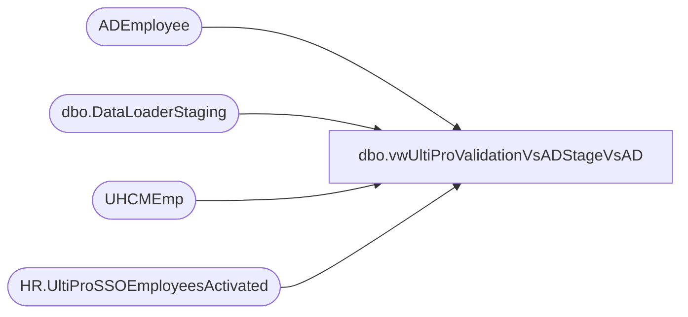

# dbo.vwUltiProValidationVsADStageVsAD

**Database:** dw  
**Server:** papamart  

## Architecture Diagram



## Table Dependencies

| Referenced Table |
|---|
| ADEmployee |
| dbo.DataLoaderStaging |
| UHCMEmp |
| HR.UltiProSSOEmployeesActivated |

## View Code

```sql
--select * from vwUltiProValidationVsADStageVsAD   -- 38,063


CREATE view [dbo].[vwUltiProValidationVsADStageVsAD]

as


--select *
--from vwUltiProValidationVsADStageVsAD
--where 1=1
--and not (Location = 'UKBQ' or left(Location,1) = '2') -- exclude uk for now
--and not (UltiProStatus = 'Terminated' and UltiProSamAccountName is NULL) --excludes terminated that don't have samaccount--we don't care about these
--and (
--		(UltiProStatus = 'Active' and UltiProSamAccountName is NULL) --Active employees should have a samaccount in UltiPro
--		--OR

--	)

----and datediff(dd, isnull(UltiProUpdateDate, UltiProInsertDate), getdate()) = 0


------------------------------------------------------------------------------------------------------------
--	Dan Tweedie - 2019-05-21 - View to help validate if UltiPro data is getting into AD and vice versa
------------------------------------------------------------------------------------------------------------

with 
UltiPro as
	(
		select 
			u.eepEEID as EmployeeID,
			u.eepCompanyCode CompanyCode,
			u.eecLocation as Location,
			u.SamAccountName,
			u.eepAddressEmail, 
			u.eecEmplStatus,
			u.FullName,
			u.eepNamePreferred,
			u.eecDateOfLastHire LastHireDate,
			u.TerminatedEffectiveDate,
			u.InsertDate,
			u.UpdateDate
		from UHCMEmp u  with (nolock)
		where 1=1
		--and u.EepCompanyCode <> 'BABUK'
		--and u.eepeeid = '0060748'
		--and datediff(dd, isnull(UpdateDate, InsertDate), getdate()) = 0
		--and datediff(mi, isnull(UpdateDate, InsertDate), getdate()) >= 30
		--and eepEEID not in (select EmployeeID from ADEmployee)
	),
ADStage as
	(
		select 
			EmployeeID, 
			max(UpdatedTimeStamp) MaxDate
		from coredb01.AIMSConfig.dbo.DataLoaderStaging with (nolock)
		--where EmployeeID not like '2%'
		group by
			EmployeeID
	)
	,
Provisioning as
	(
		select
			p.EmployeeID,
			p.ProvisioningEvent,
			p.UserLogonNamePreWindows2000,
			p.ExtensionAttribute1,
			p.FirstName,
			p.DisplayName,
			a.MaxDate
		from coredb01.AIMSConfig.dbo.DataLoaderStaging p with (nolock)
		join ADStage a on p.EmployeeID=a.EmployeeID and p.UpdatedTimeStamp=a.MaxDate
	),
AD as
	(
		select 
			EmployeeID,
			samaccountName,
			mail,
			memberOf,
			InsertDate,
			UpdateDate
		from ADEmployee with (nolock)
	),
SSO as
	(
		select 
			EmployeeID,
			InsertDate,
			ActivatedDate
		from [stl-ssis-p-01].IntegrationStaging.HR.UltiProSSOEmployeesActivated
	)
select DISTINCT
	u.EmployeeID,
	u.CompanyCode,
	u.Location,
	u.LastHireDate,
	u.SamAccountName as UltiProSamAccountName,
	u.eepAddressEmail as UltiProEmail,
	u.eecEmplStatus as UltiProStatus,
	u.TerminatedEffectiveDate,
	u.FullName,
	u.eepNamePreferred,
	u.InsertDate as UltiProInsertDate,
	u.UpdateDate as UltiProUpdateDate,
	ads.MaxDate as ADStageDate,
	p.ProvisioningEvent as StagedProvisionEvent, 
	p.UserLogonNamePreWindows2000 as StagedUserLogonPreWindows2000,
	p.ExtensionAttribute1 as StagedExtensionAttribute1,
	p.FirstName,
	p.DisplayName,
	ad.SamAccountName as ADSamAccountName,
	ad.mail as ADEmail,
	ad.memberOf,
	ad.InsertDate as ADInsertDate,
	ad.UpdateDate as ADUpdateDate,
	sso.InsertDate SSOInsertDate,
	sso.ActivatedDate as SSOActivatedDate
from UltiPro u
left join ADStage ads on u.EmployeeID=ads.EmployeeID
left join AD on u.EmployeeID=ad.EmployeeID
left join SSO on u.EmployeeID=SSO.EmployeeID
left join Provisioning p on u.EmployeeID=p.EmployeeID


BAB\BlakeN,vwHLK_Seasonality,CREATE VIEW vwHLK_Seasonality
AS
select
	case when sd.country in ('UK','IE') then 'UK' else sd.country end as continent,
	dd.fiscal_year,
	dd.fiscal_week,
	min(dd.actual_date) as start_date,
	max(dd.actual_date) as end_date,
	sum(tf.gaap_transaction_flag) as gaap_transactions
FROM [dw].[dbo].[Transaction_Facts] tf with (nolock)
	join [dw].[dbo].[date_dim] dd with (nolock)	on tf.date_key=dd.date_key
	join [dw].[dbo].[store_dim] sd with (nolock) on tf.store_key=sd.store_key
where
	dd.fiscal_year >= Year(dateadd(year,-1,getdate()))
	and sd.country not in ('CN','DK')
group by
	case when sd.country in ('UK','IE') then 'UK' else sd.country end,
	dd.fiscal_year,
	dd.fiscal_week
```

