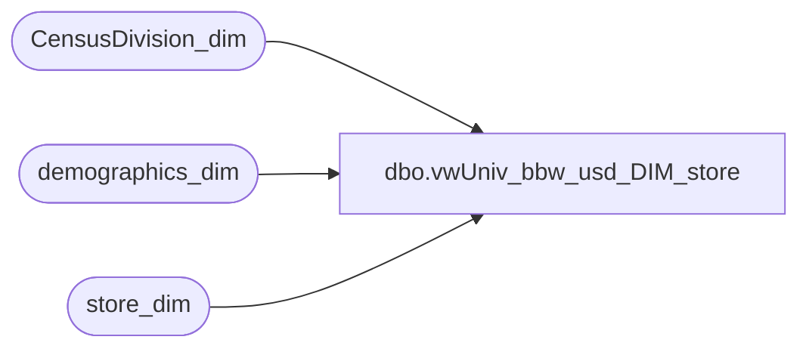

# dbo.vwUniv_bbw_usd_DIM_store

**Database:** dw  
**Server:** papamart  

## Architecture Diagram



## Table Dependencies

| Referenced Table |
|---|
| CensusDivision_dim |
| demographics_dim |
| store_dim |

## View Code

```sql
CREATE VIEW vwUniv_bbw_usd_DIM_store
AS

/********************************************************
Name:		vwUniv_bbw_usd_DIM_store
Author:		Dan Morgan
Purpose:	To be used by Business Objects for the USD BBW Universes.
Currency:	USD
Company:	BBW
Created:	6/4/07
Updated:

*********************************************************/

select sd.*
,cd.region as CensusRegion
,cd.division as CensusDivision
,dd.cluster_code
,dd.cluster_name
,dd.metro_code
,dd.metro_name
,dd.dma_code
,dd.dma_name
from store_dim sd
	left join CensusDivision_dim cd on sd.state_province = cd.state
	left join demographics_dim dd on sd.demographics_bg_key = dd.demographics_bg_key
where 
sd.bearea <> 'pool points' 
and sd.division <> 'US-Zone' --RZ
and sd.country = 'US'
```

