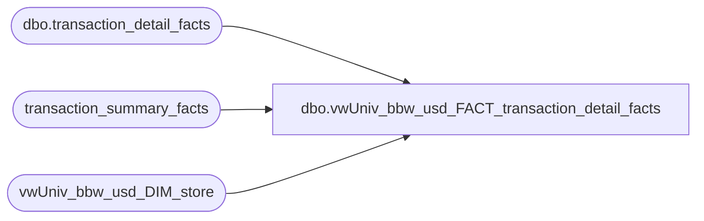

# dbo.vwUniv_bbw_usd_FACT_transaction_detail_facts

**Database:** dw  
**Server:** papamart  

## Architecture Diagram



## Table Dependencies

| Referenced Table |
|---|
| dbo.transaction_detail_facts |
| transaction_summary_facts |
| vwUniv_bbw_usd_DIM_store |

## View Code

```sql
CREATE VIEW vwUniv_bbw_usd_FACT_transaction_detail_facts
AS

/********************************************************
Name:		vwUniv_bbw_usd_FACT_transaction_detail_facts
Author:		Dan Morgan
Purpose:	To be used by Business Objects for the USD BBW HoneyPot Universe.
Currency:	USD
Company:	BBW
Created:	6/4/07
Updated:

*********************************************************/


SELECT tdf.[product_key]
      ,tdf.[sender_customer_key]
      ,tdf.[currency_key]
      ,tdf.[transaction_id]
      ,tdf.[transaction_line_seq]
      ,tdf.[register_num]
      ,tdf.[sender_household_key]
      ,tdf.[channel_key]
      ,tdf.[cashier_id]
      ,tdf.[time_key]
      ,tdf.[distance_to_store_TOP]
      ,tdf.[store_key]
      ,tdf.[promotion_key]
      ,tdf.[unit_gross_amount]
      ,tdf.[date_key]
      ,tdf.[units]
      ,tdf.[animal_key]
      ,tdf.[unit_disc_amount]
      ,tdf.[recipient_household_key]
      ,tdf.[recipient_customer_key]
      ,tdf.[party_y_n]
      ,tdf.[nearest_store_key_TOP]
      ,tdf.[coupon_group_key]
      ,tdf.[tender_group_key]
      ,tdf.[transaction_type_key]
      ,tdf.[line_object_key]
      ,tdf.[party_deposit]
      ,tdf.[non_merch]
      ,tdf.[Party]
      ,tdf.[Loyality]
      ,tdf.[purpose_key]
      ,tdf.[tdf_key]
      ,tdf.[source_key]
      ,tdf.[recipient_address_key]
      ,tdf.[sender_address_key]
      ,tdf.[process_name]
      ,tdf.[process_date]
      ,tdf.[charm_group_key]
      ,tdf.[transaction_no]
      ,tdf.[reference_no]
      ,tdf.[sfs_transaction_type_key]
      ,tdf.[customer_demographics_key]
      ,tdf.[customer_geography_key]
	  ,tsf.Net_Sale as 'Net Sale'
	  ,tsf.GAAP_Sale  as 'Total Bearly GAAP Sale'
	  ,tsf.Units as 'Total Bearly GAAP Units'
  FROM [dw].[dbo].[transaction_detail_facts] tdf
	join vwUniv_bbw_usd_DIM_store sd on tdf.store_key = sd.store_key
	join transaction_summary_facts tsf on tdf.date_key = tsf.date_key and tdf.store_key = tsf.store_key and tdf.transaction_id = tsf.transaction_id 
WHERE tdf.transaction_line_seq <> -1
```

