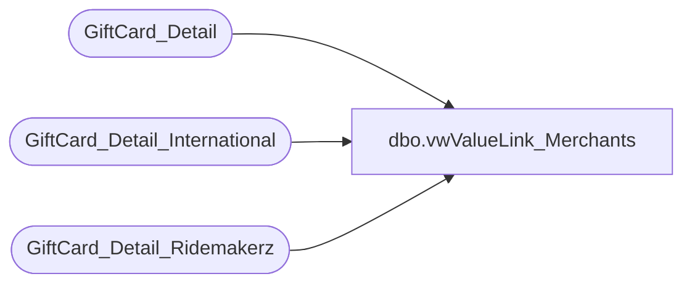

# dbo.vwValueLink_Merchants

**Database:** dw  
**Server:** papamart  

## Architecture Diagram



## Table Dependencies

| Referenced Table |
|---|
| GiftCard_Detail |
| GiftCard_Detail_International |
| GiftCard_Detail_Ridemakerz |

## View Code

```sql
create view dbo.vwValueLink_Merchants
as
select merchant_id , case
When merchant_id = '97001100007' Then 'Walgreens'
When merchant_id = '97016000002' Then 'Blackhawk'
When merchant_id = '97020300000' Then 'Build-A-Bear US'
When merchant_id = '97032000002' Then 'Build-A-Bear CAN'
When merchant_id = '97088700000' Then 'Build-A-Bear UK'
When merchant_id = '97136200003' Then 'InComm'
When merchant_id = '97153900006' Then 'Ridemakerz'
When merchant_id = '99909049997' Then 'Build-A-Bear US'
When merchant_id = '99909049998' Then 'Build A Bear CAN IVR'
When merchant_id = '99909049999' Then 'Build-A-Bear US'
When merchant_id = '99089599997' Then 'Build-A-Bear US'
When merchant_id = '99089599998' Then 'Build A Bear US IVR'
When merchant_id = '99087799999' Then 'Build A Bear Walgreens help desk'
When merchant_id = '99085839999' Then 'Build A Bear InComm help desk'
When merchant_id = '37020300000' Then 'Build-A-Bear US'
When merchant_id = '37023000000' Then 'Build-A-Bear CAN'
When merchant_id = '37032000002' Then 'Build-A-Bear CAN'
When merchant_id = '99084239999' Then 'Blackhawk help desk'
When merchant_id = '37023000002' Then 'Build-A-Bear CAN'
When merchant_id = '97023100239' Then 'Build-A-Bear US'
When merchant_id = '19708' Then 'Build-A-Bear US'
When merchant_id = '29708' Then 'Build-A-Bear US'
When merchant_id = '97005600002' Then 'Build-A-Bear US'
When merchant_id = '97088750003' Then 'Build-A-Bear US'
When merchant_id = '60312233979' Then 'Build-A-Bear US'
When merchant_id = '60312247248' Then 'Build-A-Bear US'
When merchant_id = '60312255649' Then 'Build-A-Bear US'
When merchant_id = '97088700000' Then 'Build-A-Bear UK'
When merchant_id = '97020300000' Then 'Build-A-Bear US'
When merchant_id = '97032000002' Then 'Build-A-Bear CAN'
When merchant_id = '97088900006' Then 'Build-A-Bear SWE'
When merchant_id = '99086439997' Then 'Build-A-Bear UK Internet'
When merchant_id = '99086439999' Then 'Build-A-Bear UK help Desk'
When merchant_id = '99909049999' Then 'Unspecified'
When merchant_id = '99086429999' Then 'Build-A-Bear Denmark help Desk'
When merchant_id = '99909049998' Then 'Build-A-Bear IVR'
When merchant_id = '97153900006' Then 'Ridemakerz'
When merchant_id = '99085259997' Then 'Ridemakerz'
When merchant_id = '99085259998' Then 'Ridemakerz'
When merchant_id = '99085259999' Then 'Ridemakerz'
ELSE'Unspecified' END as Merchant
FROM GiftCard_Detail_Ridemakerz with (nolock)
GROUP BY  merchant_id,  
CASE
When merchant_id = '97001100007' Then 'Walgreens'
When merchant_id = '97016000002' Then 'Blackhawk'
When merchant_id = '97020300000' Then 'Build-A-Bear US'
When merchant_id = '97032000002' Then 'Build-A-Bear CAN'
When merchant_id = '97088700000' Then 'Build-A-Bear UK'
When merchant_id = '97136200003' Then 'InComm'
When merchant_id = '97153900006' Then 'Ridemakerz'
When merchant_id = '99909049997' Then 'Build-A-Bear US'
When merchant_id = '99909049998' Then 'Build A Bear CAN IVR'
When merchant_id = '99909049999' Then 'Build-A-Bear US'
When merchant_id = '99089599997' Then 'Build-A-Bear US'
When merchant_id = '99089599998' Then 'Build A Bear US IVR'
When merchant_id = '99087799999' Then 'Build A Bear Walgreens help desk'
When merchant_id = '99085839999' Then 'Build A Bear InComm help desk'
When merchant_id = '37020300000' Then 'Build-A-Bear US'
When merchant_id = '37023000000' Then 'Build-A-Bear CAN'
When merchant_id = '37032000002' Then 'Build-A-Bear CAN'
When merchant_id = '99084239999' Then 'Blackhawk help desk'
When merchant_id = '37023000002' Then 'Build-A-Bear CAN'
When merchant_id = '97023100239' Then 'Build-A-Bear US'
When merchant_id = '19708' Then 'Build-A-Bear US'
When merchant_id = '29708' Then 'Build-A-Bear US'
When merchant_id = '97005600002' Then 'Build-A-Bear US'
When merchant_id = '97088750003' Then 'Build-A-Bear US'
When merchant_id = '60312233979' Then 'Build-A-Bear US'
When merchant_id = '60312247248' Then 'Build-A-Bear US'
When merchant_id = '60312255649' Then 'Build-A-Bear US'
When merchant_id = '97088700000' Then 'Build-A-Bear UK'
When merchant_id = '97020300000' Then 'Build-A-Bear US'
When merchant_id = '97032000002' Then 'Build-A-Bear CAN'
When merchant_id = '97088900006' Then 'Build-A-Bear SWE'
When merchant_id = '99086439997' Then 'Build-A-Bear UK Internet'
When merchant_id = '99086439999' Then 'Build-A-Bear UK help Desk'
When merchant_id = '99909049999' Then 'Unspecified'
When merchant_id = '99086429999' Then 'Build-A-Bear Denmark help Desk'
When merchant_id = '99909049998' Then 'Build-A-Bear IVR'
When merchant_id = '97153900006' Then 'Ridemakerz'
When merchant_id = '99085259997' Then 'Ridemakerz'
When merchant_id = '99085259998' Then 'Ridemakerz'
When merchant_id = '99085259999' Then 'Ridemakerz'
ELSE'Unspecified' END
UNION

select merchant_id , case
When merchant_id = '97001100007' Then 'Walgreens'
When merchant_id = '97016000002' Then 'Blackhawk'
When merchant_id = '97020300000' Then 'Build-A-Bear US'
When merchant_id = '97032000002' Then 'Build-A-Bear CAN'
When merchant_id = '97088700000' Then 'Build-A-Bear UK'
When merchant_id = '97136200003' Then 'InComm'
When merchant_id = '97153900006' Then 'Ridemakerz'
When merchant_id = '99909049997' Then 'Build-A-Bear US'
When merchant_id = '99909049998' Then 'Build A Bear CAN IVR'
When merchant_id = '99909049999' Then 'Build-A-Bear US'
When merchant_id = '99089599997' Then 'Build-A-Bear US'
When merchant_id = '99089599998' Then 'Build A Bear US IVR'
When merchant_id = '99087799999' Then 'Build A Bear Walgreens help desk'
When merchant_id = '99085839999' Then 'Build A Bear InComm help desk'
When merchant_id = '37020300000' Then 'Build-A-Bear US'
When merchant_id = '37023000000' Then 'Build-A-Bear CAN'
When merchant_id = '37032000002' Then 'Build-A-Bear CAN'
When merchant_id = '99084239999' Then 'Blackhawk help desk'
When merchant_id = '37023000002' Then 'Build-A-Bear CAN'
When merchant_id = '97023100239' Then 'Build-A-Bear US'
When merchant_id = '19708' Then 'Build-A-Bear US'
When merchant_id = '29708' Then 'Build-A-Bear US'
When merchant_id = '97005600002' Then 'Build-A-Bear US'
When merchant_id = '97088750003' Then 'Build-A-Bear US'
When merchant_id = '60312233979' Then 'Build-A-Bear US'
When merchant_id = '60312247248' Then 'Build-A-Bear US'
When merchant_id = '60312255649' Then 'Build-A-Bear US'
When merchant_id = '97088700000' Then 'Build-A-Bear UK'
When merchant_id = '97020300000' Then 'Build-A-Bear US'
When merchant_id = '97032000002' Then 'Build-A-Bear CAN'
When merchant_id = '97088900006' Then 'Build-A-Bear SWE'
When merchant_id = '99086439997' Then 'Build-A-Bear UK Internet'
When merchant_id = '99086439999' Then 'Build-A-Bear UK help Desk'
When merchant_id = '99909049999' Then 'Unspecified'
When merchant_id = '99086429999' Then 'Build-A-Bear Denmark help Desk'
When merchant_id = '99909049998' Then 'Build-A-Bear IVR'
When merchant_id = '97153900006' Then 'Ridemakerz'
When merchant_id = '99085259997' Then 'Ridemakerz'
When merchant_id = '99085259998' Then 'Ridemakerz'
When merchant_id = '99085259999' Then 'Ridemakerz'
ELSE'Unspecified' END as Merchant
FROM GiftCard_Detail_International with (nolock)
GROUP BY  merchant_id,  
CASE
When merchant_id = '97001100007' Then 'Walgreens'
When merchant_id = '97016000002' Then 'Blackhawk'
When merchant_id = '97020300000' Then 'Build-A-Bear US'
When merchant_id = '97032000002' Then 'Build-A-Bear CAN'
When merchant_id = '97088700000' Then 'Build-A-Bear UK'
When merchant_id = '97136200003' Then 'InComm'
When merchant_id = '97153900006' Then 'Ridemakerz'
When merchant_id = '99909049997' Then 'Build-A-Bear US'
When merchant_id = '99909049998' Then 'Build A Bear CAN IVR'
When merchant_id = '99909049999' Then 'Build-A-Bear US'
When merchant_id = '99089599997' Then 'Build-A-Bear US'
When merchant_id = '99089599998' Then 'Build A Bear US IVR'
When merchant_id = '99087799999' Then 'Build A Bear Walgreens help desk'
When merchant_id = '99085839999' Then 'Build A Bear InComm help desk'
When merchant_id = '37020300000' Then 'Build-A-Bear US'
When merchant_id = '37023000000' Then 'Build-A-Bear CAN'
When merchant_id = '37032000002' Then 'Build-A-Bear CAN'
When merchant_id = '99084239999' Then 'Blackhawk help desk'
When merchant_id = '37023000002' Then 'Build-A-Bear CAN'
When merchant_id = '97023100239' Then 'Build-A-Bear US'
When merchant_id = '19708' Then 'Build-A-Bear US'
When merchant_id = '29708' Then 'Build-A-Bear US'
When merchant_id = '97005600002' Then 'Build-A-Bear US'
When merchant_id = '97088750003' Then 'Build-A-Bear US'
When merchant_id = '60312233979' Then 'Build-A-Bear US'
When merchant_id = '60312247248' Then 'Build-A-Bear US'
When merchant_id = '60312255649' Then 'Build-A-Bear US'
When merchant_id = '97088700000' Then 'Build-A-Bear UK'
When merchant_id = '97020300000' Then 'Build-A-Bear US'
When merchant_id = '97032000002' Then 'Build-A-Bear CAN'
When merchant_id = '97088900006' Then 'Build-A-Bear SWE'
When merchant_id = '99086439997' Then 'Build-A-Bear UK Internet'
When merchant_id = '99086439999' Then 'Build-A-Bear UK help Desk'
When merchant_id = '99909049999' Then 'Unspecified'
When merchant_id = '99086429999' Then 'Build-A-Bear Denmark help Desk'
When merchant_id = '99909049998' Then 'Build-A-Bear IVR'
When merchant_id = '97153900006' Then 'Ridemakerz'
When merchant_id = '99085259997' Then 'Ridemakerz'
When merchant_id = '99085259998' Then 'Ridemakerz'
When merchant_id = '99085259999' Then 'Ridemakerz'
ELSE'Unspecified' END
UNION
select merchant_id , case
When merchant_id = '97001100007' Then 'Walgreens'
When merchant_id = '97016000002' Then 'Blackhawk'
When merchant_id = '97020300000' Then 'Build-A-Bear US'
When merchant_id = '97032000002' Then 'Build-A-Bear CAN'
When merchant_id = '97088700000' Then 'Build-A-Bear UK'
When merchant_id = '97136200003' Then 'InComm'
When merchant_id = '97153900006' Then 'Ridemakerz'
When merchant_id = '99909049997' Then 'Build-A-Bear US'
When merchant_id = '99909049998' Then 'Build A Bear CAN IVR'
When merchant_id = '99909049999' Then 'Build-A-Bear US'
When merchant_id = '99089599997' Then 'Build-A-Bear US'
When merchant_id = '99089599998' Then 'Build A Bear US IVR'
When merchant_id = '99087799999' Then 'Build A Bear Walgreens help desk'
When merchant_id = '99085839999' Then 'Build A Bear InComm help desk'
When merchant_id = '37020300000' Then 'Build-A-Bear US'
When merchant_id = '37023000000' Then 'Build-A-Bear CAN'
When merchant_id = '37032000002' Then 'Build-A-Bear CAN'
When merchant_id = '99084239999' Then 'Blackhawk help desk'
When merchant_id = '37023000002' Then 'Build-A-Bear CAN'
When merchant_id = '97023100239' Then 'Build-A-Bear US'
When merchant_id = '19708' Then 'Build-A-Bear US'
When merchant_id = '29708' Then 'Build-A-Bear US'
When merchant_id = '97005600002' Then 'Build-A-Bear US'
When merchant_id = '97088750003' Then 'Build-A-Bear US'
When merchant_id = '60312233979' Then 'Build-A-Bear US'
When merchant_id = '60312247248' Then 'Build-A-Bear US'
When merchant_id = '60312255649' Then 'Build-A-Bear US'
When merchant_id = '97088700000' Then 'Build-A-Bear UK'
When merchant_id = '97020300000' Then 'Build-A-Bear US'
When merchant_id = '97032000002' Then 'Build-A-Bear CAN'
When merchant_id = '97088900006' Then 'Build-A-Bear SWE'
When merchant_id = '99086439997' Then 'Build-A-Bear UK Internet'
When merchant_id = '99086439999' Then 'Build-A-Bear UK help Desk'
When merchant_id = '99909049999' Then 'Unspecified'
When merchant_id = '99086429999' Then 'Build-A-Bear Denmark help Desk'
When merchant_id = '99909049998' Then 'Build-A-Bear IVR'
When merchant_id = '97153900006' Then 'Ridemakerz'
When merchant_id = '99085259997' Then 'Ridemakerz'
When merchant_id = '99085259998' Then 'Ridemakerz'
When merchant_id = '99085259999' Then 'Ridemakerz'
ELSE'Unspecified' END as Merchant
FROM GiftCard_Detail with (nolock)
GROUP BY  merchant_id,  
CASE
When merchant_id = '97001100007' Then 'Walgreens'
When merchant_id = '97016000002' Then 'Blackhawk'
When merchant_id = '97020300000' Then 'Build-A-Bear US'
When merchant_id = '97032000002' Then 'Build-A-Bear CAN'
When merchant_id = '97088700000' Then 'Build-A-Bear UK'
When merchant_id = '97136200003' Then 'InComm'
When merchant_id = '97153900006' Then 'Ridemakerz'
When merchant_id = '99909049997' Then 'Build-A-Bear US'
When merchant_id = '99909049998' Then 'Build A Bear CAN IVR'
When merchant_id = '99909049999' Then 'Build-A-Bear US'
When merchant_id = '99089599997' Then 'Build-A-Bear US'
When merchant_id = '99089599998' Then 'Build A Bear US IVR'
When merchant_id = '99087799999' Then 'Build A Bear Walgreens help desk'
When merchant_id = '99085839999' Then 'Build A Bear InComm help desk'
When merchant_id = '37020300000' Then 'Build-A-Bear US'
When merchant_id = '37023000000' Then 'Build-A-Bear CAN'
When merchant_id = '37032000002' Then 'Build-A-Bear CAN'
When merchant_id = '99084239999' Then 'Blackhawk help desk'
When merchant_id = '37023000002' Then 'Build-A-Bear CAN'
When merchant_id = '97023100239' Then 'Build-A-Bear US'
When merchant_id = '19708' Then 'Build-A-Bear US'
When merchant_id = '29708' Then 'Build-A-Bear US'
When merchant_id = '97005600002' Then 'Build-A-Bear US'
When merchant_id = '97088750003' Then 'Build-A-Bear US'
When merchant_id = '60312233979' Then 'Build-A-Bear US'
When merchant_id = '60312247248' Then 'Build-A-Bear US'
When merchant_id = '60312255649' Then 'Build-A-Bear US'
When merchant_id = '97088700000' Then 'Build-A-Bear UK'
When merchant_id = '97020300000' Then 'Build-A-Bear US'
When merchant_id = '97032000002' Then 'Build-A-Bear CAN'
When merchant_id = '97088900006' Then 'Build-A-Bear SWE'
When merchant_id = '99086439997' Then 'Build-A-Bear UK Internet'
When merchant_id = '99086439999' Then 'Build-A-Bear UK help Desk'
When merchant_id = '99909049999' Then 'Unspecified'
When merchant_id = '99086429999' Then 'Build-A-Bear Denmark help Desk'
When merchant_id = '99909049998' Then 'Build-A-Bear IVR'
When merchant_id = '97153900006' Then 'Ridemakerz'
When merchant_id = '99085259997' Then 'Ridemakerz'
When merchant_id = '99085259998' Then 'Ridemakerz'
When merchant_id = '99085259999' Then 'Ridemakerz'
ELSE'Unspecified' END
```

