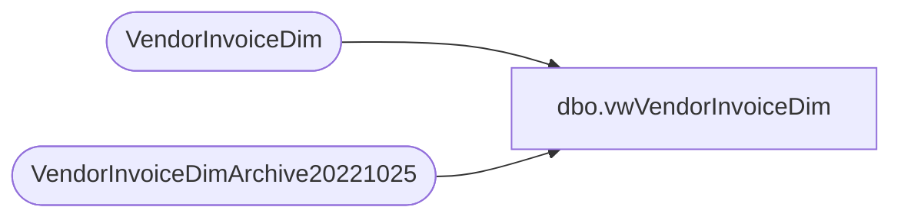

# dbo.vwVendorInvoiceDim

**Database:** dw  
**Server:** papamart  

## Architecture Diagram



## Table Dependencies

| Referenced Table |
|---|
| VendorInvoiceDim |
| VendorInvoiceDimArchive20221025 |

## View Code

```sql
CREATE VIEW [dbo].[vwVendorInvoiceDim]

as

with LegacyVID as (
select *
from VendorInvoiceDim
union
select *
from VendorInvoiceDimArchive20221025

) 

select *
from LegacyVID v
```

