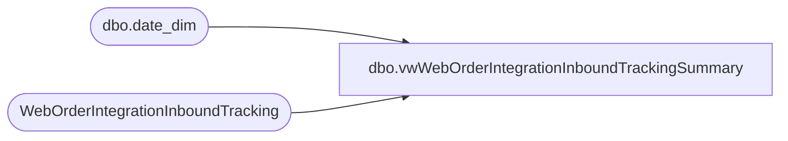

# dbo.vwWebOrderIntegrationInboundTrackingSummary

**Database:** dw  
**Server:** papamart  

## Architecture Diagram



## Table Dependencies

| Referenced Table |
|---|
| dbo.date_dim |
| WebOrderIntegrationInboundTracking |

## View Code

```sql
CREATE view [dbo].[vwWebOrderIntegrationInboundTrackingSummary]

as

With
DeckOrdersCreated as 
	(
		select 
			DeckOrderDate,
			Count(distinct DeckOrderNumber) as DeckOrdersCreated
		from WebOrderIntegrationInboundTracking
		where DeckOrderDate is not null
		group by DeckOrderDate
	),
ImportedOrders as
	(	
		select 
			ImportedDate,
			count(distinct ImportedWebOrderNumber) as ImportedOrders
		from WebOrderIntegrationInboundTracking
		where ImportedDate is not null
		group by ImportedDate	
	),
WebOrderProcessingOrders as
	(
		select 
			WebOrderProcessingOrderDate,
			isnull(WEB_US,0) US_WebOrders,
			isnull(STORE_US,0) US_StoreOrders,
			isnull(WEB_UK,0) UK_WebOrders,
			isnull(STORE_UK,0) UK_StoreOrders
		from 
			(
				select 
					WOPNewOrderStatusDate as WebOrderProcessingOrderDate,
					case 
						when WOPCountry = 'US' and WOPFulfillmentLocation = '0013'
							then 'WEB_US'
						when WOPCountry = 'US' and WOPFulfillmentLocation <> '0013' 
							then 'STORE_US'
						when WOPCountry = 'Uk' and WOPFulfillmentLocation = '2013'
							then 'WEB_UK'
						when WOPCountry = 'UK' and WOPFulfillmentLocation <> '2013' 
							then 'STORE_UK'
					end as WebOrderProcessingFulfillmentLocation,
					count(distinct WOPWebOrderNumber) WebOrderProcessingWebOrders
				from WebOrderIntegrationInboundTracking
				where WOPNewOrderStatusDate is not null
				group by 
					WOPNewOrderStatusDate,
					case 
						when WOPCountry = 'US' and WOPFulfillmentLocation = '0013'
							then 'WEB_US'
						when WOPCountry = 'US' and WOPFulfillmentLocation <> '0013' 
							then 'STORE_US'
						when WOPCountry = 'Uk' and WOPFulfillmentLocation = '2013'
							then 'WEB_UK'
						when WOPCountry = 'UK' and WOPFulfillmentLocation <> '2013' 
							then 'STORE_UK'
					end
			) as locations
		pivot
			(
				sum(WebOrderProcessingWebOrders)
				for WebOrderProcessingFulfillmentLocation in ([WEB_US], [STORE_US],[WEB_UK], [STORE_UK])
			) as wop
	),
DynamicsAPI as
	(
		select
			DynamicsAPILogDate,
			count(distinct DynamicsAPIWebOrderNumber) DynamicsAPIWebOrders
		from WebOrderIntegrationInboundTracking
		where DynamicsAPILogDate is not null
		group by DynamicsAPILogDate
	),
DynamicsOrders as
	(
		select
			DynamicsOrderCreationDateTime DynamicsOrderDate,
			count(distinct DynamicsSalesOrderNumber) as DynamicsOrdersCreated
		from WebOrderIntegrationInboundTracking
		where DynamicsOrderCreationDateTime is not null
		group by DynamicsOrderCreationDateTime
	),
UKFTP as
	(
		select 
			UKFTPLogDate,
			count(distinct UKFTPWebOrderNumber) UKFTPOrders
		from WebOrderIntegrationInboundTracking
		where UKFTPLogDate is not null
		group by UKFTPLogDate
	),
UKOrdersCreated as
	(
		select 
			UKCreatedLogDate,
			count(distinct UKCreatedWebOrderNumber) UKCreatedOrders
		from WebOrderIntegrationInboundTracking
		where UKCreatedLogDate is not null
		group by UKCreatedLogDate
	)
select 
	cast(dd.actual_date as date) as ActualDate,
	isnull(oc.DeckOrdersCreated,0) as DeckOrdersCreated,
	isnull(i.ImportedOrders,0) as ImportedOrders,
	isnull(wop.US_WebOrders,0) as US_WebOrders,
	isnull(wop.US_StoreOrders,0) as US_StoreOrders,
	isnull(wop.UK_WebOrders,0) as UK_WebOrders,
	isnull(wop.UK_StoreOrders,0) as UK_StoreOrders,
	isnull(api.DynamicsAPIWebOrders,0) as DynamicsAPIWebOrders,
	isnull(d.DynamicsOrdersCreated,0) as DynamicsOrdersCreated,
	isnull(ftp.UKFTPOrders,0) as UKFTPOrders,
	isnull(uk.UKCreatedOrders,0) as UKCreatedOrders
from dw.dbo.date_dim dd 
left join DeckOrdersCreated oc on cast(dd.actual_date as date)=oc.DeckOrderDate
left join ImportedOrders i on cast(dd.actual_date as date)=i.ImportedDate
left join WebOrderProcessingOrders wop on cast(dd.actual_date as date)=wop.WebOrderProcessingOrderDate
left join DynamicsAPI api on cast(dd.actual_date as date)=api.DynamicsAPILogDate
left join DynamicsOrders d on cast(dd.actual_date as date)=d.DynamicsOrderDate
left join UKFTP ftp on cast(dd.actual_date as date)=UKFTPLogDate
left join UKOrdersCreated uk on cast(dd.actual_date as date)=UKCreatedLogDate
where 1=1
and cast(dd.actual_date as date) <= cast(getdate() as date)
```

