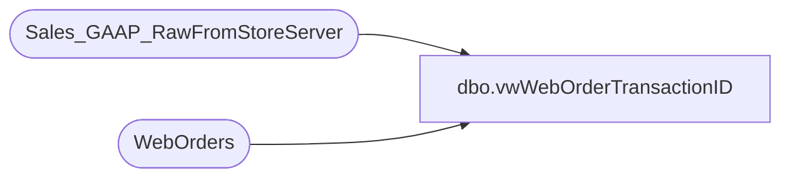

# dbo.vwWebOrderTransactionID

**Database:** dw  
**Server:** papamart  

## Architecture Diagram



## Table Dependencies

| Referenced Table |
|---|
| Sales_GAAP_RawFromStoreServer |
| WebOrders |

## View Code

```sql
CREATE view vwWebOrderTransactionID

as 

select 
	s.WebOrderNumber,
	s.TransactionID,
	s.store_no as StoreNumber,
	wo.OrderDate,
	s.entry_date as ShipDate,
	datediff(dd, wo.OrderDate, s.entry_date) ProcessingDays
from Sales_GAAP_RawFromStoreServer s
left join WebOrders wo on s.WebOrderNumber=wo.OrderNum
where 1=1
and s.TransactionID is not null
and wo.OrderDate is not null
```

