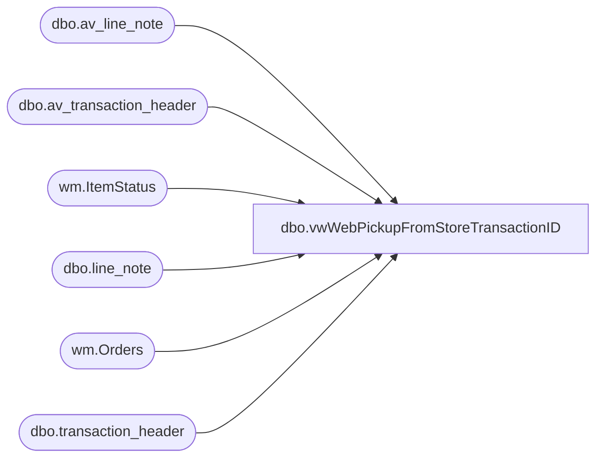

# dbo.vwWebPickupFromStoreTransactionID

**Database:** dw  
**Server:** papamart  

## Architecture Diagram



## Table Dependencies

| Referenced Table |
|---|
| dbo.av_line_note |
| dbo.av_transaction_header |
| wm.ItemStatus |
| dbo.line_note |
| wm.Orders |
| dbo.transaction_header |

## View Code

```sql
create view vwWebPickupFromStoreTransactionID

as 

with
PickUpOrders as
	(
		select o.OrderNumber
		from [bearcluster01.sql.buildabear.com].WebOrderProcessing.wm.Orders o with (nolock)
		join [bearcluster01.sql.buildabear.com].WebOrderProcessing.wm.ItemStatus oi on o.OrderID=oi.OrderID
		where oi.Status in 
			(
				'OPPU',
				'ORPU', 
				'OPU',
				'OIVNC',
				'OIV'
			)
		group by o.OrderNumber
	)
select  
	th.transaction_id
from bedrockdb01.auditworks.dbo.transaction_header th (nolock)
join bedrockdb01.auditworks.dbo.line_note ln (nolock) on th.transaction_id = ln.transaction_id
where th.store_no not in ('13', '2013')
and ln.line_note like 'Web Order%'
and exists (select OrderNumber from PickUpOrders po where po.OrderNumber COLLATE SQL_Latin1_General_CP1_CI_AS =cast(substring (ln.line_note, 12,30) as varchar(8))) 
group by 
	th.transaction_id
union 
select  
	th.av_transaction_id as transaction_id
from bedrockdb01.auditworks.dbo.av_transaction_header th (nolock)
join bedrockdb01.auditworks.dbo.av_line_note ln (nolock) on th.av_transaction_id = ln.av_transaction_id
where th.store_no not in ('13', '2013')
and ln.line_note like 'Web Order%'
and exists (select OrderNumber from PickUpOrders po where po.OrderNumber COLLATE SQL_Latin1_General_CP1_CI_AS =cast(substring (ln.line_note, 12,30) as varchar(8)))
group by 
	th.av_transaction_id
```

