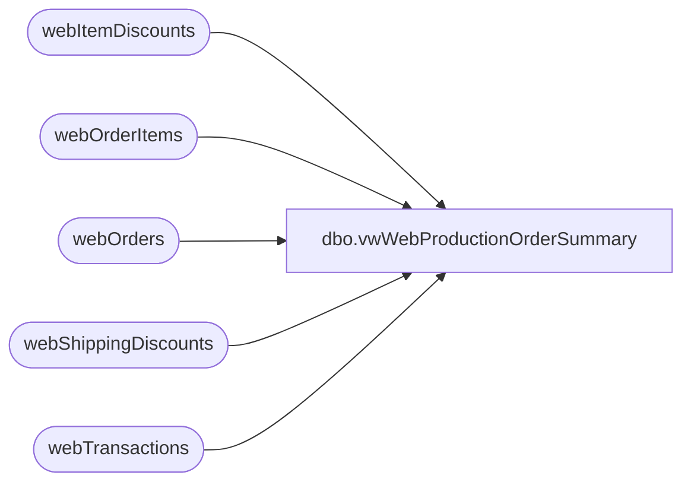

# dbo.vwWebProductionOrderSummary

**Database:** dw  
**Server:** papamart  

## Architecture Diagram



## Table Dependencies

| Referenced Table |
|---|
| webItemDiscounts |
| webOrderItems |
| webOrders |
| webShippingDiscounts |
| webTransactions |

## View Code

```sql
CREATE view [dbo].[vwWebProductionOrderSummary]
as

------------------------------------------------------------------------------------------------------------------------------------------
--Dan Tweedie - 2017-10-23 - Created view (work in progress) 
------------------------------------------------------------------------------------------------------------------------------------------


WITH
	Transactions as
		(
			select
				TransactionID,
				sum(TaxAmount) TaxAmount
			from webTransactions
			group by 
				TransactionID
		),
	OrderItems as
		(
			select 
				OrderID,
				sum(Price) Price,
				sum(DiscountedPrice) DiscountedPrice,
				max(TrackingNumber) TrackingNumber
			from webOrderItems
			group by OrderID
		),
	ItemDiscounts as
		(
			select 
				OrderID,
				sum(DiscountAmount) ItemDiscount
			from webItemDiscounts
			group by OrderID
		),
	Shipping as 
		(
			select
				OrderID,
				sum(ShippingAmount) as ShippingPrice
			from webOrders with (nolock)
			group by OrderID
		),
	ShippingDiscounts as
		(
			select 
				OrderID,
				sum(DiscountAmount) ShippingDiscount
			from webShippingDiscounts
			where DiscountAmount is not NULL
			group by OrderID
		),
	OrdersSummary as
		(
			select  
				replace(o.SourceSite, '-', '_') as WebSite,
				o.OrderID,
				o.OrderNum,
				o.OrderDate,
				o.OrderStatus,
				o.StatusDate,
				case 
					when substring(o.OrderNum, 9,1) = '_'
						then 'YES'
					else 'NO'
				end as SendToWMS,
				case o.OrderStatus
					when 'New' then 1
					when 'Pending' then 2
					when 'Waved' then 3
					when 'Shipped' then 4
					when 'Complete' then 5
					when 'Cancelled' then 6
				end as StatusSortOrder,
				isnull(i.Price,0) as Price,
				isnull(i.Price,0) 
				+ isnull(s.ShippingPrice,0)
				- isnull(id.ItemDiscount,0)
				-isnull(sd.ShippingDiscount,0) 
				as SubTotal,
				isnull(t.TaxAmount,0) as TaxAmount,

				isnull(s.ShippingPrice,0) 
				- isnull(sd.ShippingDiscount,0)
				as ShippingTotal,

				isnull(id.ItemDiscount,0) as ItemDiscount,
				isnull(s.ShippingPrice,0) as ShippingPrice,
				isnull(sd.ShippingDiscount,0) as ShippingDiscount,
				i.TrackingNumber,
				o.ShipToState,
				o.ShipToPostalCode,
				o.ShipToCountry,
				o.ESReferenceNbr,
				replace(o.SourceSite, '-', '_') as SourceSite
			from Transactions t
			join webOrders o with (nolock) on t.TransactionID = o.TransactionID
			left join OrderItems i on o.OrderID = i.OrderID
			left join Shipping s on o.OrderID = s.OrderID
			left join ItemDiscounts id on i.OrderID = id.OrderID
			left join ShippingDiscounts sd on s.OrderID = sd.OrderID
		)
select 
	os.OrderID as ProductionOrderId, 
	cast(os.OrderNum as varchar(32)) as ProductionOrderNumber,
	os.SubTotal as ProductionOrderSubTotal,
	os.ShippingTotal as ProductionOrderShippingAndHandling,
	NULL as ProductionOrderPromoCode, --view is expecting one record per OrderID, but our tables have multiple
	ItemDiscount
	+ ShippingDiscount
		as ProductionOrderPromoDiscount,  --view is expecting one record per OrderID, but our tables have multiple
	NULL as ProductionOrderPromoDescription, --view is expecting one record per OrderID, but our tables have multiple
	NULL as ProductionOrderBearBucksNumber, --view is expecting one record per OrderID, but our tables have multiple
	os.SubTotal
	+ os.TaxAmount
		as ProductionOrderTotal, 
	os.OrderDate as ProductionOrderDateTimeCreated, 
	NULL as ProductionOrderDeferredShipDate, 
	cast(os.TrackingNumber as varchar(50)) as ProductionOrderTrackingNumber,  
	cast(os.ShipToState as nvarchar(50)) as ProductionOrderShippingStateProvince, 
	cast(os.ShipToPostalCode as nvarchar(20)) as ProductionOrderShippingZipPostalCode, 
	cast(os.ShipToCountry as nvarchar(50)) as ProductionOrderShippingCountry, 
	NULL as ProductionOrderIsWillCall, 
	NULL as ProductionOrderIsLoyaltyMember, 
	NULL as ProductionOrderLoyaltyNumber, 
	cast(os.OrderStatus as varchar(50)) as ProductionOrderWebOrderStatus, 
	cast(os.SourceSite as varchar(32)) as ProductionOrderCatalogName, 
	NULL as ProductionOrderNumberOfPackages, 
	cast(os.OrderID as int) as ProductionOrderWebCartOrderId, 
	0 as ProductionOrderWebCartUpdateMsgSent, 
	cast(os.SourceSite as nvarchar(20)) as ProductionOrderSiteCode, 
	NULL as ProductionOrderBearBuilderId, 
	NULL as ProductionOrderBuyStuffStamps, 
	os.ShippingTotal as ProductionOrderActuallShippingCost, 
	cast(case when substring(os.OrderNum, 9,1) = '_' then 1 else 0 end as bit) as ProductionOrderHasShippableProducts, 
	NULL as ProductionOrderWH_version, 
	NULL as ProductionOrderReceiptCode, 
	cast('BEARCLUSTER01' as nvarchar(50)) as ProductionOrderServerName,
	os.StatusDate,
	os.ESReferenceNbr
from OrdersSummary os (nolock)
```

