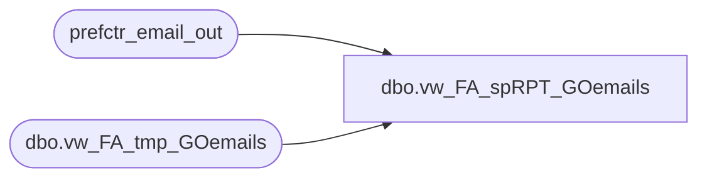

# dbo.vw_FA_spRPT_GOemails

**Database:** dw  
**Server:** papamart  

## Architecture Diagram



## Table Dependencies

| Referenced Table |
|---|
| prefctr_email_out |
| dbo.vw_FA_tmp_GOemails |

## View Code

```sql
create view dbo.vw_FA_spRPT_GOemails 
as
select distinct lower(email) email,store_id from dbo.vw_FA_tmp_GOemails d
	left join 
		(select distinct email_addr_lc from prefctr_email_out where date_optbackin is null) a
	on d.email = a.email_addr_lc
where a.email_addr_lc is null
and d.email is not null
```

