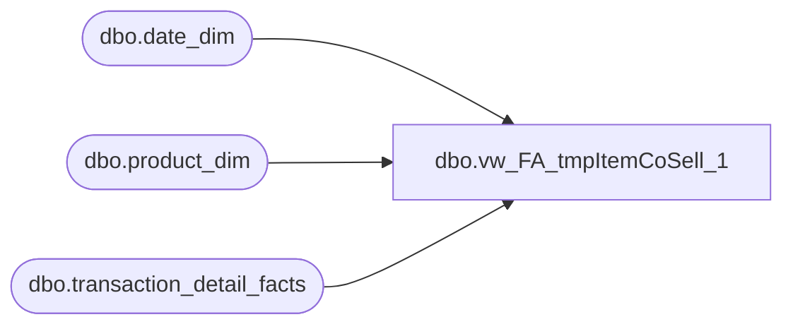

# dbo.vw_FA_tmpItemCoSell_1

**Database:** dw  
**Server:** papamart  

## Architecture Diagram



## Table Dependencies

| Referenced Table |
|---|
| dbo.date_dim |
| dbo.product_dim |
| dbo.transaction_detail_facts |

## View Code

```sql
CREATE VIEW [dbo].[vw_FA_tmpItemCoSell_1]
	AS
	SELECT DISTINCT
		t.transaction_id,
		t.store_key,
		t.date_key,
		p.sku,
		d.actual_date
	FROM
		dbo.transaction_detail_facts t
		JOIN dbo.product_dim p
			ON p.product_key = t.product_key
			JOIN dbo.date_dim d
				ON d.date_key = t.date_key
				--where p.sku =@iItem -- 7018 

				--and (d.actual_date BETWEEN @StartDate AND @EndDate) --- '5/1/2005' AND '5/10/2005')
				AND t.transaction_line_seq >= 0
```

