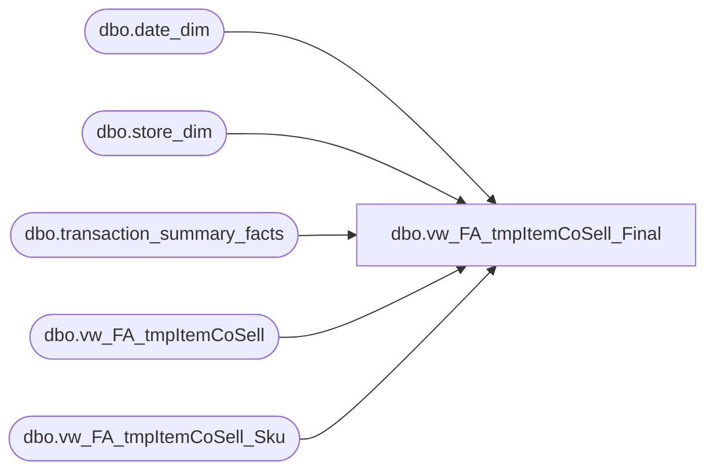

# dbo.vw_FA_tmpItemCoSell_Final

**Database:** dw  
**Server:** papamart  

## Architecture Diagram



## Table Dependencies

| Referenced Table |
|---|
| dbo.date_dim |
| dbo.store_dim |
| dbo.transaction_summary_facts |
| dbo.vw_FA_tmpItemCoSell |
| dbo.vw_FA_tmpItemCoSell_Sku |

## View Code

```sql
create view dbo.vw_FA_tmpItemCoSell_Final --WITH SCHEMABINDING
as

Select  a.transaction_id,
	a.sku,
	a.product_desc,
	a.department,
	a.units, --b.ttlUnits,
	sd.store_id,
	dd.actual_date,
	dd.fiscal_week,
	dd.fiscal_period,
	dd.fiscal_year,
	tsf.Net_Sale/b.ttlSku as ttlHoneyBySku

--into #tmpItemCoSell_final
from dbo.vw_FA_tmpItemCoSell a
join dbo.vw_FA_tmpItemCoSell_Sku b on  a.transaction_id = b.transaction_id
join dbo.transaction_summary_facts tsf on a.transaction_id = tsf.transaction_id
join dbo.store_dim sd on a.store_key = sd.store_key  
join dbo.date_dim dd on a.date_key = dd.date_key
```

