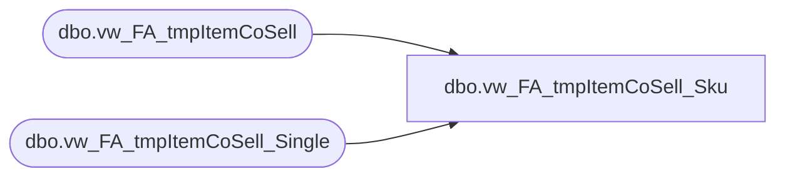

# dbo.vw_FA_tmpItemCoSell_Sku

**Database:** dw  
**Server:** papamart  

## Architecture Diagram



## Table Dependencies

| Referenced Table |
|---|
| dbo.vw_FA_tmpItemCoSell |
| dbo.vw_FA_tmpItemCoSell_Single |

## View Code

```sql
create view dbo.vw_FA_tmpItemCoSell_Sku --WITH SCHEMABINDING
as


select distinct a.transaction_id,a.store_key, a.date_key, count(distinct sku) as ttlSku, sum(units) as ttlUnits 
--into dbo.#tmpItemCoSell_Sku
from dbo.vw_FA_tmpItemCoSell_Single a with (nolock)
join dbo.vw_FA_tmpItemCoSell b with (nolock) on a.transaction_id = b.transaction_id
group by a.transaction_id,a.store_key, a.date_key
```

