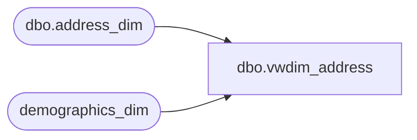

# dbo.vwdim_address

**Database:** dw  
**Server:** papamart  

## Architecture Diagram



## Table Dependencies

| Referenced Table |
|---|
| dbo.address_dim |
| demographics_dim |

## View Code

```sql
create view vwdim_address
as
SELECT ad.[address_key]
      ,ad.[Address_ID]
      ,ad.[address1]
      ,ad.[address2]
      ,ad.[apt_unit]
      ,ad.[city]
      ,ad.[state_province]
      ,ad.[county]
      ,ad.[vanity_city]
      ,ad.[country]
      ,ad.[state_province_name]
      ,ad.[country_name]
      ,ad.[postal_code]
      ,ad.[carrier_route]
      ,ad.[latitude]
      ,ad.[longitude]
      ,ad.[postal_plus4]
      ,ad.[address3]
      ,ad.[address4]
      ,ad.[address5]
      ,ad.[blockgroup_cd]
--      ,[demographics_bg_key]
--      ,[demographics_zip_key]
      ,ad.[Verified_Address]
      ,ad.[apt_unit_y_n]
--      ,ad.[process_name]
--      ,ad.[process_date]
      ,ad.[addr_type_code]
      ,ad.[addr_type_desc]
      ,ad.[address1_orig]
      ,ad.[Status_Flag]
      ,d.[cluster_code]
      ,d.[cluster_name]
      ,d.[metro_code]
      ,d.[metro_name]
      ,d.[dma_code]
      ,d.[dma_name]
  FROM [dw].[dbo].[address_dim] ad
	join demographics_dim d on ad.demographics_bg_key = d.demographics_bg_key
```

