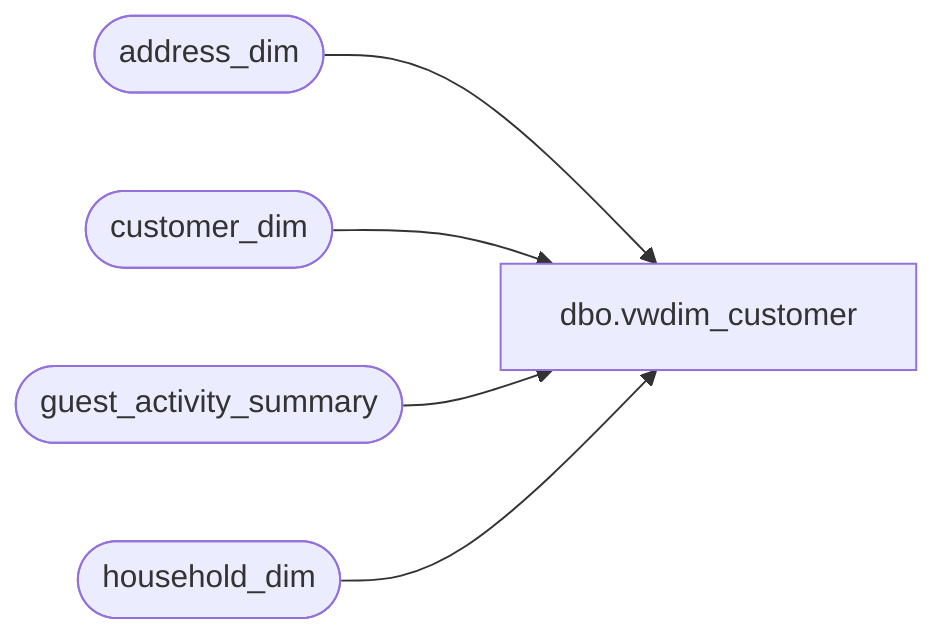

# dbo.vwdim_customer

**Database:** dw  
**Server:** papamart  

## Architecture Diagram



## Table Dependencies

| Referenced Table |
|---|
| address_dim |
| customer_dim |
| guest_activity_summary |
| household_dim |

## View Code

```sql
CREATE view vwdim_customer
as 
select 
 gas.customer_key		 as customer_key
,gas.current_address_key as address_key
,gas.household_key		as household_key
,cd.customer_num
,cd.customer_num_crm
,cd.loyalty_no
,cd.customer_key		as xref_customer_key
,ad.address_key			as xref_address_key
,hh.household_key		as xref_household_key
,cd.customer_num		as xref_customer_num
,NULL as active_record_flag	
,cd.first_name
,cd.last_name
,cd.nickname
,cd.gender
,cd.gender_dc as gender_dc
,cd.birth_date
,cd.email
,cd.head_of_household_y_n
,hh.household_surname
--,crm_household_match_key
--,dc_head_of_household
--,dc_household_key
,cd.send_email_y_n
,hh.send_mail_y_n
,cd.loyalty_send_email_y_n
--age_current
,cd.language
,gas.Number_Of_Visits
,gas.Recency_in_Months
,gas.Web_Number_Of_Visits
,gas.Web_Recency_In_Months
,gas.First_Visit_date_key
,gas.Last_Visit_date_key
,gas.Web_First_Visit_Date_Key
,gas.Web_Last_Visit_Date_key
,gas.nearest_store_key
,gas.distance_to_nearest_store
,gas.nearest_futurestore_key
,gas.distance_to_nearest_futurestore
--,ad.demographics_bg_key
--hosted_party_y_n
--lifetime_totals_etc...
,gas.process_date
,'vwcust' as source
from guest_activity_summary gas
	join address_dim ad on gas.current_address_key = ad.address_key 
	join customer_dim cd on gas.customer_key = cd.customer_key
	join household_dim hh on gas.household_key = hh.household_key
```

