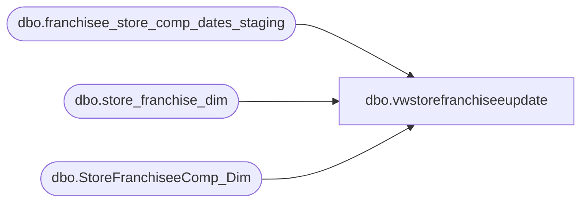

# dbo.vwstorefranchiseeupdate

**Database:** dw  
**Server:** papamart  

## Architecture Diagram



## Table Dependencies

| Referenced Table |
|---|
| dbo.franchisee_store_comp_dates_staging |
| dbo.store_franchise_dim |
| dbo.StoreFranchiseeComp_Dim |

## View Code

```sql
CREATE VIEW vwstorefranchiseeupdate 
AS
WITH CTE AS
(
SELECT s.store_key,d.recID
,s.end_date_key
,s.start_date_key
,ROW_NUMBER() OVER(partition by d.recid order by d.recid asc) as rnk
FROM
(SELECT l.store_key -- Lookup StoreKey
, ltrim(rtrim(s.Code)) as Code
, s.start_date_key
, s.end_date_key 
FROM dwstaging.dbo.franchisee_store_comp_dates_staging s 
INNER JOIN -- Source
dw.dbo.store_franchise_dim l -- lookup join
ON s.Code = l.store_id) s INNER JOIN	
dw.dbo.StoreFranchiseeComp_Dim d -- Target
ON s.store_key = d.store_key
WHERE s.end_date_key <> d.date_key_thru
OR s.start_date_key <> d.date_key_from
)
SELECT c.rnk,c.store_key,c.recID,c.end_date_key,c.start_date_key
FROM cte c
WHERE c.rnk = (SELECT MAX(rnk) FROM cte WHERE recid = c.recid)
```

