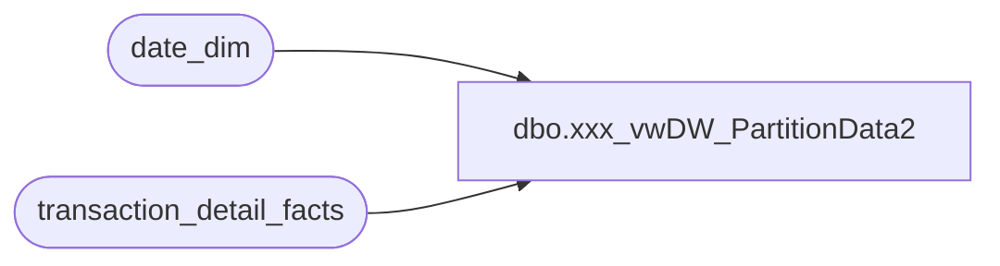

# dbo.xxx_vwDW_PartitionData2

**Database:** dw  
**Server:** papamart  

## Architecture Diagram



## Table Dependencies

| Referenced Table |
|---|
| date_dim |
| transaction_detail_facts |

## View Code

```sql
CREATE VIEW [dbo].[vwDW_PartitionData2]
AS
-- current and previous 2 months
	SELECT 'BAB DW' AS DataSourceID, 'Papa Mart' AS CubeName, 'Papa Mart' AS CubeID, 'Transactions' AS MeasureGroup, 'Transaction Detail Rollup' AS MeasureGroupID, 
			'Transactions_' + CAST(d.fiscal_year AS varchar) + '_' + CAST(d.fiscal_period AS varchar) + '_P' AS Partition, 'SELECT [dbo].[vwDW_Transactions].[date_key],[dbo].[vwDW_Transactions].[store_key],[dbo].[vwDW_Transactions].[transaction_id],[dbo].[vwDW_Transactions].[PartyFlag],[dbo].[vwDW_Transactions].[tender_group_key],[dbo].[vwDW_Transactions].[LineCount],[dbo].[vwDW_Transactions].[transaction_key],[dbo].[vwDW_Transactions].[GAAPTransactionFlag],[dbo].[vwDW_Transactions].[currency_key],[dbo].[vwDW_Transactions].[unit_net_amount],[dbo].[vwDW_Transactions].[Animal_UGA],[dbo].[vwDW_Transactions].[Non_Animal_UGA],[dbo].[vwDW_Transactions].[Footwear_UGA],[dbo].[vwDW_Transactions].[Accessories_UGA],[dbo].[vwDW_Transactions].[Sounds_UGA],[dbo].[vwDW_Transactions].[Clothing_UGA],[dbo].[vwDW_Transactions].[Other_UGA],[dbo].[vwDW_Transactions].[GaapSales],[dbo].[vwDW_Transactions].[GiftCardDiscount],[dbo].[vwDW_Transactions].[GiftCardsSoldUga],[dbo].[vwDW_Transactions].[MerchandiseUnits],[dbo].[vwDW_Transactions].[MerchandiseUga],[dbo].[vwDW_Transactions].[DonationsUga],[dbo].[vwDW_Transactions].[StuffingAndSuppliesUGA],[dbo].[vwDW_Transactions].[ShippingUGA],[dbo].[vwDW_Transactions].[OtherFeesUGA],[dbo].[vwDW_Transactions].[CubCashUGA],[dbo].[vwDW_Transactions].[PartyDepositUGA],[dbo].[vwDW_Transactions].[RewardCertificate],[dbo].[vwDW_Transactions].[BuyStuff],[dbo].[vwDW_Transactions].[Tax],[dbo].[vwDW_Transactions].[Redemptions],[dbo].[vwDW_Transactions].[CouponDiscount],[dbo].[vwDW_Transactions].[TotalDiscount],[dbo].[vwDW_Transactions].[AnimalUnits],[dbo].[vwDW_Transactions].[ShoeUnits],[dbo].[vwDW_Transactions].[SoundUnits],[dbo].[vwDW_Transactions].[UnitGrossAmount],[dbo].[vwDW_Transactions].[UnitDiscAmount],[dbo].[vwDW_Transactions].[NetSales] FROM [dbo].[vwDW_Transactions] WHERE store_key = 192 AND date_key &gt;= ' + CAST(min_date_key AS varchar) + ' AND date_key &lt;= ' + CAST(max_date_key AS varchar) AS SQL,
			CONVERT(VARCHAR(10), d.min_date_key) AS min_date_key, CONVERT(VARCHAR(10), d.max_date_key) AS max_date_key,
			1 AS ProcessFlag, '1000000' AS EstimatedRows, 'AggregationDesign 1' AS AggregationDesignID
	FROM
		(SELECT fiscal_year, fiscal_period,
			(SELECT fiscal_year FROM date_dim WHERE actual_date = convert(datetime, convert(char(10), GETDATE(), 101))) AS current_fiscal_year,
			(SELECT fiscal_period FROM date_dim WHERE actual_date = convert(datetime, convert(char(10), GETDATE(), 101))) AS current_fiscal_period,
			(SELECT MIN(date_key) FROM date_dim d2 WHERE d2.fiscal_year = d.fiscal_year AND d2.fiscal_period = d.fiscal_period) min_date_key, 
			(SELECT MAX(date_key) FROM date_dim d2 WHERE d2.fiscal_year = d.fiscal_year AND d2.fiscal_period = d.fiscal_period) max_date_key
		FROM
			(SELECT DISTINCT TOP 3 d2.fiscal_year, d2.fiscal_period
			FROM (SELECT period_id - 3 AS max_period_id FROM date_dim d2 WHERE actual_date = convert(datetime, convert(char(10), GETDATE(), 101))) d
			INNER JOIN date_dim d2 ON d2.period_id > d.max_period_id ORDER BY d2.fiscal_year, d2.fiscal_period) d) d
	--WHERE EXISTS (SELECT TOP 1 * FROM transaction_detail_facts WHERE date_key BETWEEN d.min_date_key AND d.max_date_key)

	UNION

	-- current year through 3 months ago
	SELECT 'BAB DW' AS DataSourceID, 'Papa Mart' AS CubeName, 'Papa Mart' AS CubeID, 'Transactions' AS MeasureGroup, 'Transaction Detail Rollup' AS MeasureGroupID, 
			'Transactions_' + CAST(d.fiscal_year AS varchar) + '_YTD' AS Partition, 'SELECT [dbo].[vwDW_Transactions].[date_key],[dbo].[vwDW_Transactions].[store_key],[dbo].[vwDW_Transactions].[transaction_id],[dbo].[vwDW_Transactions].[PartyFlag],[dbo].[vwDW_Transactions].[tender_group_key],[dbo].[vwDW_Transactions].[LineCount],[dbo].[vwDW_Transactions].[transaction_key],[dbo].[vwDW_Transactions].[GAAPTransactionFlag],[dbo].[vwDW_Transactions].[currency_key],[dbo].[vwDW_Transactions].[unit_net_amount],[dbo].[vwDW_Transactions].[Animal_UGA],[dbo].[vwDW_Transactions].[Non_Animal_UGA],[dbo].[vwDW_Transactions].[Footwear_UGA],[dbo].[vwDW_Transactions].[Accessories_UGA],[dbo].[vwDW_Transactions].[Sounds_UGA],[dbo].[vwDW_Transactions].[Clothing_UGA],[dbo].[vwDW_Transactions].[Other_UGA],[dbo].[vwDW_Transactions].[GaapSales],[dbo].[vwDW_Transactions].[GiftCardDiscount],[dbo].[vwDW_Transactions].[GiftCardsSoldUga],[dbo].[vwDW_Transactions].[MerchandiseUnits],[dbo].[vwDW_Transactions].[MerchandiseUga],[dbo].[vwDW_Transactions].[DonationsUga],[dbo].[vwDW_Transactions].[StuffingAndSuppliesUGA],[dbo].[vwDW_Transactions].[ShippingUGA],[dbo].[vwDW_Transactions].[OtherFeesUGA],[dbo].[vwDW_Transactions].[CubCashUGA],[dbo].[vwDW_Transactions].[PartyDepositUGA],[dbo].[vwDW_Transactions].[RewardCertificate],[dbo].[vwDW_Transactions].[BuyStuff],[dbo].[vwDW_Transactions].[Tax],[dbo].[vwDW_Transactions].[Redemptions],[dbo].[vwDW_Transactions].[CouponDiscount],[dbo].[vwDW_Transactions].[TotalDiscount],[dbo].[vwDW_Transactions].[AnimalUnits],[dbo].[vwDW_Transactions].[ShoeUnits],[dbo].[vwDW_Transactions].[SoundUnits],[dbo].[vwDW_Transactions].[UnitGrossAmount],[dbo].[vwDW_Transactions].[UnitDiscAmount],[dbo].[vwDW_Transactions].[NetSales] FROM [dbo].[vwDW_Transactions] WHERE store_key = 192 AND date_key &gt;= ' + CAST(min_date_key AS varchar) + ' AND date_key &lt;= ' + CAST(max_date_key AS varchar) AS SQL,
			CONVERT(VARCHAR(10), d.min_date_key) AS min_date_key, CONVERT(VARCHAR(10), d.max_date_key) AS max_date_key,
			0 AS ProcessFlag, CAST(1000000 * max_fiscal_period AS varchar) AS EstimatedRows, 'AggregationDesign 1' AS AggregationDesignID
	FROM
		(SELECT fiscal_year, max_fiscal_period,
			(SELECT fiscal_year FROM date_dim WHERE actual_date = convert(datetime, convert(char(10), GETDATE(), 101))) AS current_fiscal_year,
			(SELECT fiscal_period FROM date_dim WHERE actual_date = convert(datetime, convert(char(10), GETDATE(), 101))) AS current_fiscal_period,
			(SELECT MIN(date_key) FROM date_dim d2 WHERE d2.fiscal_year = d.fiscal_year) min_date_key, 
			(SELECT MAX(date_key) FROM date_dim d2 WHERE d2.fiscal_year = d.fiscal_year AND d2.fiscal_period = d.max_fiscal_period) max_date_key
		FROM
			(SELECT distinct d.fiscal_year, d.max_fiscal_period
			FROM (SELECT fiscal_year, fiscal_period - 3 AS max_fiscal_period FROM date_dim d2 WHERE actual_date = convert(datetime, convert(char(10), GETDATE(), 101))) d) d) d
	WHERE EXISTS (SELECT TOP 1 * FROM transaction_detail_facts WHERE date_key BETWEEN d.min_date_key AND d.max_date_key)

	UNION

	-- previous years
	SELECT 'BAB DW' AS DataSourceID, 'Papa Mart' AS CubeName, 'Papa Mart' AS CubeID, 'Transactions' AS MeasureGroup, 'Transaction Detail Rollup' AS MeasureGroupID, 
			'Transactions_' + CONVERT(VARCHAR(10), d.fiscal_year) AS Partition, 'SELECT [dbo].[vwDW_Transactions].[date_key],[dbo].[vwDW_Transactions].[store_key],[dbo].[vwDW_Transactions].[transaction_id],[dbo].[vwDW_Transactions].[PartyFlag],[dbo].[vwDW_Transactions].[tender_group_key],[dbo].[vwDW_Transactions].[LineCount],[dbo].[vwDW_Transactions].[transaction_key],[dbo].[vwDW_Transactions].[GAAPTransactionFlag],[dbo].[vwDW_Transactions].[currency_key],[dbo].[vwDW_Transactions].[unit_net_amount],[dbo].[vwDW_Transactions].[Animal_UGA],[dbo].[vwDW_Transactions].[Non_Animal_UGA],[dbo].[vwDW_Transactions].[Footwear_UGA],[dbo].[vwDW_Transactions].[Accessories_UGA],[dbo].[vwDW_Transactions].[Sounds_UGA],[dbo].[vwDW_Transactions].[Clothing_UGA],[dbo].[vwDW_Transactions].[Other_UGA],[dbo].[vwDW_Transactions].[GaapSales],[dbo].[vwDW_Transactions].[GiftCardDiscount],[dbo].[vwDW_Transactions].[GiftCardsSoldUga],[dbo].[vwDW_Transactions].[MerchandiseUnits],[dbo].[vwDW_Transactions].[MerchandiseUga],[dbo].[vwDW_Transactions].[DonationsUga],[dbo].[vwDW_Transactions].[StuffingAndSuppliesUGA],[dbo].[vwDW_Transactions].[ShippingUGA],[dbo].[vwDW_Transactions].[OtherFeesUGA],[dbo].[vwDW_Transactions].[CubCashUGA],[dbo].[vwDW_Transactions].[PartyDepositUGA],[dbo].[vwDW_Transactions].[RewardCertificate],[dbo].[vwDW_Transactions].[BuyStuff],[dbo].[vwDW_Transactions].[Tax],[dbo].[vwDW_Transactions].[Redemptions],[dbo].[vwDW_Transactions].[CouponDiscount],[dbo].[vwDW_Transactions].[TotalDiscount],[dbo].[vwDW_Transactions].[AnimalUnits],[dbo].[vwDW_Transactions].[ShoeUnits],[dbo].[vwDW_Transactions].[SoundUnits],[dbo].[vwDW_Transactions].[UnitGrossAmount],[dbo].[vwDW_Transactions].[UnitDiscAmount],[dbo].[vwDW_Transactions].[NetSales] FROM [dbo].[vwDW_Transactions] WHERE store_key = 192 AND date_key &gt;= ' + CAST(min_date_key AS varchar) + ' AND date_key &lt;= ' + CAST(max_date_key AS varchar) AS SQL,
			CONVERT(VARCHAR(10), d.min_date_key) AS min_date_key, CONVERT(VARCHAR(10), d.max_date_key) AS max_date_key,
			CASE WHEN d.current_fiscal_year = d.fiscal_year THEN 1
				WHEN d.fiscal_year = d.current_fiscal_year - 1 AND d.current_fiscal_period = 1 THEN 1
				ELSE 0 END AS ProcessFlag, '11000000' AS EstimatedRows, 'AggregationDesign 1' AS AggregationDesignID
	FROM
		(SELECT fiscal_year,
			(SELECT fiscal_year FROM date_dim WHERE actual_date = convert(datetime, convert(char(10), GETDATE(), 101))) AS current_fiscal_year,
			(SELECT fiscal_period FROM date_dim WHERE actual_date = convert(datetime, convert(char(10), GETDATE(), 101))) AS current_fiscal_period,
			(SELECT MIN(date_key) FROM date_dim d2 WHERE d2.fiscal_year = d.fiscal_year) min_date_key, 
			(SELECT MAX(date_key) FROM date_dim d2 WHERE d2.fiscal_year = d.fiscal_year) max_date_key
		FROM (SELECT DISTINCT fiscal_year FROM date_dim WHERE date_key >= (SELECT MIN(date_key) FROM date_dim d WHERE fiscal_year = (SELECT fiscal_year - 3 FROM date_dim d2 WHERE actual_date = convert(datetime, convert(char(10), GETDATE(), 101))))) d) d
	WHERE EXISTS (SELECT TOP 1 * FROM transaction_detail_facts WHERE date_key BETWEEN d.min_date_key AND d.max_date_key)
		AND d.fiscal_year < d.current_fiscal_year
```

