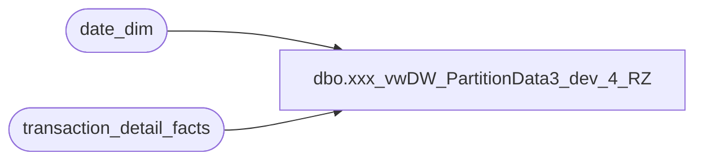

# dbo.xxx_vwDW_PartitionData3_dev_4_RZ

**Database:** dw  
**Server:** papamart  

## Architecture Diagram



## Table Dependencies

| Referenced Table |
|---|
| date_dim |
| transaction_detail_facts |

## View Code

```sql
CREATE VIEW [dbo].[vwDW_PartitionData3_dev_4_RZ]
AS

	-- BAB stores
	SELECT 'BAB DW' AS DataSourceID, 'Papa Mart' AS CubeName, 'Papa Mart' AS CubeID, 
			'Transactions' AS MeasureGroup, 'Transaction Detail Rollup' AS MeasureGroupID, 
			'Transactions_' + CAST(d.fiscal_year AS varchar) + '_' + RIGHT('0' + CAST(d.fiscal_period AS varchar), 2) AS Partition,
			'SELECT [date_key],[store_key],[transaction_id],[PartyFlag],[tender_group_key],[LineCount],[transaction_key],[GAAPTransactionFlag],[currency_key],[unit_net_amount],[Animal_UGA],[Non_Animal_UGA],[Footwear_UGA],[Accessories_UGA],[Sounds_UGA],[Clothing_UGA],[Other_UGA],[GaapSales],[GiftCardDiscount],[GiftCardsSoldUga],[MerchandiseUnits],[MerchandiseUga],[DonationsUga],[StuffingAndSuppliesUGA],[ShippingUGA],[OtherFeesUGA],[CubCashUGA],[PartyDepositUGA],[RewardCertificate],[BuyStuff],[Tax],[Redemptions],[CouponDiscount],[TotalDiscount],[AnimalUnits],[ShoeUnits],[SoundUnits],[UnitGrossAmount],[UnitDiscAmount],[NetSales],[IsComp],[IsCompNextYear],[CompGaapSales],[CompGAAPTransactionFlag],[CompAnimalUnits],[CompSoundUnits],[CompShoeUnits],[CompAnimal_UGA],[CompPartyFlag],[CompMerchandiseUnits],[GaapSalesForCompLY],[GAAPTransactionFlagForCompLY],[AnimalUnitsForCompLY],[SoundUnitsForCompLY],[ShoeUnitsForCompLY],[Animal_UGAForCompLY],[PartyFlagForCompLY],[MerchandiseUnitsForCompLY],[FranchiseePartyCount],[FranchiseePartySales],[FranchiseeCompPartyCount],[FranchiseePartyCountForCompLY],[customer_demographics_key],[customer_geography_key],[sfs_transaction_type_key],[RadioControlledChassis_UGA],[Rimz_UGA],[radio_controlled_chassis_units],[rimz_units],[CompRadioControlledChassisUnits],[CompRimzUnits],[RadioControlledChassisUnitsForCompLY],[RimzUnitsForCompLY] FROM [dbo].[vwDW_Transactions] WHERE date_key &gt;= ' + CAST(min_date_key AS varchar) + ' AND date_key &lt;= ' + CAST(max_date_key AS varchar) AS SQL,
			CONVERT(VARCHAR(10), d.min_date_key) AS min_date_key,
			CONVERT(VARCHAR(10), d.max_date_key) AS max_date_key,
			CASE
				WHEN d.period_id > d.current_period_id - 2 THEN 1
				ELSE 0
			END AS ProcessFlag,
			'1000000' AS EstimatedRows,
			'AggregationDesign' AS AggregationDesignID
	FROM
		(SELECT fiscal_year, fiscal_period, period_id,
			(SELECT fiscal_year FROM date_dim WHERE actual_date = convert(datetime, convert(char(10), getdate(), 101))) AS current_fiscal_year,
			(SELECT fiscal_period FROM date_dim WHERE actual_date = convert(datetime, convert(char(10), getdate(), 101))) AS current_fiscal_period,
			(SELECT period_id FROM date_dim WHERE actual_date = convert(datetime, convert(char(10), getdate(), 101))) AS current_period_id,
			(SELECT MIN(date_key) FROM date_dim d2 WHERE d2.fiscal_year = d.fiscal_year AND d2.fiscal_period = d.fiscal_period) min_date_key, 
			(SELECT MAX(date_key) FROM date_dim d2 WHERE d2.fiscal_year = d.fiscal_year AND d2.fiscal_period = d.fiscal_period) max_date_key
		FROM (SELECT DISTINCT fiscal_year, fiscal_period, period_id FROM date_dim WHERE date_key >= (SELECT MIN(date_key) FROM date_dim d WHERE fiscal_year = (SELECT fiscal_year - 3 FROM date_dim d2 WHERE actual_date = convert(datetime, convert(char(10), getdate(), 101))))) d) d
	WHERE EXISTS (SELECT TOP 1 *
					FROM transaction_detail_facts
					WHERE date_key BETWEEN d.min_date_key AND d.max_date_key)

	UNION

	SELECT 'BAB DW' AS DataSourceID, 'Papa Mart' AS CubeName, 'Papa Mart' AS CubeID, 
			'Transactions' AS MeasureGroup, 'Transaction Detail Rollup' AS MeasureGroupID, 
			'Transactions_Franchisees' AS Partition,
			'SELECT
				[date_key]
				,[store_key]
				,[transaction_id]
				,[tender_group_key]
				,[transaction_key]
				,[PartyFlag]
				,[LineCount]
				,[currency_key]
				,[GAAPTransactionFlag]
				,[unit_net_amount]
				,[Animal_UGA]
				,[Non_Animal_UGA]
				,[Footwear_UGA]
				,[Accessories_UGA]
				,[Sounds_UGA]
				,[Clothing_UGA]
				,[Other_UGA]
				,[UnitGrossAmount]
				,[UnitDiscAmount]
				,[GaapSales]
				,[NetSales]
				,[GiftCardDiscount]
				,[GiftCardsSoldUga]
				,[MerchandiseUnits]
				,[MerchandiseUga]
				,[DonationsUga]
				,[StuffingAndSuppliesUGA]
				,[ShippingUGA]
				,[OtherFeesUGA]
				,[CubCashUGA]
				,[PartyDepositUGA]
				,[RewardCertificate]
				,[BuyStuff]
				,[Tax]
				,[Redemptions]
				,[CouponDiscount]
				,[TotalDiscount]
				,[AnimalUnits]
				,[ShoeUnits]
				,[SoundUnits]
				,[IsComp]
				,[IsCompNextYear]
				,CASE WHEN IsComp = 1 THEN GaapSales ELSE 0 END AS CompGaapSales
				,CASE WHEN IsComp = 1 THEN GAAPTransactionFlag ELSE 0 END AS CompGAAPTransactionFlag
				,CASE WHEN IsComp = 1 THEN AnimalUnits ELSE 0 END AS CompAnimalUnits
				,CASE WHEN IsComp = 1 THEN SoundUnits ELSE 0 END AS CompSoundUnits
				,CASE WHEN IsComp = 1 THEN ShoeUnits ELSE 0 END AS CompShoeUnits
				,CASE WHEN IsComp = 1 THEN Animal_UGA ELSE 0 END AS CompAnimal_UGA
				,CASE WHEN IsComp = 1 THEN PartyFlag ELSE 0 END AS CompPartyFlag
				,CASE WHEN IsComp = 1 THEN MerchandiseUnits ELSE 0 END AS CompMerchandiseUnits

				,CASE WHEN IsCompNextYear = 1 THEN GaapSales ELSE 0 END AS GaapSalesForCompLY
				,CASE WHEN IsCompNextYear = 1 THEN GAAPTransactionFlag ELSE 0 END AS GAAPTransactionFlagForCompLY
				,CASE WHEN IsCompNextYear = 1 THEN AnimalUnits ELSE 0 END AS AnimalUnitsForCompLY
				,CASE WHEN IsCompNextYear = 1 THEN SoundUnits ELSE 0 END AS SoundUnitsForCompLY
				,CASE WHEN IsCompNextYear = 1 THEN ShoeUnits ELSE 0 END AS ShoeUnitsForCompLY
				,CASE WHEN IsCompNextYear = 1 THEN Animal_UGA ELSE 0 END AS Animal_UGAForCompLY
				,CASE WHEN IsCompNextYear = 1 THEN PartyFlag ELSE 0 END AS PartyFlagForCompLY
				,CASE WHEN IsCompNextYear = 1 THEN MerchandiseUnits ELSE 0 END AS MerchandiseUnitsForCompLY

				,party_count AS FranchiseePartyCount
				,party_sales AS FranchiseePartySales
				,CASE WHEN IsComp = 1 THEN party_count ELSE 0 END AS FranchiseeCompPartyCount
				,CASE WHEN IsCompNextYear = 1 THEN party_count ELSE 0 END AS FranchiseePartyCountForCompLY
				,NULL AS [customer_demographics_key]
				,NULL AS [customer_geography_key]
				,NULL AS [sfs_transaction_type_key]
				,NULL AS [RadioControlledChassis_UGA]
				,0 AS [Rimz_UGA]
				,0 AS [radio_controlled_chassis_units]
				,0 AS [rimz_units]
				,0 AS [CompRadioControlledChassisUnits]
				,0 AS [CompRimzUnits]
				,0 AS [RadioControlledChassisUnitsForCompLY]
				,0 AS [RimzUnitsForCompLY]
			FROM
			(
				SELECT
					week_ending_date_key AS date_key
					,franchisee_store_key AS store_key
					,0 AS transaction_id
					,0 AS tender_group_key
					,0 AS transaction_key
					,0 AS PartyFlag
					,0 AS LineCount
					,currency_key
					,transaction_count AS GAAPTransactionFlag
					,0 AS unit_net_amount
					,unstuffed_sales * (1 - ISNULL(vat.vat_percentage, 0)) AS Animal_UGA
					,0 AS Non_Animal_UGA
					,footware_sales * (1 - ISNULL(vat.vat_percentage, 0)) AS Footwear_UGA
					,accessories_sales * (1 - ISNULL(vat.vat_percentage, 0)) AS Accessories_UGA
					,sound_sales * (1 - ISNULL(vat.sound_vat_percentage, 0)) AS Sounds_UGA
					,clothes_sales * (1 - ISNULL(vat.vat_percentage, 0)) AS Clothing_UGA
					,0 AS Other_UGA
					,0 AS UnitGrossAmount
					,0 AS UnitDiscAmount
					,total_sales * (1 - ISNULL(vat.vat_percentage, 0)) AS GaapSales
					,0 AS NetSales
					,0 AS GiftCardDiscount
					,gift_card_sales * (1 - ISNULL(vat.vat_percentage, 0)) AS GiftCardsSoldUga
					,footware_units + sound_units + unstuffed_units + gift_card_units + accessories_units + clothes_units + sports_units + prestuffed_units
					AS MerchandiseUnits -- ?
					,(footware_sales * (1 - ISNULL(vat.vat_percentage, 0)))
						+ (sound_sales * (1 - ISNULL(vat.sound_vat_percentage, 0)))
						+ (unstuffed_sales * (1 - ISNULL(vat.vat_percentage, 0)))
						+ (gift_card_sales * (1 - ISNULL(vat.vat_percentage, 0)))
						+ (accessories_sales * (1 - ISNULL(vat.vat_percentage, 0)))
						+ (clothes_sales * (1 - ISNULL(vat.vat_percentage, 0)))
						+ (sports_sales * (1 - ISNULL(vat.vat_percentage, 0)))
						+ (prestuffed_sales * (1 - ISNULL(vat.vat_percentage, 0)))
						AS MerchandiseUga
					,0 AS DonationsUga
					,0 AS StuffingAndSuppliesUGA
					,0 AS ShippingUGA
					,0 AS OtherFeesUGA
					,0 AS CubCashUGA
					,0 AS PartyDepositUGA
					,0 AS RewardCertificate
					,0 AS BuyStuff
					,0 AS Tax
					,0 AS Redemptions
					,0 AS CouponDiscount
					,0 AS TotalDiscount
					,unstuffed_units AS AnimalUnits
					,footware_units AS ShoeUnits
					,sound_units AS SoundUnits
					,CAST(CASE WHEN trans_date_dim.week_id >= comp_date_dim.week_id THEN 1 ELSE 0 END AS bit) AS IsComp
					,CAST(CASE WHEN date_dim_for_next_year.week_id >= comp_date_dim.week_id THEN 1 ELSE 0 END AS bit) AS IsCompNextYear
					,party_count
					,party_sales * (1 - ISNULL(vat.vat_percentage, 0)) AS party_sales
				FROM dbo.franchisee_sales_facts tdf
				INNER JOIN vwDW_Store s ON s.store_key = tdf.franchisee_store_key
				INNER JOIN date_dim comp_date_dim ON comp_date_dim.date_key = s.comp_date_key
				INNER JOIN date_dim trans_date_dim ON trans_date_dim.date_key = tdf.week_ending_date_key
				LEFT JOIN date_dim date_dim_for_next_year ON date_dim_for_next_year.fiscal_year = trans_date_dim.fiscal_year + 1
					AND date_dim_for_next_year.fiscal_week = trans_date_dim.fiscal_week
					AND date_dim_for_next_year.day_of_week = trans_date_dim.day_of_week
				LEFT JOIN dbo.country_vat_xref vat ON vat.country_code = s.country
					AND vat.as_of_date_key = (	SELECT TOP 1 as_of_date_key
												FROM dbo.country_vat_xref vat2
												WHERE vat2.country_code = s.country
													AND vat2.as_of_date_key &lt;= trans_date_dim.date_key
												ORDER BY as_of_date_key)
			) t ' AS SQL,
			'1' AS min_date_key,
			'9999' AS max_date_key,
			0 ProcessFlag,
			'1000000' AS EstimatedRows,
			'AggregationDesign' AS AggregationDesignID
```

