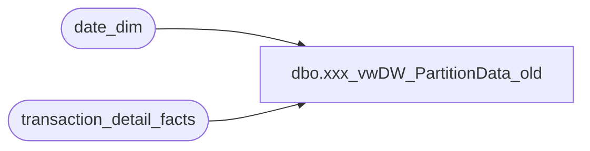

# dbo.xxx_vwDW_PartitionData_old

**Database:** dw  
**Server:** papamart  

## Architecture Diagram



## Table Dependencies

| Referenced Table |
|---|
| date_dim |
| transaction_detail_facts |

## View Code

```sql
CREATE VIEW [dbo].[vwDW_PartitionData_old]
AS
SELECT 'BAB DW' AS DataSourceID, 'Papa Mart' AS CubeName, 'Papa Mart' AS CubeID, 
		   'Transaction Detail Facts' AS MeasureGroup, 'Transaction Detail Facts' AS MeasureGroupID, 
		   'Transaction_Detail_Facts_' + CONVERT(VARCHAR(10), d.fiscal_year) AS Partition,
		   'SELECT [dbo].[vwDW_TransactionDetail].[product_key],[dbo].[vwDW_TransactionDetail].[currency_key],[dbo].[vwDW_TransactionDetail].[transaction_id],[dbo].[vwDW_TransactionDetail].[transaction_line_seq],[dbo].[vwDW_TransactionDetail].[register_num],[dbo].[vwDW_TransactionDetail].[channel_key],[dbo].[vwDW_TransactionDetail].[cashier_id],[dbo].[vwDW_TransactionDetail].[time_key],[dbo].[vwDW_TransactionDetail].[store_key],[dbo].[vwDW_TransactionDetail].[promotion_key],[dbo].[vwDW_TransactionDetail].[unit_gross_amount],[dbo].[vwDW_TransactionDetail].[date_key],[dbo].[vwDW_TransactionDetail].[units],[dbo].[vwDW_TransactionDetail].[unit_disc_amount],[dbo].[vwDW_TransactionDetail].[party_y_n],[dbo].[vwDW_TransactionDetail].[coupon_group_key],[dbo].[vwDW_TransactionDetail].[tender_group_key],[dbo].[vwDW_TransactionDetail].[transaction_type_key],[dbo].[vwDW_TransactionDetail].[line_object_key],[dbo].[vwDW_TransactionDetail].[party_deposit],[dbo].[vwDW_TransactionDetail].[non_merch],[dbo].[vwDW_TransactionDetail].[Party],[dbo].[vwDW_TransactionDetail].[Loyality],[dbo].[vwDW_TransactionDetail].[source_key],[dbo].[vwDW_TransactionDetail].[process_name],[dbo].[vwDW_TransactionDetail].[process_date],[dbo].[vwDW_TransactionDetail].[transaction_no],[dbo].[vwDW_TransactionDetail].[transaction_key],[dbo].[vwDW_TransactionDetail].[PartyFlag],[dbo].[vwDW_TransactionDetail].[tdf_key] FROM [dbo].[vwDW_TransactionDetail] @WHERE_CLAUSE@ ' AS SQL,
			CONVERT(VARCHAR(10), d.min_date_key) AS min_date_key,
			CONVERT(VARCHAR(10), d.max_date_key) AS max_date_key,
			CASE
				WHEN d.current_fiscal_year = d.fiscal_year
					THEN 1
				WHEN d.fiscal_year = d.current_fiscal_year - 1 AND d.current_fiscal_period = 1
					THEN 1
				ELSE 0
			END AS ProcessFlag,
			CAST(50000000 AS varchar) AS EstimatedRows,
			'AggregationDesign 3' AS AggregationDesignID
	FROM
		(SELECT fiscal_year,
			(SELECT fiscal_year FROM date_dim WHERE actual_date = convert(datetime, convert(char(10), getdate(), 101))) AS current_fiscal_year,
			(SELECT fiscal_period FROM date_dim WHERE actual_date = convert(datetime, convert(char(10), getdate(), 101))) AS current_fiscal_period,
			(SELECT MIN(date_key) FROM date_dim d2 WHERE d2.fiscal_year = d.fiscal_year) min_date_key, 
			(SELECT MAX(date_key) FROM date_dim d2 WHERE d2.fiscal_year = d.fiscal_year) max_date_key
		FROM (SELECT DISTINCT fiscal_year FROM date_dim WHERE date_key >= (SELECT MIN(date_key) FROM date_dim d WHERE fiscal_year = (SELECT fiscal_year - 3 FROM date_dim d2 WHERE actual_date = convert(datetime, convert(char(10), getdate(), 101))))) d) d
	WHERE EXISTS (SELECT TOP 1 *
					FROM transaction_detail_facts
					WHERE date_key BETWEEN d.min_date_key AND d.max_date_key)

	UNION

	SELECT 'BAB DW' AS DataSourceID, 'Papa Mart' AS CubeName, 'Papa Mart' AS CubeID, 
		   'Discount Facts' AS MeasureGroup, 'Discount Facts' AS MeasureGroupID, 
		   'Discount_Facts_' + CONVERT(VARCHAR(10), d.fiscal_year) AS Partition,
		   'SELECT [dbo].[vwDW_Discounts].[transaction_id],[dbo].[vwDW_Discounts].[store_key],[dbo].[vwDW_Discounts].[date_key],[dbo].[vwDW_Discounts].[coupon_key],[dbo].[vwDW_Discounts].[line_object_key],[dbo].[vwDW_Discounts].[units],[dbo].[vwDW_Discounts].[unit_gross_amount],[dbo].[vwDW_Discounts].[uid],[dbo].[vwDW_Discounts].[PartyFlag],[dbo].[vwDW_Discounts].[currency_key] @WHERE_CLAUSE@ ' AS SQL,
			CONVERT(VARCHAR(10), d.min_date_key) AS min_date_key,
			CONVERT(VARCHAR(10), d.max_date_key) AS max_date_key,
			CASE
				WHEN d.current_fiscal_year = d.fiscal_year
					THEN 1
				WHEN d.fiscal_year = d.current_fiscal_year - 1 AND d.current_fiscal_period = 1
					THEN 1
				ELSE 0
			END AS ProcessFlag,
			CAST(1000000 AS varchar) AS EstimatedRows,
			'AggregationDesign 2' AS AggregationDesignID
	FROM
		(SELECT fiscal_year,
			(SELECT fiscal_year FROM date_dim WHERE actual_date = convert(datetime, convert(char(10), getdate(), 101))) AS current_fiscal_year,
			(SELECT fiscal_period FROM date_dim WHERE actual_date = convert(datetime, convert(char(10), getdate(), 101))) AS current_fiscal_period,
			(SELECT MIN(date_key) FROM date_dim d2 WHERE d2.fiscal_year = d.fiscal_year) min_date_key, 
			(SELECT MAX(date_key) FROM date_dim d2 WHERE d2.fiscal_year = d.fiscal_year) max_date_key
		FROM (SELECT DISTINCT fiscal_year FROM date_dim WHERE date_key >= (SELECT MIN(date_key) FROM date_dim d WHERE fiscal_year = (SELECT fiscal_year - 3 FROM date_dim d2 WHERE actual_date = convert(datetime, convert(char(10), getdate(), 101))))) d) d
	WHERE EXISTS (SELECT TOP 1 *
					FROM transaction_detail_facts
					WHERE date_key BETWEEN d.min_date_key AND d.max_date_key)

	UNION

	SELECT 'BAB DW' AS DataSourceID, 'Papa Mart' AS CubeName, 'Papa Mart' AS CubeID, 
		   'Tender Group Facts' AS MeasureGroup, 'Tender Group Dim' AS MeasureGroupID, 
		   'Tender_Group_' + CONVERT(VARCHAR(10), d.fiscal_year) AS Partition,
		   'SELECT [dbo].[vwDW_TenderGroup].[seq_num],[dbo].[vwDW_TenderGroup].[tender_group_key],[dbo].[vwDW_TenderGroup].[tender_key],[dbo].[vwDW_TenderGroup].[tender_amt],[dbo].[vwDW_TenderGroup].[ratio],[dbo].[vwDW_TenderGroup].[tax],[dbo].[vwDW_TenderGroup].[store_key],[dbo].[vwDW_TenderGroup].[date_key],[dbo].[vwDW_TenderGroup].[transaction_id],[dbo].[vwDW_TenderGroup].[PartyFlag],[dbo].[vwDW_TenderGroup].[currency_key] FROM [dbo].[vwDW_TenderGroup] @WHERE_CLAUSE@ ' AS SQL,
			CONVERT(VARCHAR(10), d.min_date_key) AS min_date_key,
			CONVERT(VARCHAR(10), d.max_date_key) AS max_date_key,
			CASE
				WHEN d.current_fiscal_year = d.fiscal_year
					THEN 1
				WHEN d.fiscal_year = d.current_fiscal_year - 1 AND d.current_fiscal_period = 1
					THEN 1
				ELSE 0
			END AS ProcessFlag,
			CAST(17000000 AS varchar) AS EstimatedRows,
			'AggregationDesign 2' AS AggregationDesignID
	FROM
		(SELECT fiscal_year,
			(SELECT fiscal_year FROM date_dim WHERE actual_date = convert(datetime, convert(char(10), getdate(), 101))) AS current_fiscal_year,
			(SELECT fiscal_period FROM date_dim WHERE actual_date = convert(datetime, convert(char(10), getdate(), 101))) AS current_fiscal_period,
			(SELECT MIN(date_key) FROM date_dim d2 WHERE d2.fiscal_year = d.fiscal_year) min_date_key, 
			(SELECT MAX(date_key) FROM date_dim d2 WHERE d2.fiscal_year = d.fiscal_year) max_date_key
		FROM (SELECT DISTINCT fiscal_year FROM date_dim WHERE date_key >= (SELECT MIN(date_key) FROM date_dim d WHERE fiscal_year = (SELECT fiscal_year - 3 FROM date_dim d2 WHERE actual_date = convert(datetime, convert(char(10), getdate(), 101))))) d) d
	WHERE EXISTS (SELECT TOP 1 *
					FROM transaction_detail_facts
					WHERE date_key BETWEEN d.min_date_key AND d.max_date_key)

	UNION

	SELECT 'BAB DW' AS DataSourceID, 'Papa Mart' AS CubeName, 'Papa Mart' AS CubeID, 
		   'Transaction Detail Rollup' AS MeasureGroup, 'Transaction Detail Rollup' AS MeasureGroupID, 
		   'Transaction_Detail_Rollup_' + CONVERT(VARCHAR(10), d.fiscal_year) AS Partition,
		   'SELECT [dbo].[vwDW_TransactionDetailRollup].[date_key],[dbo].[vwDW_TransactionDetailRollup].[store_key],[dbo].[vwDW_TransactionDetailRollup].[transaction_id],[dbo].[vwDW_TransactionDetailRollup].[PartyFlag],[dbo].[vwDW_TransactionDetailRollup].[tender_group_key],[dbo].[vwDW_TransactionDetailRollup].[LineCount],[dbo].[vwDW_TransactionDetailRollup].[transaction_key],[dbo].[vwDW_TransactionDetailRollup].[GAAPTransactionFlag],[dbo].[vwDW_TransactionDetailRollup].[currency_key], unit_net_amount, Animal_UGA, Non_Animal_UGA, Footwear_UGA, Accessories_UGA, Sounds_UGA, Clothing_UGA, Other_UGA FROM [dbo].[vwDW_TransactionDetailRollup] @WHERE_CLAUSE@ ' AS SQL,
			CONVERT(VARCHAR(10), d.min_date_key) AS min_date_key,
			CONVERT(VARCHAR(10), d.max_date_key) AS max_date_key,
			CASE
				WHEN d.current_fiscal_year = d.fiscal_year
					THEN 1
				WHEN d.fiscal_year = d.current_fiscal_year - 1 AND d.current_fiscal_period = 1
					THEN 1
				ELSE 0
			END AS ProcessFlag,
			CAST(15000000 AS varchar) AS EstimatedRows,
			'AggregationDesign 2' AS AggregationDesignID
	FROM
		(SELECT fiscal_year,
			(SELECT fiscal_year FROM date_dim WHERE actual_date = convert(datetime, convert(char(10), getdate(), 101))) AS current_fiscal_year,
			(SELECT fiscal_period FROM date_dim WHERE actual_date = convert(datetime, convert(char(10), getdate(), 101))) AS current_fiscal_period,
			(SELECT MIN(date_key) FROM date_dim d2 WHERE d2.fiscal_year = d.fiscal_year) min_date_key, 
			(SELECT MAX(date_key) FROM date_dim d2 WHERE d2.fiscal_year = d.fiscal_year) max_date_key
		FROM (SELECT DISTINCT fiscal_year FROM date_dim WHERE date_key >= (SELECT MIN(date_key) FROM date_dim d WHERE fiscal_year = (SELECT fiscal_year - 3 FROM date_dim d2 WHERE actual_date = convert(datetime, convert(char(10), getdate(), 101))))) d) d
	WHERE EXISTS (SELECT TOP 1 *
					FROM transaction_detail_facts
					WHERE date_key BETWEEN d.min_date_key AND d.max_date_key)

dbo,vwRawAddrDim_DrvdCntry,--ALTER view [dbo].[vwRAW_ADDR_DIM] 
CREATE VIEW [dbo].[vwRawAddrDim_DrvdCntry]
AS 
select r.CLNSD_ADDR_ID,r.DRVD_CNTRY_ABBRV
from dbo.RAW_ADDR_DIM r with (nolock)
group by r.CLNSD_ADDR_ID,r.DRVD_CNTRY_ABBRV
```

