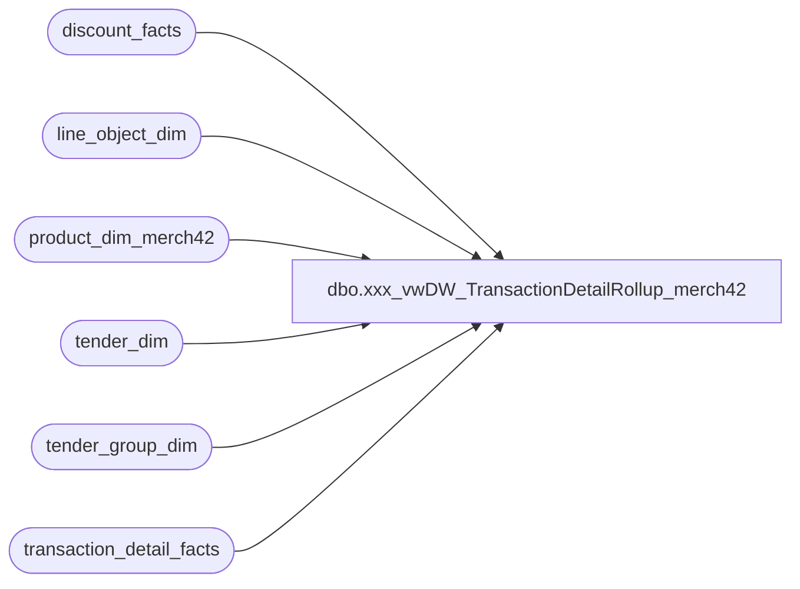

# dbo.xxx_vwDW_TransactionDetailRollup_merch42

**Database:** dw  
**Server:** papamart  

## Architecture Diagram



## Table Dependencies

| Referenced Table |
|---|
| discount_facts |
| line_object_dim |
| product_dim_merch42 |
| tender_dim |
| tender_group_dim |
| transaction_detail_facts |

## View Code

```sql
CREATE VIEW [dbo].[vwDW_TransactionDetailRollup_merch42] 
AS
SELECT tdf.date_key
		,tdf.store_key
		,tdf.transaction_id
		,tdf.tender_group_key
		,CAST(tdf.transaction_id AS varchar) 
			+ '-' + CAST(tdf.store_key AS varchar) 
			+ '-' + CAST(tdf.date_key AS varchar) AS transaction_key
		,CASE tdf.party_y_n WHEN 'y' THEN 1 ELSE 0 END AS PartyFlag
		,tdf.LineCount
		,tdf.currency_key
		,CASE WHEN
				-- is the receipt total >= 0?
				(tdf.Tran_detail_Amt + ISNULL(df.Discount_amt, 0) + ISNULL(tender.Tender_group_amt, 0)) >= 0
				AND 
				-- is it a donation only?
				(CASE WHEN tdf.merchandise = 0 AND tdf.donations <> 0 AND tdf.giftcards = 0 AND tdf.partydep = 0 
					THEN 1 ELSE 0 END) = 0
				AND 
				-- is it gift cards only?
				(CASE WHEN tdf.merchandise = 0 AND tdf.donations = 0 AND tdf.giftcards <> 0 AND tdf.partydep = 0 
					THEN 1 ELSE 0 END) = 0
				AND 
				-- is it a party deposit only?
				(CASE WHEN tdf.merchandise = 0 AND tdf.donations = 0 AND tdf.giftcards = 0 AND tdf.partydep <> 0 
					THEN 1 ELSE 0 END) = 0
			THEN 1
			ELSE 0
		END AS GAAPTransactionFlag
		,tdf.unit_net_amount
		,tdf.ttlanimalUGA AS Animal_UGA
		,tdf.ttlnonanimalUGA AS Non_Animal_UGA
		,tdf.ttlFootwearUGA AS Footwear_UGA
		,tdf.ttlAccessoriesUGA AS Accessories_UGA
		,tdf.ttlSoundsUGA AS Sounds_UGA
		,tdf.ttlClothingUGA AS Clothing_UGA
		,tdf.ttlOtherUGA AS Other_UGA
	FROM
		(SELECT tdf1.date_key
				,tdf1.store_key
				,tdf1.transaction_id
				,max(tdf1.tender_group_key) as tender_group_key
				,max(tdf1.currency_key)		as currency_key
				,max(tdf1.party_y_n)		as party_y_n
				,COUNT(*)					as LineCount
				,SUM(CASE WHEN lo.line_object = 100 THEN ISNULL(tdf1.unit_gross_amount, 0) ELSE 0 END) as merchandise
				,SUM(CASE WHEN lo.line_object IN (101,292) THEN ISNULL(tdf1.unit_gross_amount, 0) ELSE 0 END) as donations
				,SUM(CASE WHEN lo.line_object IN (294,400,401,402,403,404,410,1625) THEN ISNULL(tdf1.unit_gross_amount, 0) ELSE 0 END) as giftcards
				,SUM(CASE WHEN tdf1.product_key = -18 THEN ISNULL(tdf1.unit_gross_amount, 0) ELSE 0 END) as partydep
				,SUM(CASE WHEN tdf1.product_key = -18 OR lo.line_object_key IS NOT NULL THEN ISNULL(tdf1.unit_gross_amount, 0) ELSE 0 END) AS Tran_detail_Amt
				,SUM(ISNULL(CASE WHEN (unit_gross_amount > 0 AND unit_disc_amount > 0) 
									THEN unit_gross_amount - unit_disc_amount
									WHEN (unit_gross_amount > 0 AND unit_disc_amount < 0)
									THEN unit_gross_amount - unit_disc_amount
									WHEN (unit_gross_amount < 0 AND unit_disc_amount > 0)
									THEN unit_gross_amount + unit_disc_amount
									WHEN (unit_gross_amount < 0 AND unit_disc_amount < 0)	
									THEN unit_gross_amount + unit_disc_amount
									WHEN (unit_gross_amount = 0 AND unit_disc_amount < 0)
									THEN unit_gross_amount + unit_disc_amount
									WHEN (unit_gross_amount = 0 AND unit_disc_amount > 0)
									THEN unit_gross_amount - unit_disc_amount
									WHEN (unit_disc_amount = 0)
									THEN unit_gross_amount 
									ELSE unit_gross_amount END, 0)) AS unit_net_amount
				,sum(isnull(CASE WHEN right(p.department_code,2) = 25 OR right(p.subclass_code,2) = 25
						THEN
							ISNULL(CASE WHEN (unit_gross_amount > 0 AND unit_disc_amount > 0) 
							THEN unit_gross_amount - unit_disc_amount
							WHEN (unit_gross_amount > 0 AND unit_disc_amount < 0)
							THEN unit_gross_amount - unit_disc_amount
							WHEN (unit_gross_amount < 0 AND unit_disc_amount > 0)
							THEN unit_gross_amount + unit_disc_amount
							WHEN (unit_gross_amount < 0 AND unit_disc_amount < 0)	
							THEN unit_gross_amount + unit_disc_amount
							WHEN (unit_gross_amount = 0 AND unit_disc_amount < 0)
							THEN unit_gross_amount + unit_disc_amount
							WHEN (unit_gross_amount = 0 AND unit_disc_amount > 0)
							THEN unit_gross_amount - unit_disc_amount
							WHEN (unit_disc_amount = 0)
							THEN unit_gross_amount 
							ELSE unit_gross_amount END, 0)
						END,0)) as ttlanimalUGA
				,sum(isnull(CASE WHEN (right(p.department_code,2) IN (10,15,20,05,30,35,12) and right(subclass_code,2) <> 25) and lo.line_object = 100
						THEN
							ISNULL(CASE WHEN (unit_gross_amount > 0 AND unit_disc_amount > 0) 
							THEN unit_gross_amount - unit_disc_amount
							WHEN (unit_gross_amount > 0 AND unit_disc_amount < 0)
							THEN unit_gross_amount - unit_disc_amount
							WHEN (unit_gross_amount < 0 AND unit_disc_amount > 0)
							THEN unit_gross_amount + unit_disc_amount
							WHEN (unit_gross_amount < 0 AND unit_disc_amount < 0)	
							THEN unit_gross_amount + unit_disc_amount
							WHEN (unit_gross_amount = 0 AND unit_disc_amount < 0)
							THEN unit_gross_amount + unit_disc_amount
							WHEN (unit_gross_amount = 0 AND unit_disc_amount > 0)
							THEN unit_gross_amount - unit_disc_amount
							WHEN (unit_disc_amount = 0)
							THEN unit_gross_amount 
							ELSE unit_gross_amount END, 0)
						END,0)) as ttlnonanimalUGA
				,sum(isnull(CASE WHEN  right(p.department_code,2) = 15 
						THEN
							ISNULL(CASE WHEN (unit_gross_amount > 0 AND unit_disc_amount > 0) 
							THEN unit_gross_amount - unit_disc_amount
							WHEN (unit_gross_amount > 0 AND unit_disc_amount < 0)
							THEN unit_gross_amount - unit_disc_amount
							WHEN (unit_gross_amount < 0 AND unit_disc_amount > 0)
							THEN unit_gross_amount + unit_disc_amount
							WHEN (unit_gross_amount < 0 AND unit_disc_amount < 0)	
							THEN unit_gross_amount + unit_disc_amount
							WHEN (unit_gross_amount = 0 AND unit_disc_amount < 0)
							THEN unit_gross_amount + unit_disc_amount
							WHEN (unit_gross_amount = 0 AND unit_disc_amount > 0)
							THEN unit_gross_amount - unit_disc_amount
							WHEN (unit_disc_amount = 0)
							THEN unit_gross_amount 
							ELSE unit_gross_amount END, 0)
						END,0)) as ttlFootwearUGA
				,sum(isnull(CASE WHEN right(p.department_code,2) = 05 
						THEN
							ISNULL(CASE WHEN (unit_gross_amount > 0 AND unit_disc_amount > 0) 
							THEN unit_gross_amount - unit_disc_amount
							WHEN (unit_gross_amount > 0 AND unit_disc_amount < 0)
							THEN unit_gross_amount - unit_disc_amount
							WHEN (unit_gross_amount < 0 AND unit_disc_amount > 0)
							THEN unit_gross_amount + unit_disc_amount
							WHEN (unit_gross_amount < 0 AND unit_disc_amount < 0)	
							THEN unit_gross_amount + unit_disc_amount
							WHEN (unit_gross_amount = 0 AND unit_disc_amount < 0)
							THEN unit_gross_amount + unit_disc_amount
							WHEN (unit_gross_amount = 0 AND unit_disc_amount > 0)
							THEN unit_gross_amount - unit_disc_amount
							WHEN (unit_disc_amount = 0)
							THEN unit_gross_amount 
							ELSE unit_gross_amount END, 0)
						END,0)) as ttlAccessoriesUGA
				,sum(isnull(CASE WHEN right(p.department_code,2) = 20  
						THEN
							ISNULL(CASE WHEN (unit_gross_amount > 0 AND unit_disc_amount > 0) 
							THEN unit_gross_amount - unit_disc_amount
							WHEN (unit_gross_amount > 0 AND unit_disc_amount < 0)
							THEN unit_gross_amount - unit_disc_amount
							WHEN (unit_gross_amount < 0 AND unit_disc_amount > 0)
							THEN unit_gross_amount + unit_disc_amount
							WHEN (unit_gross_amount < 0 AND unit_disc_amount < 0)	
							THEN unit_gross_amount + unit_disc_amount
							WHEN (unit_gross_amount = 0 AND unit_disc_amount < 0)
							THEN unit_gross_amount + unit_disc_amount
							WHEN (unit_gross_amount = 0 AND unit_disc_amount > 0)
							THEN unit_gross_amount - unit_disc_amount
							WHEN (unit_disc_amount = 0)
							THEN unit_gross_amount 
							ELSE unit_gross_amount END, 0)
						END,0)) as ttlSoundsUGA
				,sum(isnull(CASE WHEN right(p.department_code,2) = 10  
						THEN
							ISNULL(CASE WHEN (unit_gross_amount > 0 AND unit_disc_amount > 0) 
							THEN unit_gross_amount - unit_disc_amount
							WHEN (unit_gross_amount > 0 AND unit_disc_amount < 0)
							THEN unit_gross_amount - unit_disc_amount
							WHEN (unit_gross_amount < 0 AND unit_disc_amount > 0)
							THEN unit_gross_amount + unit_disc_amount
							WHEN (unit_gross_amount < 0 AND unit_disc_amount < 0)	
							THEN unit_gross_amount + unit_disc_amount
							WHEN (unit_gross_amount = 0 AND unit_disc_amount < 0)
							THEN unit_gross_amount + unit_disc_amount
							WHEN (unit_gross_amount = 0 AND unit_disc_amount > 0)
							THEN unit_gross_amount - unit_disc_amount
							WHEN (unit_disc_amount = 0)
							THEN unit_gross_amount 
							ELSE unit_gross_amount END, 0)
						END,0)) as ttlClothingUGA
				,sum(isnull(CASE WHEN right(department_code,2) NOT IN (25,10,15,20,05,30,35,12) or department_code is null  
						THEN
							ISNULL(CASE WHEN (unit_gross_amount > 0 AND unit_disc_amount > 0) 
							THEN unit_gross_amount - unit_disc_amount
							WHEN (unit_gross_amount > 0 AND unit_disc_amount < 0)
							THEN unit_gross_amount - unit_disc_amount
							WHEN (unit_gross_amount < 0 AND unit_disc_amount > 0)
							THEN unit_gross_amount + unit_disc_amount
							WHEN (unit_gross_amount < 0 AND unit_disc_amount < 0)	
							THEN unit_gross_amount + unit_disc_amount
							WHEN (unit_gross_amount = 0 AND unit_disc_amount < 0)
							THEN unit_gross_amount + unit_disc_amount
							WHEN (unit_gross_amount = 0 AND unit_disc_amount > 0)
							THEN unit_gross_amount - unit_disc_amount
							WHEN (unit_disc_amount = 0)
							THEN unit_gross_amount 
							ELSE unit_gross_amount END, 0)
						END,0)) as ttlOtherUGA
		FROM transaction_detail_facts tdf1 WITH (NOLOCK)
		LEFT JOIN line_object_dim lo WITH (NOLOCK)
			ON lo.line_object_key = tdf1.line_object_key
			AND lo.line_object IN (100,101,292,210,250,200,203,202,204,205,206,294,400,401,402,403,404,410,1625)
		LEFT JOIN dw_sample..product_dim_merch42 p 
			ON p.product_key = tdf1.product_key
		WHERE	tdf1.transaction_line_seq > 0
		GROUP BY tdf1.date_key
				,tdf1.store_key
				,tdf1.transaction_id
		) tdf
	LEFT JOIN
		(SELECT store_key
				,date_key
				,transaction_id
				,SUM(ISNULL(unit_gross_amount, 0)) AS Discount_amt
			FROM discount_facts WITH (NOLOCK)
			where line_object_key is not null -- assume fk constraint is enforced
			GROUP BY store_key, date_key, transaction_id

		) df ON df.store_key = tdf.store_key
			AND df.date_key = tdf.date_key
			AND df.transaction_id = tdf.transaction_id
	LEFT JOIN	/*get the total amount of tax (-1) and redemptions (621,633,640,690) for the tender group*/
		(SELECT tg.tender_group_key
				,SUM( ISNULL(tg.tender_amt, 0)) AS Tender_group_amt
			FROM tender_group_dim tg WITH (NOLOCK)
			INNER JOIN tender_dim t WITH (NOLOCK) 
				ON t.tender_key = tg.tender_key
			where t.tender_code IN (-1,621,633,640,690)
			GROUP BY tender_group_key
		) tender ON tdf.tender_group_key = tender.tender_group_key

/*

ALTER VIEW [dbo].[vwDW_TransactionDetailRollup] 
AS
SELECT tdf.date_key
		,tdf.fiscal_year
		,tdf.store_key
		,tdf.transaction_id
		,tdf.tender_group_key
		,CAST(tdf.transaction_id AS varchar) + '-' + CAST(tdf.store_key AS varchar) + '-' + CAST(tdf.date_key AS varchar) AS transaction_key
		,CASE tdf.party_y_n WHEN 'y' THEN 1 ELSE 0 END AS PartyFlag
		,tdf.LineCount
		,tdf.currency_key
		--,CASE WHEN tdf.merchandise > 0 THEN 1 ELSE 0 END AS MerchandiseFlag
		,CASE WHEN
			(tdf.merchandise 
			+ tdf.gift_cards_sold
			+ tdf.donations
			+ tdf.stuffing_supplies
			+ tdf.party_deposit
			+ tdf.shipping
			+ tdf.other_fees
			+ ISNULL(df.CouponDiscount, 0)
			+ ISNULL(df.TotalDiscount, 0)
			+ ISNULL(tender.Tax, 0)
			+ ISNULL(tender.Redemptions, 0)) >= 0
			AND 
				(tdf.merchandise <> 0) --OR tdf.donations > 0)
			THEN 1
			ELSE 0
		END AS GAAPTransactionFlag
	FROM
		(SELECT tdf1.date_key
				,tdf1.store_key
				,tdf1.transaction_id
				,tdf1.tender_group_key
				,tdf1.currency_key
				,tdf1.party_y_n 
				,dd.Fiscal_Year
				,COUNT(*) as LineCount
				,SUM(CASE WHEN lo.line_object = 100 
							THEN ISNULL(tdf1.unit_gross_amount, 0) ELSE 0 END)	as merchandise
				,SUM(CASE WHEN lo.line_object IN (294,400,401,402,403,404,410,1625) 
							THEN ISNULL(tdf1.unit_gross_amount, 0) ELSE 0 END)  as gift_cards_sold
				,SUM(CASE WHEN lo.line_object IN (101, 192) 
							THEN ISNULL(tdf1.unit_gross_amount, 0) ELSE 0 END)	as  donations
				,SUM(CASE WHEN lo.line_object IN (210,250) 
							THEN ISNULL(tdf1.unit_gross_amount, 0) ELSE 0 END)	as  stuffing_supplies
				,SUM(CASE WHEN tdf1.product_key = -18 
							THEN ISNULL(tdf1.unit_gross_amount, 0) ELSE 0 END)	as party_deposit
				,SUM(CASE WHEN lo.line_object IN (200,203) 
							THEN ISNULL(tdf1.unit_gross_amount, 0) ELSE 0 END)	as shipping
				,SUM(CASE WHEN lo.line_object IN (202,204,205,206) 
							THEN ISNULL(tdf1.unit_gross_amount, 0) ELSE 0 END)	as other_fees
		FROM transaction_detail_facts tdf1 WITH (NOLOCK)
		LEFT JOIN line_object_dim lo WITH (NOLOCK)
			ON lo.line_object_key = tdf1.line_object_key
		INNER JOIN date_dim dd WITH (NOLOCK)
			on dd.date_key = tdf1.date_key
		WHERE tdf1.transaction_line_seq > 0
		GROUP BY tdf1.date_key
				,tdf1.store_key
				,tdf1.transaction_id
				,tdf1.tender_group_key
				,tdf1.currency_key
				,tdf1.party_y_n 
				,dd.Fiscal_Year
		) tdf
	LEFT JOIN
		(SELECT df_s.store_key
				,df_s.date_key
				,df_s.transaction_id
				,SUM(CASE WHEN disc_lo.line_object IN (290,295,1600,1610,1611,1615,1618,1802,1803,1806,1809) 
					THEN ISNULL(df_s.unit_gross_amount, 0) ELSE 0 END) AS CouponDiscount
				,SUM(CASE WHEN disc_lo.line_object NOT IN (290,295,1600,1610,1611,1615,1618,1802,1803,1806,1809) 
					THEN ISNULL(df_s.unit_gross_amount, 0) ELSE 0 END) AS TotalDiscount
			FROM discount_facts df_s WITH (NOLOCK)
			INNER JOIN line_object_dim disc_lo WITH (NOLOCK)
				ON disc_lo.line_object_key = df_s.line_object_key
			GROUP BY df_s.store_key, df_s.date_key, df_s.transaction_id

		) df ON df.store_key = tdf.store_key
			AND df.date_key = tdf.date_key
			AND df.transaction_id = tdf.transaction_id
	LEFT JOIN
		(SELECT tender_group_key
				,SUM(CASE WHEN t.tender_code = -1 THEN ISNULL(tender_amt, 0) ELSE 0 END) AS Tax
				,SUM(CASE WHEN t.tender_code IN (621,633,640,690) THEN ISNULL(tender_amt, 0) ELSE 0 END) AS Redemptions
			FROM tender_group_dim tg WITH (NOLOCK)
			INNER JOIN tender_dim t WITH (NOLOCK) ON t.tender_key = tg.tender_key
			GROUP BY tender_group_key

		) tender ON tdf.tender_group_key = tender.tender_group_key
*/
/*
set rowcount 100
select * from tender_group_dim tg
inner join tender_dim t
ON t.tender_key = tg.tender_key
order by tg.tender_group_key

where t.tender_code IN (-1,621,633,640,690)
and tg.tender_group_key = 36388281

set rowcount 0
SELECT tg.tender_group_key
				,SUM( ISNULL(tg.tender_amt, 0)) AS Tender_group_amt
			FROM tender_group_dim tg WITH (NOLOCK)
			INNER JOIN tender_dim t WITH (NOLOCK) ON t.tender_key = tg.tender_key
			where t.tender_code IN (-1,621,633,640,690)
			GROUP BY tender_group_key

-- check for missing keys
SELECT count(*)
FROM discount_facts df_s WITH (NOLOCK)
where not exists (select * from line_object_dim disc_lo WITH (NOLOCK)
				where disc_lo.line_object_key = line_object_key)
and line_object_key is not null

-- and for null keys.
SELECT count(*)
FROM discount_facts
where line_object_key is null
*/
```

