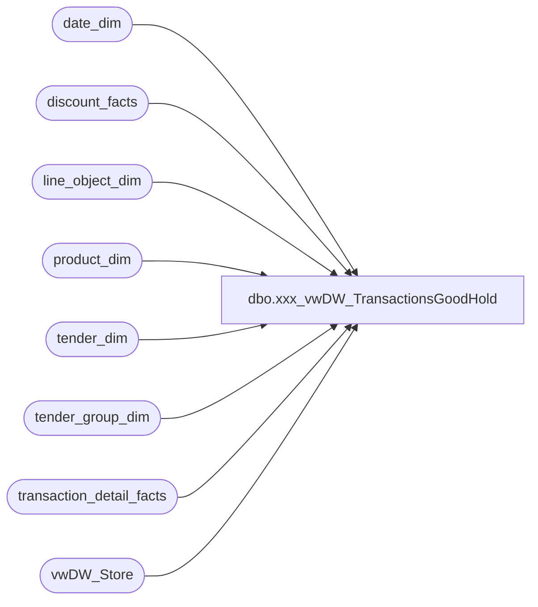

# dbo.xxx_vwDW_TransactionsGoodHold

**Database:** dw  
**Server:** papamart  

## Architecture Diagram



## Table Dependencies

| Referenced Table |
|---|
| date_dim |
| discount_facts |
| line_object_dim |
| product_dim |
| tender_dim |
| tender_group_dim |
| transaction_detail_facts |
| vwDW_Store |

## View Code

```sql
--ALTER VIEW [dbo].[vwDW_Transactions_dev_4_RZ]
CREATE VIEW [dbo].[vwDW_TransactionsGoodHold]
AS
/***********************************
vwDW_Transactions_original
************************************/
SELECT temp.*
		,CASE WHEN IsComp = 1 THEN GaapSales ELSE 0 END AS CompGaapSales
		,CASE WHEN IsComp = 1 THEN GAAPTransactionFlag ELSE 0 END AS CompGAAPTransactionFlag
		,CASE WHEN IsComp = 1 THEN AnimalUnits ELSE 0 END AS CompAnimalUnits
		,CASE WHEN IsComp = 1 THEN SoundUnits ELSE 0 END AS CompSoundUnits
		,CASE WHEN IsComp = 1 THEN ShoeUnits ELSE 0 END AS CompShoeUnits
		,CASE WHEN IsComp = 1 THEN radio_controlled_chassis_units ELSE 0 END AS CompRadioControlledChassisUnits
		,CASE WHEN IsComp = 1 THEN rimz_units ELSE 0 END AS CompRimzUnits
		,CASE WHEN IsComp = 1 THEN Animal_UGA ELSE 0 END AS CompAnimal_UGA
		,CASE WHEN IsComp = 1 THEN PartyFlag ELSE 0 END AS CompPartyFlag
		,CASE WHEN IsComp = 1 THEN MerchandiseUnits ELSE 0 END AS CompMerchandiseUnits

		,CASE WHEN IsCompNextYear = 1 THEN GaapSales ELSE 0 END AS GaapSalesForCompLY
		,CASE WHEN IsCompNextYear = 1 THEN GAAPTransactionFlag ELSE 0 END AS GAAPTransactionFlagForCompLY
		,CASE WHEN IsCompNextYear = 1 THEN AnimalUnits ELSE 0 END AS AnimalUnitsForCompLY
		,CASE WHEN IsCompNextYear = 1 THEN SoundUnits ELSE 0 END AS SoundUnitsForCompLY
		,CASE WHEN IsCompNextYear = 1 THEN ShoeUnits ELSE 0 END AS ShoeUnitsForCompLY
		,CASE WHEN IsCompNextYear = 1 THEN radio_controlled_chassis_units ELSE 0 END AS RadioControlledChassisUnitsForCompLY
		,CASE WHEN IsCompNextYear = 1 THEN rimz_units ELSE 0 END AS RimzUnitsForCompLY
		,CASE WHEN IsCompNextYear = 1 THEN Animal_UGA ELSE 0 END AS Animal_UGAForCompLY
		,CASE WHEN IsCompNextYear = 1 THEN PartyFlag ELSE 0 END AS PartyFlagForCompLY
		,CASE WHEN IsCompNextYear = 1 THEN MerchandiseUnits ELSE 0 END AS MerchandiseUnitsForCompLY

		,CAST(NULL AS int) AS FranchiseePartyCount
		,CAST(NULL AS decimal) AS FranchiseePartySales
		,CAST(NULL AS int) AS FranchiseeCompPartyCount
		,CAST(NULL AS int) AS FranchiseePartyCountForCompLY

	FROM
	(
		SELECT tdf.date_key
			,tdf.store_key
			,tdf.transaction_id
			,tdf.tender_group_key
			,CAST(tdf.transaction_id AS varchar) 
				+ '-' + CAST(tdf.store_key AS varchar) 
				+ '-' + CAST(tdf.date_key AS varchar) AS transaction_key
			,CASE tdf.party_y_n WHEN 'y' THEN 1 ELSE 0 END AS PartyFlag
			,tdf.LineCount
			,tdf.currency_key
			,CASE WHEN
					-- is the receipt total >= 0? --commented out by Edin on 3/2/2007 because the condition was causing returns to not be included
					(tdf.Tran_detail_Amt + ISNULL(df.Discount_amt, 0) + ISNULL(tender.Tender_group_amt, 0)) >= 0
					AND 
					-- is it a donation only?
					(CASE WHEN tdf.merchandise = 0 AND tdf.donations <> 0 AND tdf.giftcards = 0 AND tdf.partydep = 0 
						THEN 1 ELSE 0 END) = 0
					AND 
					-- is it gift cards only?
					(CASE WHEN tdf.merchandise = 0 AND tdf.donations = 0 AND tdf.giftcards <> 0 AND tdf.partydep = 0 
						THEN 1 ELSE 0 END) = 0
					AND 
					-- is it a party deposit only?
					(CASE WHEN tdf.merchandise = 0 AND tdf.donations = 0 AND tdf.giftcards = 0 AND tdf.partydep <> 0 
						THEN 1 ELSE 0 END) = 0
				THEN 1
				ELSE 0
			END AS GAAPTransactionFlag
			,tdf.unit_net_amount
			,tdf.ttlanimalUGA AS Animal_UGA
			,tdf.ttlnonanimalUGA AS Non_Animal_UGA
			,tdf.ttlFootwearUGA AS Footwear_UGA
			,tdf.ttlAccessoriesUGA AS Accessories_UGA
			,tdf.ttlSoundsUGA AS Sounds_UGA
			,tdf.ttlClothingUGA AS Clothing_UGA
			,tdf.ttlOtherUGA AS Other_UGA
			,tdf.ttlRadioControlledChassisUGA AS RadioControlledChassis_UGA
			,tdf.ttlRimzUGA AS Rimz_UGA

			,tdf.UnitGrossAmount
			,tdf.UnitDiscAmount
			,ISNULL(tdf.merchandise, 0) + ISNULL(df.CouponDiscount, 0) + ISNULL(df.TotalDiscount, 0) - ISNULL(tdf.GiftCardDiscount, 0)
				+ ISNULL(tdf.CubCashUGA, 0) + ISNULL(tender.RewardCertificateAmt, 0) + ISNULL(tender.BuyStuffAmt, 0) + ISNULL(tdf.ShippingUGA, 0)
				+ ISNULL(tdf.OtherFeesUGA, 0) + ISNULL(tdf.StuffingAndSuppliesUGA, 0) AS GaapSales
			,ISNULL(tdf.merchandise, 0) + ISNULL(df.CouponDiscount, 0) + ISNULL(df.TotalDiscount, 0) + ISNULL(tender.RedemptionsAmt, 0)
				+ ISNULL(tdf.giftcards, 0) + ISNULL(tdf.CubCashUGA, 0) + ISNULL(tdf.partydep, 0) + ISNULL(tdf.ShippingUGA, 0)
				+ ISNULL(tdf.OtherFeesUGA, 0) + ISNULL(tdf.StuffingAndSuppliesUGA, 0) AS NetSales
			,tdf.GiftCardDiscount
			,tdf.giftcards AS GiftCardsSoldUga
			,tdf.MerchandiseUnits
			,tdf.merchandise AS MerchandiseUga
			,tdf.donations AS DonationsUga
			,tdf.StuffingAndSuppliesUGA
			,tdf.ShippingUGA
			,tdf.OtherFeesUGA
			,tdf.CubCashUGA
			,tdf.partydep AS PartyDepositUGA
			,tender.RewardCertificateAmt AS RewardCertificate
			,tender.BuyStuffAmt AS BuyStuff
			,tender.TaxAmt AS Tax
			,tender.RedemptionsAmt AS Redemptions
			,df.CouponDiscount
			,df.TotalDiscount
			,tdf.AnimalUnits
			,tdf.ShoeUnits
			,tdf.SoundUnits

			,tdf.radio_controlled_chassis_units
			,tdf.rimz_units

			/* 10/30/06 - TMK - added comp logic to view */
			,CAST(CASE WHEN trans_date_dim.week_id >= comp_date_dim.week_id THEN 1 ELSE 0 END AS bit) AS IsComp
			,CAST(CASE WHEN date_dim_for_next_year.week_id >= comp_date_dim.week_id THEN 1 ELSE 0 END AS bit) AS IsCompNextYear
			,tdf.customer_demographics_key
			,tdf.customer_geography_key
			,tdf.sfs_transaction_type_key
			,CAST(visit_count_key_12months AS int) AS visit_count_key_12months
			,CAST(visit_count_key_24months AS int) AS visit_count_key_24months
			,CAST(visit_count_key_36months AS int) AS visit_count_key_36months
		FROM
			(SELECT tdf1.date_key
					,tdf1.store_key
					,tdf1.transaction_id
					,max(tdf1.tender_group_key) as tender_group_key
					,max(tdf1.currency_key)		as currency_key
					,max(tdf1.party_y_n)		as party_y_n
					,COUNT(*)					as LineCount
					,SUM(ISNULL(tdf1.unit_gross_amount, 0)) AS UnitGrossAmount
					,SUM(ISNULL(tdf1.unit_disc_amount, 0)) AS UnitDiscAmount

					/*** START - Adding new keys - TMK - 2007-05-29 ***/
					,MAX(tdf1.customer_geography_key) AS customer_geography_key
					,ISNULL(MAX(tdf1.customer_demographics_key), 0) AS customer_demographics_key
					,MAX(tdf1.sfs_transaction_type_key) AS sfs_transaction_type_key
					/*** END - Adding new keys - TMK - 2007-05-29 ***/

					/*** START - Adding new keys - TMK - 2007-08-27 ***/
					,MAX(visit_count_key_12months) AS visit_count_key_12months
					,MAX(visit_count_key_24months) AS visit_count_key_24months
					,MAX(visit_count_key_36months) AS visit_count_key_36months
					/*** END - Adding new keys - TMK - 2007-08-27 ***/

					,SUM(CASE WHEN lo.line_object = 100 THEN ISNULL(tdf1.unit_gross_amount, 0) ELSE 0 END) as merchandise
					,SUM(CASE WHEN lo.line_object IN (101,292) THEN ISNULL(tdf1.unit_gross_amount, 0) ELSE 0 END) as donations
					,SUM(CASE WHEN lo.line_object IN (294,400,401,402,403,404,410,1625) THEN ISNULL(tdf1.unit_gross_amount, 0) ELSE 0 END) as giftcards
					,SUM(CASE WHEN tdf1.product_key = -18 THEN ISNULL(tdf1.unit_gross_amount, 0) ELSE 0 END) as partydep
					,SUM(CASE WHEN tdf1.product_key = -18 OR lo.line_object_key IS NOT NULL THEN ISNULL(tdf1.unit_gross_amount, 0) ELSE 0 END) AS Tran_detail_Amt

					,SUM(CASE WHEN lo.line_object IN (101,294,400,401,402,403,404,410) THEN ISNULL(tdf1.unit_disc_amount, 0) * CASE WHEN ISNULL(tdf1.unit_gross_amount, 0) >= 0 THEN -1 ELSE 1 END ELSE 0 END) AS GiftCardDiscount
	--				,SUM(ISNULL(CASE WHEN tdf1.unit_gross_amount >= 0 AND lo.line_object IN (101,294,400,401,402,403,404,410) --including heart donation line obj 
	--					THEN (tdf1.unit_disc_amount * -1)
	--					WHEN tdf1.unit_gross_amount < 0  AND lo.line_object IN (101,294,400,401,402,403,404,410)
	--					THEN tdf1.unit_disc_amount END ,0)) AS GiftCardDiscount
					,SUM(CASE WHEN lo.line_object = 291 THEN ISNULL(tdf1.unit_gross_amount, 0) ELSE 0 END) AS CubCashUGA
					,SUM(CASE WHEN lo.line_object IN (200,203) THEN ISNULL(tdf1.unit_gross_amount, 0) ELSE 0 END) AS ShippingUGA
					,SUM(CASE WHEN lo.line_object IN (202,204,205,206) THEN ISNULL(tdf1.unit_gross_amount, 0) ELSE 0 END) AS OtherFeesUGA
					,SUM(CASE WHEN lo.line_object IN (210,250) THEN ISNULL(tdf1.unit_gross_amount, 0) ELSE 0 END) AS StuffingAndSuppliesUGA
					,SUM(CASE WHEN lo.line_object = 100 THEN ISNULL(tdf1.units, 0) ELSE 0 END) as MerchandiseUnits

					-- 6/22/2007 - TMK - Modifying department logic for RZ stores

					,SUM(CASE WHEN
						-- Existing BAB logic
						(((RIGHT(p.department_code, 2) = '25' OR RIGHT(p.subclass_code, 2) = '25') AND LEFT(p.department_code, 5) <> 'R-R-R')
						-- New RZ logic
						OR (p.department_code = 'R-R-R-02'))
							THEN ISNULL(tdf1.units, 0)
						ELSE 0 END
					) AS AnimalUnits
					,SUM(CASE WHEN
						-- Existing BAB logic
						((RIGHT(department_code, 2) = '15' AND LEFT(p.department_code, 5) <> 'R-R-R')
						-- New RZ logic
						OR (p.department_code = 'R-R-R-10'))
							THEN ISNULL(tdf1.units, 0)
						ELSE 0 END
					) AS ShoeUnits
					,SUM(CASE WHEN
						-- Existing BAB logic
						((RIGHT(department_code, 2) = '20' AND LEFT(p.department_code, 5) <> 'R-R-R')
						-- New RZ logic
						OR (p.department_code = 'R-R-R-06'))
							THEN ISNULL(tdf1.units, 0)
						ELSE 0 END
					) AS SoundUnits

					-- 6/22/2007 - TMK - Adding new departments for RZ

					,SUM(CASE WHEN p.department_code = 'R-R-R-04' AND RIGHT(p.subclass_code, 2) = '02' THEN ISNULL(tdf1.units, 0)
						ELSE 0 END) AS radio_controlled_chassis_units
					,SUM(CASE WHEN p.department_code = 'R-R-R-08' THEN ISNULL(tdf1.units, 0) ELSE 0 END) AS rimz_units

					,SUM(ISNULL(CASE WHEN (unit_gross_amount > 0 AND unit_disc_amount > 0) 
										THEN unit_gross_amount - unit_disc_amount
										WHEN (unit_gross_amount > 0 AND unit_disc_amount < 0)
										THEN unit_gross_amount - unit_disc_amount
										WHEN (unit_gross_amount < 0 AND unit_disc_amount > 0)
										THEN unit_gross_amount + unit_disc_amount
										WHEN (unit_gross_amount < 0 AND unit_disc_amount < 0)	
										THEN unit_gross_amount + unit_disc_amount
										WHEN (unit_gross_amount = 0 AND unit_disc_amount < 0)
										THEN unit_gross_amount + unit_disc_amount
										WHEN (unit_gross_amount = 0 AND unit_disc_amount > 0)
										THEN unit_gross_amount - unit_disc_amount
										WHEN (unit_disc_amount = 0)
										THEN unit_gross_amount 
										ELSE unit_gross_amount END, 0)) AS unit_net_amount

					-- 6/22/2007 - TMK - Modifying department logic for RZ stores

					,sum(isnull(CASE WHEN
						-- Existing BAB Logic
						(((right(p.department_code,2) = 25 OR right(p.subclass_code,2) = 25) AND LEFT(p.department_code, 5) <> 'R-R-R')
						-- New RZ logic
						OR (p.department_code = 'R-R-R-02'))
							THEN
								ISNULL(CASE WHEN (unit_gross_amount > 0 AND unit_disc_amount > 0) 
								THEN unit_gross_amount - unit_disc_amount
								WHEN (unit_gross_amount > 0 AND unit_disc_amount < 0)
								THEN unit_gross_amount - unit_disc_amount
								WHEN (unit_gross_amount < 0 AND unit_disc_amount > 0)
								THEN unit_gross_amount + unit_disc_amount
								WHEN (unit_gross_amount < 0 AND unit_disc_amount < 0)	
								THEN unit_gross_amount + unit_disc_amount
								WHEN (unit_gross_amount = 0 AND unit_disc_amount < 0)
								THEN unit_gross_amount + unit_disc_amount
								WHEN (unit_gross_amount = 0 AND unit_disc_amount > 0)
								THEN unit_gross_amount - unit_disc_amount
								WHEN (unit_disc_amount = 0)
								THEN unit_gross_amount 
								ELSE unit_gross_amount END, 0)
							END,0)) as ttlanimalUGA
					,sum(isnull(CASE WHEN
						(((right(p.department_code,2) IN (10,15,20,05,30,35,12) and right(subclass_code,2) <> 25) and lo.line_object = 100) AND LEFT(p.department_code, 5) <> 'R-R-R')
							THEN
								ISNULL(CASE WHEN (unit_gross_amount > 0 AND unit_disc_amount > 0) 
								THEN unit_gross_amount - unit_disc_amount
								WHEN (unit_gross_amount > 0 AND unit_disc_amount < 0)
								THEN unit_gross_amount - unit_disc_amount
								WHEN (unit_gross_amount < 0 AND unit_disc_amount > 0)
								THEN unit_gross_amount + unit_disc_amount
								WHEN (unit_gross_amount < 0 AND unit_disc_amount < 0)	
								THEN unit_gross_amount + unit_disc_amount
								WHEN (unit_gross_amount = 0 AND unit_disc_amount < 0)
								THEN unit_gross_amount + unit_disc_amount
								WHEN (unit_gross_amount = 0 AND unit_disc_amount > 0)
								THEN unit_gross_amount - unit_disc_amount
								WHEN (unit_disc_amount = 0)
								THEN unit_gross_amount 
								ELSE unit_gross_amount END, 0)
							END,0)) as ttlnonanimalUGA
					,sum(isnull(CASE WHEN
						((right(p.department_code,2) = 15 AND LEFT(p.department_code, 5) <> 'R-R-R')
						OR
						(p.department_code = 'R-R-R-10'))
							THEN
								ISNULL(CASE WHEN (unit_gross_amount > 0 AND unit_disc_amount > 0) 
								THEN unit_gross_amount - unit_disc_amount
								WHEN (unit_gross_amount > 0 AND unit_disc_amount < 0)
								THEN unit_gross_amount - unit_disc_amount
								WHEN (unit_gross_amount < 0 AND unit_disc_amount > 0)
								THEN unit_gross_amount + unit_disc_amount
								WHEN (unit_gross_amount < 0 AND unit_disc_amount < 0)	
								THEN unit_gross_amount + unit_disc_amount
								WHEN (unit_gross_amount = 0 AND unit_disc_amount < 0)
								THEN unit_gross_amount + unit_disc_amount
								WHEN (unit_gross_amount = 0 AND unit_disc_amount > 0)
								THEN unit_gross_amount - unit_disc_amount
								WHEN (unit_disc_amount = 0)
								THEN unit_gross_amount 
								ELSE unit_gross_amount END, 0)
							END,0)) as ttlFootwearUGA
					,sum(isnull(CASE WHEN
						((right(p.department_code,2) = 05 AND LEFT(p.department_code, 5) <> 'R-R-R')
						OR
						(p.department_code IN ('R-R-R-12', 'R-R-R-14', 'R-R-R-16')))
							THEN
								ISNULL(CASE WHEN (unit_gross_amount > 0 AND unit_disc_amount > 0) 
								THEN unit_gross_amount - unit_disc_amount
								WHEN (unit_gross_amount > 0 AND unit_disc_amount < 0)
								THEN unit_gross_amount - unit_disc_amount
								WHEN (unit_gross_amount < 0 AND unit_disc_amount > 0)
								THEN unit_gross_amount + unit_disc_amount
								WHEN (unit_gross_amount < 0 AND unit_disc_amount < 0)	
								THEN unit_gross_amount + unit_disc_amount
								WHEN (unit_gross_amount = 0 AND unit_disc_amount < 0)
								THEN unit_gross_amount + unit_disc_amount
								WHEN (unit_gross_amount = 0 AND unit_disc_amount > 0)
								THEN unit_gross_amount - unit_disc_amount
								WHEN (unit_disc_amount = 0)
								THEN unit_gross_amount 
								ELSE unit_gross_amount END, 0)
							END,0)) as ttlAccessoriesUGA
					,sum(isnull(CASE WHEN
						((right(p.department_code,2) = 20 AND LEFT(p.department_code, 5) <> 'R-R-R')
						OR
						(p.department_code = 'R-R-R-06'))
							THEN
								ISNULL(CASE WHEN (unit_gross_amount > 0 AND unit_disc_amount > 0) 
								THEN unit_gross_amount - unit_disc_amount
								WHEN (unit_gross_amount > 0 AND unit_disc_amount < 0)
								THEN unit_gross_amount - unit_disc_amount
								WHEN (unit_gross_amount < 0 AND unit_disc_amount > 0)
								THEN unit_gross_amount + unit_disc_amount
								WHEN (unit_gross_amount < 0 AND unit_disc_amount < 0)	
								THEN unit_gross_amount + unit_disc_amount
								WHEN (unit_gross_amount = 0 AND unit_disc_amount < 0)
								THEN unit_gross_amount + unit_disc_amount
								WHEN (unit_gross_amount = 0 AND unit_disc_amount > 0)
								THEN unit_gross_amount - unit_disc_amount
								WHEN (unit_disc_amount = 0)
								THEN unit_gross_amount 
								ELSE unit_gross_amount END, 0)
							END,0)) as ttlSoundsUGA
					,sum(isnull(CASE WHEN (right(p.department_code,2) = 10 AND LEFT(p.department_code, 5) <> 'R-R-R')
							THEN
								ISNULL(CASE WHEN (unit_gross_amount > 0 AND unit_disc_amount > 0) 
								THEN unit_gross_amount - unit_disc_amount
								WHEN (unit_gross_amount > 0 AND unit_disc_amount < 0)
								THEN unit_gross_amount - unit_disc_amount
								WHEN (unit_gross_amount < 0 AND unit_disc_amount > 0)
								THEN unit_gross_amount + unit_disc_amount
								WHEN (unit_gross_amount < 0 AND unit_disc_amount < 0)	
								THEN unit_gross_amount + unit_disc_amount
								WHEN (unit_gross_amount = 0 AND unit_disc_amount < 0)
								THEN unit_gross_amount + unit_disc_amount
								WHEN (unit_gross_amount = 0 AND unit_disc_amount > 0)
								THEN unit_gross_amount - unit_disc_amount
								WHEN (unit_disc_amount = 0)
								THEN unit_gross_amount 
								ELSE unit_gross_amount END, 0)
							END,0)) as ttlClothingUGA
					,sum(isnull(CASE WHEN
						(((right(department_code,2) NOT IN ('25','10','15','20','05','30','35','12') AND LEFT(p.department_code, 5) <> 'R-R-R') or department_code is null)
						OR
						((LEFT(p.department_code, 5) = 'R-R-R'
							AND p.department_code <> 'R-R-R-02'
							AND (p.department_code <> 'R-R-R-04' AND RIGHT(p.subclass_code, 2) <> '02')
							AND p.department_code <> 'R-R-R-08'
							AND p.department_code <> 'R-R-R-06'
							AND p.department_code <> 'R-R-R-10'
							AND p.department_code NOT IN ('R-R-R-12', 'R-R-R-14', 'R-R-R-16')) OR p.department_code IS NULL))
							THEN
								ISNULL(CASE WHEN (unit_gross_amount > 0 AND unit_disc_amount > 0) 
								THEN unit_gross_amount - unit_disc_amount
								WHEN (unit_gross_amount > 0 AND unit_disc_amount < 0)
								THEN unit_gross_amount - unit_disc_amount
								WHEN (unit_gross_amount < 0 AND unit_disc_amount > 0)
								THEN unit_gross_amount + unit_disc_amount
								WHEN (unit_gross_amount < 0 AND unit_disc_amount < 0)	
								THEN unit_gross_amount + unit_disc_amount
								WHEN (unit_gross_amount = 0 AND unit_disc_amount < 0)
								THEN unit_gross_amount + unit_disc_amount
								WHEN (unit_gross_amount = 0 AND unit_disc_amount > 0)
								THEN unit_gross_amount - unit_disc_amount
								WHEN (unit_disc_amount = 0)
								THEN unit_gross_amount 
								ELSE unit_gross_amount END, 0)
							END,0)) as ttlOtherUGA

					-- 6/22/2007 - TMK - Adding new departments for RZ
					,sum(isnull(CASE WHEN (p.department_code = 'R-R-R-04' AND RIGHT(p.subclass_code, 2) = '02')
							THEN
								ISNULL(CASE WHEN (unit_gross_amount > 0 AND unit_disc_amount > 0) 
								THEN unit_gross_amount - unit_disc_amount
								WHEN (unit_gross_amount > 0 AND unit_disc_amount < 0)
								THEN unit_gross_amount - unit_disc_amount
								WHEN (unit_gross_amount < 0 AND unit_disc_amount > 0)
								THEN unit_gross_amount + unit_disc_amount
								WHEN (unit_gross_amount < 0 AND unit_disc_amount < 0)	
								THEN unit_gross_amount + unit_disc_amount
								WHEN (unit_gross_amount = 0 AND unit_disc_amount < 0)
								THEN unit_gross_amount + unit_disc_amount
								WHEN (unit_gross_amount = 0 AND unit_disc_amount > 0)
								THEN unit_gross_amount - unit_disc_amount
								WHEN (unit_disc_amount = 0)
								THEN unit_gross_amount 
								ELSE unit_gross_amount END, 0)
							END,0)) as ttlRadioControlledChassisUGA
					,sum(isnull(CASE WHEN p.department_code = 'R-R-R-08'
							THEN
								ISNULL(CASE WHEN (unit_gross_amount > 0 AND unit_disc_amount > 0) 
								THEN unit_gross_amount - unit_disc_amount
								WHEN (unit_gross_amount > 0 AND unit_disc_amount < 0)
								THEN unit_gross_amount - unit_disc_amount
								WHEN (unit_gross_amount < 0 AND unit_disc_amount > 0)
								THEN unit_gross_amount + unit_disc_amount
								WHEN (unit_gross_amount < 0 AND unit_disc_amount < 0)	
								THEN unit_gross_amount + unit_disc_amount
								WHEN (unit_gross_amount = 0 AND unit_disc_amount < 0)
								THEN unit_gross_amount + unit_disc_amount
								WHEN (unit_gross_amount = 0 AND unit_disc_amount > 0)
								THEN unit_gross_amount - unit_disc_amount
								WHEN (unit_disc_amount = 0)
								THEN unit_gross_amount 
								ELSE unit_gross_amount END, 0)
							END,0)) as ttlRimzUGA


			FROM transaction_detail_facts tdf1 WITH (NOLOCK)
			LEFT JOIN line_object_dim lo WITH (NOLOCK)
				ON lo.line_object_key = tdf1.line_object_key
				--AND lo.line_object IN (100,101,292,210,250,200,203,202,204,205,206,294,400,401,402,403,404,410,1625)
			LEFT JOIN product_dim p WITH (NOLOCK)
				ON p.product_key = tdf1.product_key
			WHERE	tdf1.transaction_line_seq > 0
				AND date_key <= (SELECT date_key FROM date_dim WHERE actual_date = DATEADD(d, -1, CAST(CONVERT(varchar(10),GETDATE(),101) AS smalldatetime)))
			GROUP BY tdf1.date_key
					,tdf1.store_key
					,tdf1.transaction_id
			) tdf
		LEFT JOIN
			(
				SELECT
					store_key
					,date_key
					,transaction_id
					,SUM(ISNULL(unit_gross_amount, 0)) AS Discount_amt
					,SUM(CASE WHEN lo.line_object IN (290,295,1600,1610,1611,1615,1618,1802,1803,1806,1809) THEN ISNULL(unit_gross_amount, 0) ELSE 0 END) AS CouponDiscount
					-- i don't think i need gaap discount because total discount includes line_object 1625
					--,SUM(CASE WHEN lo.line_object = 1625 THEN ISNULL(unit_gross_amount, 0) ELSE 0 END) AS GAAPDiscount
					-- Total discount = total discount + gaap discount
					,SUM(CASE WHEN lo.line_object NOT IN (290,295,1600,1610,1611,1615,1618,1802,1803,1806,1809) THEN ISNULL(unit_gross_amount, 0) ELSE 0 END) AS TotalDiscount
				FROM discount_facts df WITH (NOLOCK)
				INNER JOIN line_object_dim lo ON df.line_object_key = lo.line_object_key
				--where line_object_key is not null -- assume fk constraint is enforced
				GROUP BY store_key, date_key, transaction_id

			) df ON df.store_key = tdf.store_key
				AND df.date_key = tdf.date_key
				AND df.transaction_id = tdf.transaction_id
		LEFT JOIN	/*get the total amount of tax (-1) and redemptions (621,633,640,690) for the tender group*/
			(
				SELECT
					tg.tender_group_key
					,SUM(ISNULL(tg.tender_amt, 0)) AS Tender_group_amt
					,SUM(CASE WHEN t.tender_code = 640 THEN ISNULL(tg.tender_amt, 0) ELSE 0 END) AS RewardCertificateAmt
					,SUM(CASE WHEN t.tender_code = 690 THEN ISNULL(tg.tender_amt, 0) ELSE 0 END) AS BuyStuffAmt
					,SUM(CASE WHEN t.tender_code = -1 THEN ISNULL(tg.tender_amt, 0) ELSE 0 END) AS TaxAmt
					,SUM(CASE WHEN t.tender_code IN (621,633,640,690) THEN ISNULL(tg.tender_amt, 0) ELSE 0 END) AS RedemptionsAmt
				FROM tender_group_dim tg WITH (NOLOCK)
				INNER JOIN tender_dim t WITH (NOLOCK) 
					ON t.tender_key = tg.tender_key
				WHERE t.tender_code IN (-1,621,633,640,690)
				GROUP BY tender_group_key
			) tender ON tdf.tender_group_key = tender.tender_group_key

		/* new for adding comp logic - start */
		INNER JOIN vwDW_Store s ON s.store_key = tdf.store_key
		INNER JOIN date_dim comp_date_dim ON comp_date_dim.date_key = s.comp_date_key
		INNER JOIN date_dim trans_date_dim ON trans_date_dim.date_key = tdf.date_key
		LEFT JOIN date_dim date_dim_for_next_year ON date_dim_for_next_year.fiscal_year = trans_date_dim.fiscal_year + 1
			AND date_dim_for_next_year.fiscal_week = trans_date_dim.fiscal_week
			AND date_dim_for_next_year.day_of_week = trans_date_dim.day_of_week
		/* new for adding comp logic - end */

		--WHERE tdf.date_key IN (SELECT date_key FROM date_dim WHERE fiscal_year = 2006 and fiscal_quarter = 1)
		--	AND tdf.store_key = 47
	) temp
	-- 2/17/07 - TMK - added logic to only allow data through yesterday
	--WHERE date_key <= (SELECT date_key FROM date_dim WHERE actual_date = DATEADD(d, -1, CAST(CONVERT(varchar(10),GETDATE(),101) AS smalldatetime)))
--UNION ALL
--/******************************************************************************************
--select identity(int,1,1) as uid, * into tbl_Transactions_2005 from vwDW_Transactions_original where date_key between 2920 and 3283 --2005
--alter table tbl_Transactions_2005 add 
-- CONSTRAINT [PK_tbl_Transactions_2005] PRIMARY KEY CLUSTERED 
--(	[uid] ASC)WITH FILLFACTOR = 100 ON [PRIMARY]
--
--create index idxN_NU_Transactions_2005_date on tbl_Transactions_2005 (date_key, store_key)
--******************************************************************************************/

--SELECT 
--       [date_key]
--      ,[store_key]
--      ,[transaction_id]
--      ,[tender_group_key]
--      ,[transaction_key]
--      ,[PartyFlag]
--      ,[LineCount]
--      ,[currency_key]
--      ,[GAAPTransactionFlag]
--      ,[unit_net_amount]
--      ,[Animal_UGA]
--      ,[Non_Animal_UGA]
--      ,[Footwear_UGA]
--      ,[Accessories_UGA]
--      ,[Sounds_UGA]
--      ,[Clothing_UGA]
--      ,[Other_UGA]
--      ,[UnitGrossAmount]
--      ,[UnitDiscAmount]
--      ,[GaapSales]
--      ,[NetSales]
--      ,[GiftCardDiscount]
--      ,[GiftCardsSoldUga]
--      ,[MerchandiseUnits]
--      ,[MerchandiseUga]
--      ,[DonationsUga]
--      ,[StuffingAndSuppliesUGA]
--      ,[ShippingUGA]
--      ,[OtherFeesUGA]
--      ,[CubCashUGA]
--      ,[PartyDepositUGA]
--      ,[RewardCertificate]
--      ,[BuyStuff]
--      ,[Tax]
--      ,[Redemptions]
--      ,[CouponDiscount]
--      ,[TotalDiscount]
--      ,[AnimalUnits]
--      ,[ShoeUnits]
--      ,[SoundUnits]
--      ,[IsComp]
--      ,[IsCompNextYear]
--      ,[CompGaapSales]
--      ,[CompGAAPTransactionFlag]
--      ,[CompAnimalUnits]
--      ,[CompSoundUnits]
--      ,[CompShoeUnits]
--      ,[CompAnimal_UGA]
--      ,[CompPartyFlag]
--      ,[CompMerchandiseUnits]
--      ,[GaapSalesForCompLY]
--      ,[GAAPTransactionFlagForCompLY]
--      ,[AnimalUnitsForCompLY]
--      ,[SoundUnitsForCompLY]
--      ,[ShoeUnitsForCompLY]
--      ,[Animal_UGAForCompLY]
--      ,[PartyFlagForCompLY]
--      ,[MerchandiseUnitsForCompLY]
--      ,[FranchiseePartyCount]
--      ,[FranchiseePartySales]
--      ,[FranchiseeCompPartyCount]
--      ,[FranchiseePartyCountForCompLY]
--	  , [customer_demographics_key] = ''
--		,[customer_geography_key]= ''
--  FROM [dw].[dbo].[tbl_Transactions_2005]
--  WHERE date_key >= 2920  and date_key <= 3283 --2005
--UNION ALL
--/******************************************************************************************
--select identity(int,1,1) as uid, * into tbl_Transactions_2004 from vwDW_Transactions_original where date_key >= 2556 and date_key <= 2919 --2004
--
--alter table tbl_Transactions_2004 add 
-- CONSTRAINT [PK_tbl_Transactions_2004] PRIMARY KEY CLUSTERED 
--(	[uid] ASC)WITH FILLFACTOR = 100 ON [PRIMARY]
--
--create index idxN_NU_Transactions_2004_date on tbl_Transactions_2004 (date_key, store_key)
--******************************************************************************************/
--
--SELECT 
--       [date_key]
--      ,[store_key]
--      ,[transaction_id]
--      ,[tender_group_key]
--      ,[transaction_key]
--      ,[PartyFlag]
--      ,[LineCount]
--      ,[currency_key]
--      ,[GAAPTransactionFlag]
--      ,[unit_net_amount]
--      ,[Animal_UGA]
--      ,[Non_Animal_UGA]
--      ,[Footwear_UGA]
--      ,[Accessories_UGA]
--      ,[Sounds_UGA]
--      ,[Clothing_UGA]
--      ,[Other_UGA]
--      ,[UnitGrossAmount]
--      ,[UnitDiscAmount]
--      ,[GaapSales]
--      ,[NetSales]
--      ,[GiftCardDiscount]
--      ,[GiftCardsSoldUga]
--      ,[MerchandiseUnits]
--      ,[MerchandiseUga]
--      ,[DonationsUga]
--      ,[StuffingAndSuppliesUGA]
--      ,[ShippingUGA]
--      ,[OtherFeesUGA]
--      ,[CubCashUGA]
--      ,[PartyDepositUGA]
--      ,[RewardCertificate]
--      ,[BuyStuff]
--      ,[Tax]
--      ,[Redemptions]
--      ,[CouponDiscount]
--      ,[TotalDiscount]
--      ,[AnimalUnits]
--      ,[ShoeUnits]
--      ,[SoundUnits]
--      ,[IsComp]
--      ,[IsCompNextYear]
--      ,[CompGaapSales]
--      ,[CompGAAPTransactionFlag]
--      ,[CompAnimalUnits]
--      ,[CompSoundUnits]
--      ,[CompShoeUnits]
--      ,[CompAnimal_UGA]
--      ,[CompPartyFlag]
--      ,[CompMerchandiseUnits]
--      ,[GaapSalesForCompLY]
--      ,[GAAPTransactionFlagForCompLY]
--      ,[AnimalUnitsForCompLY]
--      ,[SoundUnitsForCompLY]
--      ,[ShoeUnitsForCompLY]
--      ,[Animal_UGAForCompLY]
--      ,[PartyFlagForCompLY]
--      ,[MerchandiseUnitsForCompLY]
--      ,[FranchiseePartyCount]
--      ,[FranchiseePartySales]
--      ,[FranchiseeCompPartyCount]
--      ,[FranchiseePartyCountForCompLY]
--	  , [customer_demographics_key] = ''
--		,[customer_geography_key]= ''
--  FROM [dw].[dbo].[tbl_Transactions_2004]
--  WHERE date_key >= 2556 and date_key <= 2919 --2004
--  --WHERE date_key = 2556
```

