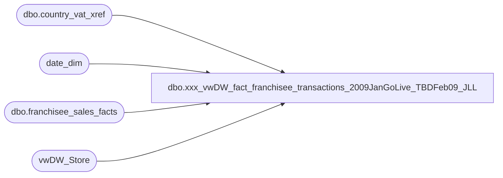

# dbo.xxx_vwDW_fact_franchisee_transactions_2009JanGoLive_TBDFeb09_JLL

**Database:** dw  
**Server:** papamart  

## Architecture Diagram



## Table Dependencies

| Referenced Table |
|---|
| dbo.country_vat_xref |
| date_dim |
| dbo.franchisee_sales_facts |
| vwDW_Store |

## View Code

```sql
CREATE VIEW [dbo].[vwDW_fact_franchisee_transactions_2009JanGoLive_TBDFeb09_JLL]
AS


	SELECT
		[date_key]
		,[store_key]
		,[transaction_id]
		,[tender_group_key]
		,[transaction_key]
		,[PartyFlag]
		,[LineCount]
		,[currency_key]
		,[GAAPTransactionFlag]
		,[unit_net_amount]
		,[Animal_UGA]
		,[Non_Animal_UGA]
		,[Footwear_UGA]
		,[Accessories_UGA]
		,[Sounds_UGA]
		,[Clothing_UGA]
		,[Other_UGA]
		,[UnitGrossAmount]
		,[UnitDiscAmount]
		,[GaapSales]
		,[NetSales]
		,[GiftCardDiscount]
		,[GiftCardsSoldUga]
		,[MerchandiseUnits]
		,[MerchandiseUga]
		,[DonationsUga]
		,[StuffingAndSuppliesUGA]
		,[ShippingUGA]
		,[OtherFeesUGA]
		,[CubCashUGA]
		,[PartyDepositUGA]
		,[RewardCertificate]
		,[BuyStuff]
		,[Tax]
		,[Redemptions]
		,[CouponDiscount]
		,[TotalDiscount]
		,[AnimalUnits]
		,[ShoeUnits]
		,[SoundUnits]
		,[IsComp]
		,[IsCompNextYear]
		,CASE WHEN IsComp = 1 THEN GaapSales ELSE 0 END AS CompGaapSales
		,CASE WHEN IsComp = 1 THEN GAAPTransactionFlag ELSE 0 END AS CompGAAPTransactionFlag
		,CASE WHEN IsComp = 1 THEN AnimalUnits ELSE 0 END AS CompAnimalUnits
		,CASE WHEN IsComp = 1 THEN SoundUnits ELSE 0 END AS CompSoundUnits
		,CASE WHEN IsComp = 1 THEN ShoeUnits ELSE 0 END AS CompShoeUnits
		,CASE WHEN IsComp = 1 THEN Animal_UGA ELSE 0 END AS CompAnimal_UGA
		,CASE WHEN IsComp = 1 THEN PartyFlag ELSE 0 END AS CompPartyFlag
		,CASE WHEN IsComp = 1 THEN MerchandiseUnits ELSE 0 END AS CompMerchandiseUnits

		,CASE WHEN IsCompNextYear = 1 THEN GaapSales ELSE 0 END AS GaapSalesForCompLY
		,CASE WHEN IsCompNextYear = 1 THEN GAAPTransactionFlag ELSE 0 END AS GAAPTransactionFlagForCompLY
		,CASE WHEN IsCompNextYear = 1 THEN AnimalUnits ELSE 0 END AS AnimalUnitsForCompLY
		,CASE WHEN IsCompNextYear = 1 THEN SoundUnits ELSE 0 END AS SoundUnitsForCompLY
		,CASE WHEN IsCompNextYear = 1 THEN ShoeUnits ELSE 0 END AS ShoeUnitsForCompLY
		,CASE WHEN IsCompNextYear = 1 THEN Animal_UGA ELSE 0 END AS Animal_UGAForCompLY
		,CASE WHEN IsCompNextYear = 1 THEN PartyFlag ELSE 0 END AS PartyFlagForCompLY
		,CASE WHEN IsCompNextYear = 1 THEN MerchandiseUnits ELSE 0 END AS MerchandiseUnitsForCompLY

		,party_count AS FranchiseePartyCount
		,party_sales AS FranchiseePartySales
		,CASE WHEN IsComp = 1 THEN party_count ELSE 0 END AS FranchiseeCompPartyCount
		,CASE WHEN IsCompNextYear = 1 THEN party_count ELSE 0 END AS FranchiseePartyCountForCompLY
		,0 AS [customer_demographics_key]
		,NULL AS [customer_geography_key]
		,0 AS [sfs_transaction_type_key]
		,NULL AS [RadioControlledChassis_UGA]
		,0 AS [Rimz_UGA]
		,0 AS [radio_controlled_chassis_units]
		,0 AS [rimz_units]
		,0 AS [CompRadioControlledChassisUnits]
		,0 AS [CompRimzUnits]
		,0 AS [RadioControlledChassisUnitsForCompLY]
		,0 AS [RimzUnitsForCompLY]
		,1 AS [visit_count_key_12months]
		,1 AS [visit_count_key_24months]
		,1 AS [visit_count_key_36months]

		,[accessories_units]
		,[clothes_units]
		,SportsUGA
		,[sports_units]
		,UnstuffedUGA
		,[unstuffed_units]

		,CASE WHEN IsComp = 1 THEN [accessories_units] ELSE 0 END AS CompAccessoriesUnits
		,CASE WHEN IsComp = 1 THEN [clothes_units] ELSE 0 END AS CompClothesUnits
		,CASE WHEN IsComp = 1 THEN SportsUGA ELSE 0 END AS CompSportsUGA
		,CASE WHEN IsComp = 1 THEN [sports_units] ELSE 0 END AS CompSportsUnits
		,CASE WHEN IsComp = 1 THEN UnstuffedUGA ELSE 0 END AS CompUnstuffedUGA
		,CASE WHEN IsComp = 1 THEN [unstuffed_units] ELSE 0 END AS CompUnstuffedUnits
		,CASE WHEN IsComp = 1 THEN [Clothing_UGA] ELSE 0 END AS CompClothingUGA
		,CASE WHEN IsComp = 1 THEN Footwear_UGA ELSE 0 END AS CompFootwearUGA
		,CASE WHEN IsComp = 1 THEN Sounds_UGA ELSE 0 END AS CompSoundsUGA
		,CASE WHEN IsComp = 1 THEN Accessories_UGA ELSE 0 END AS CompAccessoriesUGA

		,CASE WHEN IsCompNextYear = 1 THEN [accessories_units] ELSE 0 END AS AccessoriesUnitsForCompLY
		,CASE WHEN IsCompNextYear = 1 THEN [clothes_units] ELSE 0 END AS ClothesUnitsForCompLY
		,CASE WHEN IsCompNextYear = 1 THEN SportsUGA ELSE 0 END AS SportsUGAForCompLY
		,CASE WHEN IsCompNextYear = 1 THEN [sports_units] ELSE 0 END AS SportsUnitsForCompLY
		,CASE WHEN IsCompNextYear = 1 THEN UnstuffedUGA ELSE 0 END AS UnstuffedUGAForCompLY
		,CASE WHEN IsCompNextYear = 1 THEN [unstuffed_units] ELSE 0 END AS UnstuffedUnitsForCompLY
		,CASE WHEN IsCompNextYear = 1 THEN [Clothing_UGA] ELSE 0 END AS ClothingUGAForCompLY
		,CASE WHEN IsCompNextYear = 1 THEN Footwear_UGA ELSE 0 END AS FootwearUGAForCompLY
		,CASE WHEN IsCompNextYear = 1 THEN Sounds_UGA ELSE 0 END AS SoundsUGAForCompLY
		,CASE WHEN IsCompNextYear = 1 THEN Accessories_UGA ELSE 0 END AS AccessoriesUGAForCompLY

		,0 AS reward_redemption_key


		--Start New
		,[gift_card_units]
		,PrestuffedUGA
		,prestuffed_units

		,CASE WHEN IsComp = 1 THEN party_sales ELSE 0 END AS CompFranchiseePartySales
		,CASE WHEN IsComp = 1 THEN [GiftCardsSoldUga] ELSE 0 END AS CompGiftCardsSoldUga
		,CASE WHEN IsComp = 1 THEN [gift_card_units] ELSE 0 END AS CompGiftCardUnits
		,CASE WHEN IsComp = 1 THEN PrestuffedUGA ELSE 0 END AS CompPrestuffedUGA
		,CASE WHEN IsComp = 1 THEN prestuffed_units ELSE 0 END AS CompPrestuffedUnits

		,CASE WHEN IsCompNextYear = 1 THEN party_sales ELSE 0 END AS FranchiseePartySalesForCompLY
		,CASE WHEN IsCompNextYear = 1 THEN [GiftCardsSoldUga] ELSE 0 END AS GiftCardsSoldUgaForCompLY
		,CASE WHEN IsCompNextYear = 1 THEN [gift_card_units] ELSE 0 END AS GiftCardUnitsForCompLY
		,CASE WHEN IsCompNextYear = 1 THEN PrestuffedUGA ELSE 0 END AS PrestuffedUGAForCompLY
		,CASE WHEN IsCompNextYear = 1 THEN prestuffed_units ELSE 0 END AS PrestuffedUnitsForCompLY
		--End New

	FROM
	(
		SELECT
			week_ending_date_key AS date_key
			,franchisee_store_key AS store_key
			,0 AS transaction_id
			,0 AS tender_group_key
			,0 AS transaction_key
			,0 AS PartyFlag
			,0 AS LineCount
			,currency_key
			,transaction_count AS GAAPTransactionFlag
			,0 AS unit_net_amount
			,unstuffed_sales * (1 - ISNULL(vat.vat_percentage, 0)) AS Animal_UGA
			,0 AS Non_Animal_UGA
			,footware_sales * (1 - ISNULL(vat.vat_percentage, 0)) AS Footwear_UGA
			,accessories_sales * (1 - ISNULL(vat.vat_percentage, 0)) AS Accessories_UGA
			,sound_sales * (1 - ISNULL(vat.sound_vat_percentage, 0)) AS Sounds_UGA
			,clothes_sales * (1 - ISNULL(vat.vat_percentage, 0)) AS Clothing_UGA
			,0 AS Other_UGA
			,0 AS UnitGrossAmount
			,0 AS UnitDiscAmount
			,total_sales * (1 - ISNULL(vat.vat_percentage, 0)) AS GaapSales
			,0 AS NetSales
			,0 AS GiftCardDiscount
			,gift_card_sales * (1 - ISNULL(vat.vat_percentage, 0)) AS GiftCardsSoldUga
			,footware_units + sound_units + unstuffed_units + accessories_units + clothes_units + sports_units + prestuffed_units
			AS MerchandiseUnits -- removed gift_card_units 10/6 (Gift card units are not included in Line Oject 100 - merchandise for BQ
			,(footware_sales * (1 - ISNULL(vat.vat_percentage, 0)))
				+ (sound_sales * (1 - ISNULL(vat.sound_vat_percentage, 0)))
				+ (unstuffed_sales * (1 - ISNULL(vat.vat_percentage, 0)))
				+ (gift_card_sales * (1 - ISNULL(vat.vat_percentage, 0)))
				+ (accessories_sales * (1 - ISNULL(vat.vat_percentage, 0)))
				+ (clothes_sales * (1 - ISNULL(vat.vat_percentage, 0)))
				+ (sports_sales * (1 - ISNULL(vat.vat_percentage, 0)))
				+ (prestuffed_sales * (1 - ISNULL(vat.vat_percentage, 0)))
				AS MerchandiseUga
			,0 AS DonationsUga
			,0 AS StuffingAndSuppliesUGA
			,0 AS ShippingUGA
			,0 AS OtherFeesUGA
			,0 AS CubCashUGA
			,0 AS PartyDepositUGA
			,0 AS RewardCertificate
			,0 AS BuyStuff
			,0 AS Tax
			,0 AS Redemptions
			,0 AS CouponDiscount
			,0 AS TotalDiscount
			,unstuffed_units AS AnimalUnits
			,footware_units AS ShoeUnits
			,sound_units AS SoundUnits
			,CAST(CASE WHEN trans_date_dim.week_id >= comp_date_dim.week_id THEN 1 ELSE 0 END AS bit) AS IsComp
			,CAST(CASE 
			WHEN closed_date_dim.actual_date is not null and date_dim_for_next_year.week_id >= comp_date_dim.week_id and
				closed_date_dim.actual_date > dateadd(year,1, trans_date_dim.actual_date) THEN 1 
			WHEN closed_date_dim.actual_date is null and trans_date_dim.week_id >= comp_date_dim.week_id  THEN 1 
				  ELSE 0 END AS bit) AS IsCompNextYear
			,party_count
			,party_sales * (1 - ISNULL(vat.vat_percentage, 0)) AS party_sales

			-- 11/20/2007 - TMK - added new columns below
			,[accessories_units]
			,[clothes_units]
			,[sports_sales] * (1 - ISNULL(vat.vat_percentage, 0)) AS SportsUGA
			,[sports_units]
			,[unstuffed_sales] * (1 - ISNULL(vat.vat_percentage, 0)) AS UnstuffedUGA
			,[unstuffed_units]

	
			-- 12/27/2007 - SFM - added new columns below
			, [gift_card_units]
			, prestuffed_sales * (1 - ISNULL(vat.vat_percentage, 0)) as PrestuffedUGA
			, prestuffed_units 
			

		FROM dbo.franchisee_sales_facts tdf
		INNER JOIN vwDW_Store s ON s.store_key = tdf.franchisee_store_key
		INNER JOIN date_dim comp_date_dim ON comp_date_dim.date_key = s.comp_date_key
		INNER JOIN date_dim trans_date_dim ON trans_date_dim.date_key = tdf.week_ending_date_key
		LEFT JOIN date_dim closed_date_dim ON closed_date_dim.actual_date = s.closing_date
		
		LEFT JOIN date_dim date_dim_for_next_year ON date_dim_for_next_year.fiscal_year = trans_date_dim.fiscal_year + 1
			AND date_dim_for_next_year.fiscal_week = trans_date_dim.fiscal_week
			AND date_dim_for_next_year.day_of_week = trans_date_dim.day_of_week
		LEFT JOIN dbo.country_vat_xref vat ON vat.country_code = s.country
			AND vat.as_of_date_key = (	SELECT TOP 1 as_of_date_key
										FROM dbo.country_vat_xref vat2
										WHERE vat2.country_code = s.country
											AND vat2.as_of_date_key <= trans_date_dim.date_key
										ORDER BY as_of_date_key)
	) t


/*
select top 100 * from franchisee_sales_facts

select top 100 * from [vwDW_fact_franchisee_transactions_stg]

select * from vwDW_SalesPlan

select f.Sales_Plan, p.Amount, * from franchisee_sales_facts f
	inner join vwDW_Store s
		on s.Store_Key = f.Franchisee_Store_Key
	left outer join vwDW_SalesPlan p
		on p.Store_Key = f.Franchisee_Store_Key
			and p.Date_Key = f.week_ending_date_key
	where isnull(f.Sales_Plan,0) <> isnull(p.Amount,0)


select * from vwdw_store where bearrangekey like 'franchise%'
where store_id like 'sw%'
*/
```

