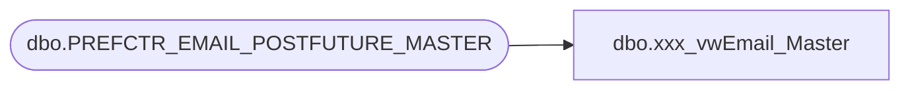

# dbo.xxx_vwEmail_Master

**Database:** dw  
**Server:** papamart  

## Architecture Diagram



## Table Dependencies

| Referenced Table |
|---|
| dbo.PREFCTR_EMAIL_POSTFUTURE_MASTER |

## View Code

```sql
create view dbo.vwEmail_Master 
as
select [email_address], [open_flag] ,[prior_emails_opened], [head_of_email]
from [dw].[dbo].[PREFCTR_EMAIL_POSTFUTURE_MASTER] with (nolock)
where [head_of_email] = 'Y'
```

