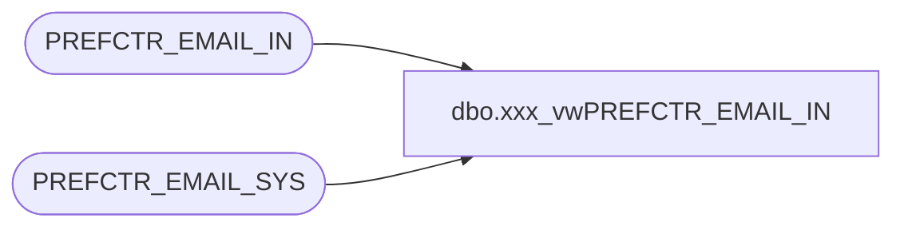

# dbo.xxx_vwPREFCTR_EMAIL_IN

**Database:** dw  
**Server:** papamart  

## Architecture Diagram



## Table Dependencies

| Referenced Table |
|---|
| PREFCTR_EMAIL_IN |
| PREFCTR_EMAIL_SYS |

## View Code

```sql
create view vwPREFCTR_EMAIL_IN
as
select email_addr_lc, sys_id, max(date_optin) as date_optin, max(date_optout) as date_optout
--into #tmp_PREFCTR_EMAIL_IN
	from  PREFCTR_EMAIL_IN i
		join PREFCTR_EMAIL_SYS s on i.SYS_KEY = s.SYS_KEY
	group by email_addr_lc, sys_id
```

