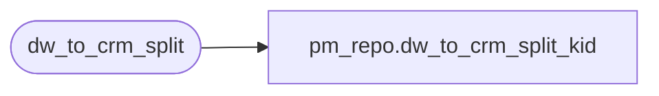

# pm_repo.dw_to_crm_split_kid

**Database:** dw  
**Server:** papamart  

## Architecture Diagram



## Table Dependencies

| Referenced Table |
|---|
| dw_to_crm_split |

## View Code

```sql
create view dw_to_crm_split_kid as select * from dw_to_crm_split where crm_vs_kid = 'K'
```

