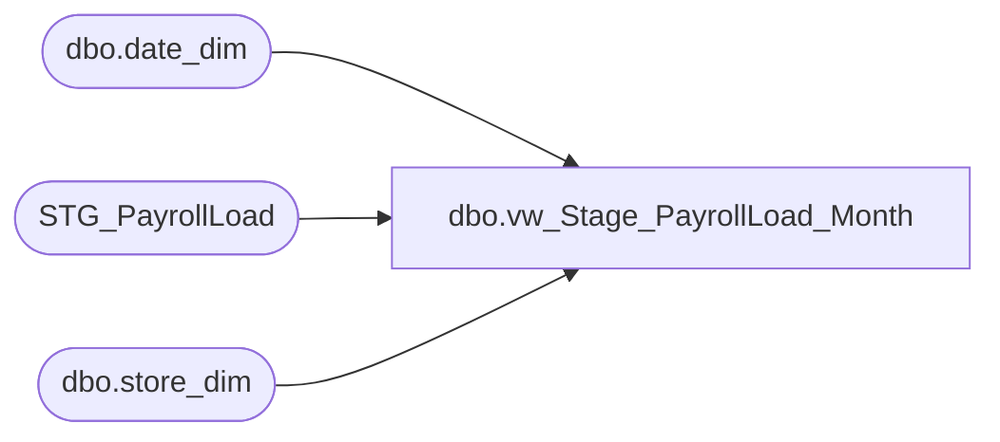

# dbo.vw_Stage_PayrollLoad_Month

**Database:** payroll  
**Server:** papamart  

## Architecture Diagram



## Table Dependencies

| Referenced Table |
|---|
| dbo.date_dim |
| STG_PayrollLoad |
| dbo.store_dim |

## View Code

```sql
CREATE VIEW [dbo].[vw_Stage_PayrollLoad_Month]
AS

SELECT stg.store_id,
	(SELECT CAST(SUBSTRING(week1_actual,1,PATINDEX('%-%',week1_actual)-2) AS DATETIME) FROM STG_PayrollLoad WHERE store_name = 'Period Dates') AS month_first_day,
	month_actual AS month_adj_actual,
	month_earned AS month_adj_earned,
	month_variance AS month_actual,
--	CASE WHEN month_actualpct = '#DIV/0!' THEN CAST(0.00 AS DECIMAL(18,2)) ELSE CAST(REPLACE(month_actualpct,'%','') AS DECIMAL(18,2))/100 END AS month_earned,
	month_actualpct AS month_earned,
	d.period_id,
	s.store_key
FROM STG_PayrollLoad stg
INNER JOIN DW.dbo.store_dim s ON
	stg.store_id = s.store_id
INNER JOIN DW.dbo.date_dim d ON
	d.actual_date = (SELECT CAST(SUBSTRING(week1_actual,1,PATINDEX('%-%',week1_actual)-2) AS DATETIME) FROM STG_PayrollLoad WHERE store_name = 'Period Dates')
WHERE stg.store_id IS NOT NULL
```

