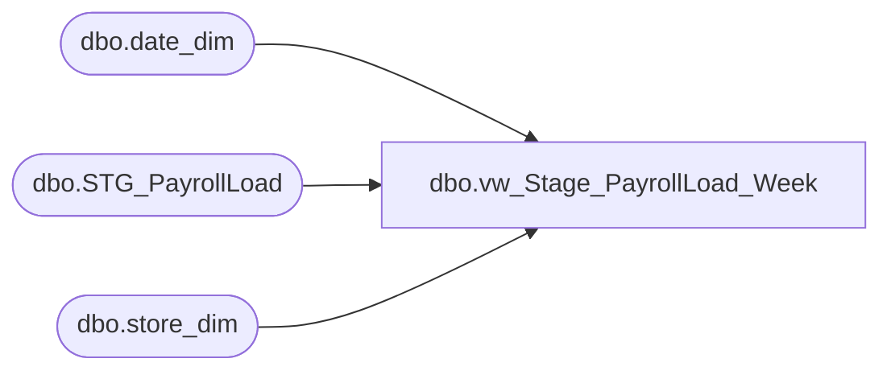

# dbo.vw_Stage_PayrollLoad_Week

**Database:** payroll  
**Server:** papamart  

## Architecture Diagram



## Table Dependencies

| Referenced Table |
|---|
| dbo.date_dim |
| dbo.STG_PayrollLoad |
| dbo.store_dim |

## View Code

```sql
CREATE VIEW [dbo].[vw_Stage_PayrollLoad_Week]
AS

WITH DateCTE (weekid, week_begin_date, week_end_date)
AS
	(SELECT 1 AS weekid, 
		CAST(SUBSTRING(week1_actual,1,PATINDEX('%-%',week1_actual)-2) AS DATETIME) AS week_begin_date,
		CAST(SUBSTRING(week1_actual,PATINDEX('%-%',week1_actual)+2,LEN(week1_actual)) AS DATETIME) AS week_end_date
	FROM dbo.STG_PayrollLoad WHERE store_name = 'Period Dates'		
	UNION 
	SELECT 2 AS weekid,
		CAST(SUBSTRING(week2_actual,1,PATINDEX('%-%',week2_actual)-2) AS DATETIME) AS week_begin_date,
		CAST(SUBSTRING(week2_actual,PATINDEX('%-%',week2_actual)+2,LEN(week2_actual)) AS DATETIME) AS week_end_date
	FROM dbo.STG_PayrollLoad WHERE store_name = 'Period Dates'		
	UNION
	SELECT 3 AS weekid,
		CAST(SUBSTRING(week3_actual,1,PATINDEX('%-%',week3_actual)-2) AS DATETIME) AS week_begin_date,
		CAST(SUBSTRING(week3_actual,PATINDEX('%-%',week3_actual)+2,LEN(week3_actual)) AS DATETIME) AS week_end_date
	FROM dbo.STG_PayrollLoad WHERE store_name = 'Period Dates'		
	UNION
	SELECT 4 AS weekid,
		CAST(SUBSTRING(week4_actual,1,PATINDEX('%-%',week4_actual)-2) AS DATETIME) AS week_begin_date,
		CAST(SUBSTRING(week4_actual,PATINDEX('%-%',week4_actual)+2,LEN(week4_actual)) AS DATETIME) AS week_end_date
	FROM dbo.STG_PayrollLoad WHERE store_name = 'Period Dates'		
	UNION
	SELECT 5 AS weekid,
		CAST(SUBSTRING(week5_actual,1,PATINDEX('%-%',week5_actual)-2) AS DATETIME) AS week_begin_date,
		CAST(SUBSTRING(week5_actual,PATINDEX('%-%',week5_actual)+2,LEN(week5_actual)) AS DATETIME) AS week_end_date
	FROM dbo.STG_PayrollLoad WHERE store_name = 'Period Dates'
	UNION
	SELECT 6 AS weekid,
		CAST(SUBSTRING(week6_actual,1,PATINDEX('%-%',week6_actual)-2) AS DATETIME) AS week_begin_date,
		CAST(SUBSTRING(week6_actual,PATINDEX('%-%',week6_actual)+2,LEN(week6_actual)) AS DATETIME) AS week_end_date
	FROM dbo.STG_PayrollLoad WHERE store_name = 'Period Dates')
	
--select * from datecte

SELECT CAST(stg.store_id AS INT) AS store_id,
	cte.week_begin_date AS week_begin_date,
	cte.week_end_date AS week_end_date, 
	CAST(week1_actual AS DECIMAL(18,2)) AS week_actual, 
	CAST(week1_earned AS DECIMAL(18,2)) AS week_earned,
	s.store_key,
	d.period_id, 
	d.week_id 
FROM dbo.STG_PayrollLoad stg
INNER JOIN DateCTE cte ON
	cte.weekid = 1
INNER JOIN DW.dbo.store_dim s ON
	stg.store_id = s.store_id
INNER JOIN DW.dbo.date_dim d ON
	cte.week_begin_date = d.actual_date
WHERE stg.store_id IS NOT NULL
UNION 
SELECT CAST(stg.store_id AS INT) AS store_id,
	cte.week_begin_date AS week_begin_date,
	cte.week_end_date AS week_end_date,
	CAST(week2_actual AS DECIMAL(18,2)) AS week_actual, 
	CAST(week2_earned AS DECIMAL(18,2)) AS week_earned,
	s.store_key,
	d.period_id, 
	d.week_id 
FROM dbo.STG_PayrollLoad stg
INNER JOIN DateCTE cte ON
	cte.weekid = 2
INNER JOIN DW.dbo.store_dim s ON
	stg.store_id = s.store_id
INNER JOIN DW.dbo.date_dim d ON
	cte.week_begin_date = d.actual_date
WHERE stg.store_id IS NOT NULL
UNION 
SELECT CAST(stg.store_id AS INT) AS store_id,
	cte.week_begin_date AS week_begin_date,
	cte.week_end_date AS week_end_date,
	CAST(week3_actual AS DECIMAL(18,2)) AS week_actual, 
	CAST(week3_earned AS DECIMAL(18,2)) AS week_earned,
	s.store_key,
	d.period_id, 
	d.week_id 
FROM dbo.STG_PayrollLoad stg
INNER JOIN DateCTE cte ON
	cte.weekid = 3
INNER JOIN DW.dbo.store_dim s ON
	stg.store_id = s.store_id
INNER JOIN DW.dbo.date_dim d ON
	cte.week_begin_date = d.actual_date
WHERE stg.store_id IS NOT NULL
UNION 
SELECT CAST(stg.store_id AS INT) AS store_id,
	cte.week_begin_date AS week_begin_date,
	cte.week_end_date AS week_end_date,
	CAST(week4_actual AS DECIMAL(18,2)) AS week_actual, 
	CAST(week4_earned AS DECIMAL(18,2)) AS week_earned,
	s.store_key,
	d.period_id, 
	d.week_id 
FROM dbo.STG_PayrollLoad stg
INNER JOIN DateCTE cte ON
	cte.weekid = 4
INNER JOIN DW.dbo.store_dim s ON
	stg.store_id = s.store_id
INNER JOIN DW.dbo.date_dim d ON
	cte.week_begin_date = d.actual_date
WHERE stg.store_id IS NOT NULL
UNION 
SELECT CAST(stg.store_id AS INT) AS store_id,
	cte.week_begin_date AS week_begin_date,
	cte.week_end_date AS week_end_date,
	CAST(week5_actual AS DECIMAL(18,2)) AS week_actual, 
	CAST(week5_earned AS DECIMAL(18,2)) AS week_earned,
	s.store_key,
	d.period_id, 
	d.week_id 
FROM dbo.STG_PayrollLoad stg
INNER JOIN DateCTE cte ON
	cte.weekid = 5
INNER JOIN DW.dbo.store_dim s ON
	stg.store_id = s.store_id
INNER JOIN DW.dbo.date_dim d ON
	cte.week_begin_date = d.actual_date
WHERE stg.store_id IS NOT NULL
UNION 
SELECT CAST(stg.store_id AS INT) AS store_id,
	cte.week_begin_date AS week_begin_date,
	cte.week_end_date AS week_end_date,
	CAST(week6_actual AS DECIMAL(18,2)) AS week_actual, 
	CAST(week6_earned AS DECIMAL(18,2)) AS week_earned,
	s.store_key,
	d.period_id, 
	d.week_id 
FROM dbo.STG_PayrollLoad stg
INNER JOIN DateCTE cte ON
	cte.weekid = 6
INNER JOIN DW.dbo.store_dim s ON
	stg.store_id = s.store_id
INNER JOIN DW.dbo.date_dim d ON
	cte.week_begin_date = d.actual_date
WHERE stg.store_id IS NOT NULL
```

