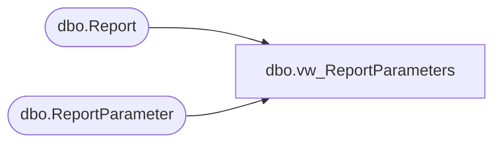

# dbo.vw_ReportParameters

**Database:** reportingservices_subscription  
**Server:** papamart  

## Architecture Diagram



## Table Dependencies

| Referenced Table |
|---|
| dbo.Report |
| dbo.ReportParameter |

## View Code

```sql
CREATE VIEW [dbo].[vw_ReportParameters]
AS
SELECT     rp.ReportId, 
		   rp.ParameterName, 
		   rp.ParameterLabel, 
           rp.ParameterValue
FROM       dbo.ReportParameter rp
INNER JOIN dbo.Report r on r.ReportId = rp.ReportId AND r.Enabled = 1
WHERE     (rp.Enabled = 1)
```

