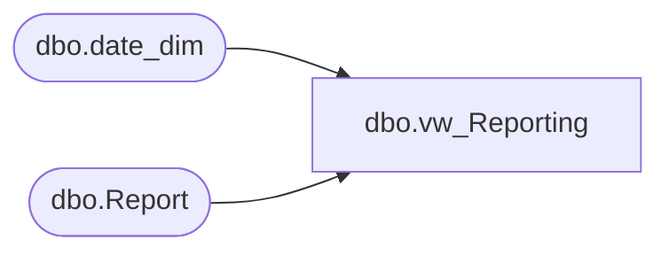

# dbo.vw_Reporting

**Database:** reportingservices_subscription  
**Server:** papamart  

## Architecture Diagram



## Table Dependencies

| Referenced Table |
|---|
| dbo.date_dim |
| dbo.Report |

## View Code

```sql
CREATE VIEW [dbo].[vw_Reporting] AS 
SELECT TOP 10000 dbo.Report.ReportId
			   , dbo.Report.Path
			   , dbo.Report.FileExtension
			   , dbo.Report.Name + ' ' + right('0' + cast(datepart (mm, getdate()) AS VARCHAR), 2) + '-' + right('0' + cast(datepart (dd, getdate()) AS VARCHAR), 2) + '-' + cast(datepart (yy, getdate()) AS VARCHAR) AS FileName
			   , dbo.Report.ReportingServiceReportName
			   , Report.rptGroupID
			   
FROM
	dw.dbo.date_dim AS dd
	CROSS JOIN dbo.Report

WHERE
	(dd.actual_date = (
					   SELECT dateadd(D, -7, cast(convert(VARCHAR(10), getdate(), 101) AS SMALLDATETIME)) AS Expr1))
	AND
	(dbo.Report.Enabled = 1)
ORDER BY
	dbo.report.reportID
```

