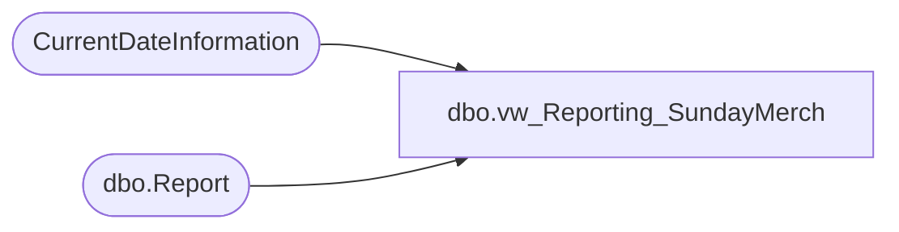

# dbo.vw_Reporting_SundayMerch

**Database:** reportingservices_subscription  
**Server:** papamart  

## Architecture Diagram



## Table Dependencies

| Referenced Table |
|---|
| CurrentDateInformation |
| dbo.Report |

## View Code

```sql
CREATE VIEW [dbo].[vw_Reporting_SundayMerch] AS SELECT TOP 1000000 rpt.ReportId
																, rpt.Path
																, rpt.FileExtension
																, rpt.Name + CASE
																	  WHEN rpt.rptFreq = 'W' THEN
																		  cdi.FWSuffix
																	  WHEN rpt.rptfreq = 'P' THEN
																		  cdi.FPSuffix
																	  WHEN rpt.rptfreq = 'Q' THEN
																		  cdi.FQSuffix
																	  ELSE
																		  cdi.FWSuffix
																  END AS FileName
																, rpt.ReportingServiceReportName
											   FROM
												   CurrentDateInformation cdi
												   CROSS JOIN dbo.Report rpt

											   WHERE
												   rpt.Enabled = 1
												   AND rpt.rptGroupID = 1
												   AND (rpt.rptFreq = 'W'
												   OR (rpt.rptFreq = 'P'
												   AND cdi.isEndFiscalPeriod = 1)
												   OR (rpt.rptFreq = 'Q'
												   AND cdi.isEndFiscalQuarter = 1))
ORDER BY
	rpt.reportID
```

